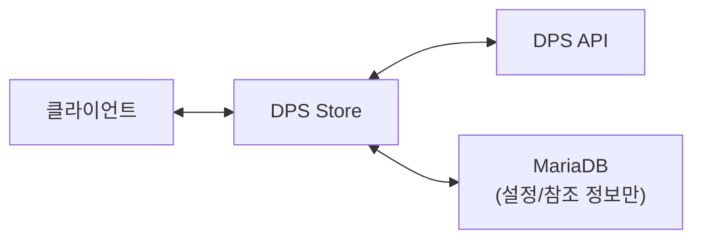
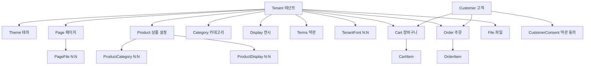
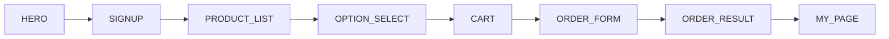

# 멀티테넌트 SaaS 아키텍처 설계기

## 멀티테넌시란

멀티테넌시(Multi-tenancy)는 하나의 소프트웨어 인스턴스가 여러 테넌트(고객 조직)에 서비스를 제공하는 아키텍처다. AWS Well-Architected SaaS Lens에서는 테넌트 격리 모델을 세 가지로 분류한다.

| 모델 | 데이터 격리 | 비용 | 적합한 상황 |
|------|-----------|------|-----------|
| **Silo** (사일로) | 테넌트별 독립 DB 인스턴스 | 높음 | 법적 규제가 엄격한 금융/의료 |
| **Pool** (풀) | 공유 DB + Row-Level Security | 낮음 | 대규모 SaaS, 비용 최적화 |
| **Bridge** (브릿지) | 공유 DB + 테넌트별 스키마 | 중간 | 엔터프라이즈 SaaS (가장 보편적) |

실제 SaaS에서는 세 모델이 혼합되어 사용된다. Shopify는 상품·주문 같은 핵심 데이터는 Pool 모델(공유 DB + 테넌트 ID)로, 결제·인증 같은 민감 데이터는 Silo 모델로 운영한다. 이런 혼합 방식이 Bridge 모델의 본질이며, 보안과 비용 사이의 균형을 잡는 것이 멀티테넌트 설계의 핵심 과제다.

이 글에서는 팝업 스토어 플랫폼의 멀티테넌트 아키텍처를 Pool 모델(`tenantId` 외래키 기반) 중심으로 설계한 과정을 정리한다.

## 배경

팝업 스토어 플랫폼을 만들면서, 업체(테넌트)별로 완전히 독립된 온라인 스토어를 운영할 수 있는 시스템이 필요했다. 단순히 데이터만 분리하는 것이 아니라, 테넌트마다 도메인, 테마, 페이지 레이아웃, 약관, 폰트까지 커스터마이징할 수 있어야 했다.

여기에 기존 DPS(디자인플러그) API와 연동하여 상품·주문 정보를 실시간으로 동기화해야 하는 요구사항도 있었다. 이 글에서는 이 시스템의 멀티테넌트 아키텍처를 어떻게 설계했는지 정리한다.

## 테넌트 식별: 3가지 도메인 전략

멀티테넌트 시스템의 첫 번째 과제는 "요청이 어느 테넌트의 것인지 어떻게 알 것인가"다. 세 가지 접근 방식을 지원하기로 했다.

| 방식          | 예시                     | 특징                 |
| ------------- | ------------------------ | -------------------- |
| 경로          | `store.example.com/acme` | 가장 간단, 기본 제공 |
| 서브도메인    | `acme.mystore.app`       | 테넌트별 독립 URL    |
| 커스텀 도메인 | `shop.acme.com`          | 테넌트가 직접 등록   |

이를 Prisma 스키마에서는 다음과 같이 표현했다.

```prisma
model Tenant {
  tenantName String  @unique  // 경로/서브도메인 식별
  domain     String? @unique  // 커스텀 도메인 식별
}
```

Next.js 16의 `proxy.ts`에서 Host 헤더를 분석하여 서브도메인과 커스텀 도메인 요청을 경로 기반으로 rewrite한다. 이렇게 하면 애플리케이션 내부에서는 항상 `/[tenant]/...` 경로 패턴으로 통일되어 처리할 수 있다.

## 데이터 저장 전략: 외부 API 의존

이 시스템의 가장 큰 특징은 상품·주문 정보를 자체 DB에 저장하지 않는다는 점이다.



DB에는 테넌트 설정, 페이지 레이아웃, 고객 정보, 장바구니, 주문 메타데이터만 저장하고, 상품명·가격·이미지 같은 실제 상품 정보는 DPS API에서 실시간으로 조회한다.

단, 주문 시점의 상품명과 가격은 스냅샷으로 저장한다. 나중에 상품 정보가 바뀌더라도 주문 당시의 정보를 보존하기 위해서다.

```prisma
model OrderItem {
  dpsProductSeqno Int     // DPS 상품 참조키
  productName     String  // 주문 시점 스냅샷
  unitPrice       Int     // 주문 시점 스냅샷
}
```

## DB 스키마: 16개 테이블

전체 스키마는 16개 테이블로 구성된다. 핵심 관계를 요약하면 다음과 같다.



테넌트별 데이터 격리는 모든 주요 테이블에 `tenantId` 외래키를 통해 구현했다.

## 3가지 테넌트 타입

테넌트가 스토어 페이지를 구성하는 방식을 세 가지로 분류했다.

```prisma
enum TenantType {
  FIXED      // 고정형: 미리 정의된 레이아웃
  FLEXIBLE   // 자유형: 노드 기반 비주얼 빌더
  GENERATIVE // 생성형: AI 자동 생성 (준비 중)
}
```

### 고정형 (FIXED)

미리 정의된 레이아웃 구조 위에 콘텐츠와 스타일만 커스터마이징하는 방식이다. 각 페이지의 `layoutConfig`(JSON)에 텍스트, 이미지, 표시 여부 등을 설정하고, `styleConfig`(JSON)에 색상, 크기 등 스타일을 설정한다.

요소의 배치 순서나 섹션 구조는 코드에서 고정되어 있으므로, 비개발자도 쉽게 스토어를 구성할 수 있다.

### 자유형 (FLEXIBLE)

노드 기반 비주얼 빌더로 페이지를 자유롭게 구성하는 방식이다. `layoutConfig`에 UINode 트리를 JSON으로 저장하며, WYSIWYG 에디터에서 드래그앤드롭으로 편집한다.

```typescript
// v2.0 노드 기반 레이아웃
interface NodeLayoutConfig {
  rootNode: UINode;
  metadata: { version: "2.0" };
}
```

렌더링 시에는 `FlexiblePageRenderer`에서 자동으로 버전을 감지하여 적절한 렌더러를 사용한다.

```typescript
if (isNodeLayoutConfig(layoutConfig)) {
  return <RootNodeRenderer config={layoutConfig} />;
}
```

### 생성형 (GENERATIVE)

AI가 브랜드와 니즈에 맞게 페이지를 자동 생성하는 방식으로, 현재 준비 중이다.

## 설정값 정규화: 중복을 잡아라

8개 페이지 타입을 구현하다 보니 설정값 중복이 심각해졌다. 배송비 정책은 CART와 ORDER_FORM에 중복되고, 디바이스 스케일은 모든 페이지에 반복되었다.

이를 해결하기 위해 설정값을 3계층으로 분리했다.

| 계층        | 저장 위치                       | 항목                                            |
| ----------- | ------------------------------- | ----------------------------------------------- |
| 정책        | `Tenant.policyConfig`           | 배송비 정책, 주문 흐름, 인증/약관 정책          |
| 공통 스타일 | `Theme.commonStyleConfig`       | 로고 크기, 배경색, 디바이스 스케일, 버튼 스타일 |
| 페이지별    | `Page.layoutConfig/styleConfig` | 텍스트, 이미지, 페이지 고유 스타일              |

```typescript
interface TenantPolicyConfig {
  deliveryPolicy?: "combined" | "individual" | "free" | "freeOver";
  freeDeliveryThreshold?: number;
  afterAddAction?: "ask" | "cart" | "order";
  showShippingForm?: boolean;
  requireVerification?: boolean;
  sessionTimeout?: number;
}

interface CommonStyleConfig {
  logoSizePreset?: LogoSizePreset;
  defaultBackgroundColor?: string;
  deviceScale?: DeviceScale;
  primaryButton?: ButtonStyleConfig;
  headerIcon?: HeaderIconStyle;
}
```

페이지별 스타일에서 공통 스타일을 참조할 때는 `useDefault` 플래그를 사용한다.

```typescript
// useResolvedBackground 훅
if (styleConfig.useDefaultBackground) {
  return commonStyleConfig.defaultBackgroundColor;
}
return styleConfig.backgroundColor;
```

이 패턴으로 중복 설정을 제거하면서도, 필요한 경우 페이지별로 오버라이드할 수 있는 유연성을 유지했다.

## 페이지 시스템: 8개 타입, 동적 네비게이션

스토어의 고객 플로우를 8개 페이지 타입으로 정의했다.



각 페이지는 활성화/비활성화가 가능하며, 비활성화된 페이지는 자동으로 건너뛴다. 예를 들어 CART를 비활성화하면 상품 선택 후 바로 주문으로 넘어가는 빠른 주문 플로우가 된다.

```typescript
// lib/navigation/page-flow.ts
function getNextPage(current: PageType, activePages: Set<PageType>): PageType {
  const flow = [HERO, SIGNUP, PRODUCT_LIST, OPTION_SELECT, CART, ORDER_FORM, ORDER_RESULT];
  const currentIndex = flow.indexOf(current);
  for (let i = currentIndex + 1; i < flow.length; i++) {
    if (activePages.has(flow[i])) return flow[i];
  }
  return ORDER_RESULT;
}
```

## 마무리

이 아키텍처의 핵심은 "테넌트별 격리"와 "유연한 커스터마이징" 사이의 균형이다. 도메인 식별, 데이터 저장, 페이지 구성, 설정 관리 각 영역에서 테넌트의 독립성을 보장하면서도, 공통 로직은 재사용할 수 있는 구조를 만들었다.

외부 API 의존 전략은 데이터 일관성 유지에 신경 쓸 부분이 있지만, 상품 정보를 이중으로 관리할 필요가 없어 시스템이 훨씬 간결해졌다. 주문 시점 스냅샷과 양방향 동기화로 데이터 정합성 문제를 해결했다.

설정값 정규화는 처음부터 설계하기보다, 구현하면서 중복을 발견하고 3계층으로 분리하는 과정을 거쳤다. "일단 만들고, 패턴을 발견하면 정리한다"는 접근이 실용적이었다.
