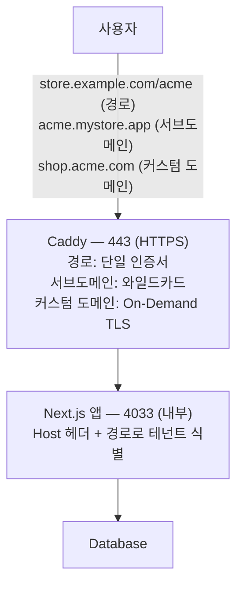

# Caddy로 멀티테넌트 SSL 자동화하기

## Caddy와 On-Demand TLS

Caddy는 Go로 작성된 웹 서버로, **자동 HTTPS**를 최초로 기본 내장한 웹 서버다. Let's Encrypt 공개 이전부터 ACME(Automatic Certificate Management Environment) 프로토콜을 사용해왔으며, 내장 ACME 클라이언트의 안정성과 프로덕션 경험은 현존하는 통합 솔루션 중 가장 풍부하다.

Caddy의 핵심 기능 중 하나인 **On-Demand TLS**는 설정 파일에 도메인을 미리 등록하지 않아도, TLS 핸드셰이크 시점에 인증서를 동적으로 발급하는 기술이다. 새로운 도메인으로 첫 HTTPS 요청이 들어오면 핸드셰이크를 잠시 보류하고, 검증 API(`ask` 엔드포인트)를 호출하여 허용 여부를 확인한 뒤 인증서를 자동 발급한다. 이 기능 덕분에 수만 개의 도메인을 동적으로 관리할 수 있어, 멀티테넌트 SaaS의 커스텀 도메인 지원에 적합하다.

| 기능          | Caddy                                | Nginx + certbot                  |
| ------------- | ------------------------------------ | -------------------------------- |
| HTTPS         | 기본 제공 (Let's Encrypt/ZeroSSL)    | 수동 설정 (certbot 별도 설치)    |
| 인증서 갱신   | 자동 (만료 30일 전)                  | 크론잡 필요                      |
| 동적 도메인   | On-Demand TLS (핸드셰이크 시점 발급) | 설정 수정 + reload 필요          |
| ACME 챌린지   | HTTP, TLS-ALPN, DNS 모두 지원        | HTTP만 기본, DNS는 별도 플러그인 |
| OCSP Stapling | 자동                                 | 수동 설정                        |

이 글에서는 Caddy의 On-Demand TLS를 활용하여 멀티테넌트 플랫폼에서 경로/서브도메인/커스텀 도메인 3가지 방식의 SSL을 하나의 Caddyfile로 자동화한 과정을 정리한다.

## 배경

멀티테넌트 스토어 플랫폼에서 3가지 도메인 방식을 지원해야 했다.

| 방식          | 예시                     | SSL 인증서         |
| ------------- | ------------------------ | ------------------ |
| 경로          | `store.example.com/acme` | 단일 인증서        |
| 서브도메인    | `acme.mystore.app`       | 와일드카드 인증서  |
| 커스텀 도메인 | `shop.acme.com`          | 개별 인증서 (동적) |

핵심 문제는 커스텀 도메인이다. 테넌트가 언제든 자신의 도메인을 연결할 수 있어야 하고, SSL 인증서가 자동으로 발급·갱신되어야 한다. Nginx + certbot 조합으로는 새 도메인을 추가할 때마다 설정 파일을 수정하고 reload해야 하는 번거로움이 있었다.

## 왜 Caddy인가

| 기능             | Caddy                     | Nginx               |
| ---------------- | ------------------------- | ------------------- |
| HTTPS            | 기본 제공 (Let's Encrypt) | 수동 설정 (certbot) |
| 인증서 갱신      | 자동                      | 크론잡 필요         |
| 동적 도메인 추가 | API로 즉시 반영           | 설정 수정 + reload  |
| 설정 복잡도      | 간단                      | 복잡                |

Caddy의 **On-Demand TLS**가 결정적이었다. 설정 파일 수정 없이, 새로운 도메인으로 요청이 들어오면 검증 API를 호출하고 통과하면 자동으로 인증서를 발급한다.

## 아키텍처



## Caddyfile 설정

### 글로벌 설정: On-Demand TLS

```caddyfile
{
    on_demand_tls {
        ask http://localhost:4033/api/caddy/check-domain
    }
}
```

`ask` 디렉티브가 핵심이다. 새로운 도메인으로 HTTPS 요청이 들어올 때마다, Caddy가 이 URL을 호출하여 인증서를 발급해도 되는지 확인한다.

### 도메인별 블록

```caddyfile
# 1. 경로 방식 — 단일 인증서
store.example.com {
    reverse_proxy localhost:4033
}

# 2. 서브도메인 방식 — On-Demand TLS
*.mystore.app {
    tls {
        on_demand
    }
    reverse_proxy localhost:4033
}

# 3. 커스텀 도메인 방식 — On-Demand TLS
:443 {
    tls {
        on_demand
    }
    reverse_proxy localhost:4033
}
```

`:443` 블록은 위의 어떤 도메인에도 매칭되지 않는 모든 HTTPS 요청을 잡아낸다. `on_demand_tls`의 `ask` API가 검증을 통과한 도메인만 인증서가 발급된다.

### 보안 헤더

```caddyfile
(security_headers) {
    @forbidden {
        path *.env* *.bak *.php.bak *.sql *.log *.ini
        path /storage/* /artisan /config/* /var/log/*
        path /.git* /.htaccess /.htpasswd
    }
    respond @forbidden "Access Denied" 403
}
```

## 도메인 검증 API

Caddy가 인증서 발급 전에 호출하는 검증 엔드포인트다.

```
GET /api/caddy/check-domain?domain=shop.acme.com

200 OK     → 인증서 발급 허용 (DB에 해당 도메인의 테넌트 존재)
404 Not Found → 인증서 발급 거부
```

DB에서 `Tenant.domain`이나 `Tenant.tenantName`으로 해당 도메인을 사용하는 테넌트가 있는지 확인한다. 없으면 404를 반환하여 인증서 발급을 차단한다. 이렇게 하면 악의적인 도메인으로 인증서가 남발되는 것을 방지할 수 있다.

## Next.js proxy.ts에서 도메인 라우팅

Next.js 16에서는 기존 `middleware.ts`가 `proxy.ts`로 변경되었다. 여기서 서브도메인과 커스텀 도메인 요청을 경로 기반으로 rewrite한다.

```typescript
// proxy.ts (Next.js 16)
export function proxy(request: Request) {
  const host = request.headers.get("host");
  const url = new URL(request.url);

  // 서브도메인 방식: acme.mystore.app → /acme/...
  for (const subdomainHost of SUBDOMAIN_HOSTS) {
    if (host?.endsWith(`.${subdomainHost}`)) {
      const tenantName = host.replace(`.${subdomainHost}`, "");
      url.pathname = `/${tenantName}${url.pathname}`;
      return NextResponse.rewrite(url);
    }
  }

  // 커스텀 도메인 방식: shop.acme.com → DB 조회 → /tenantName/...
  // ...
}
```

이렇게 하면 애플리케이션 내부에서는 항상 `app/[tenant]/...` 라우트로 통일되어 처리된다.

## 와일드카드 인증서: Cloudflare DNS 연동

서브도메인 방식(`*.mystore.app`)에 와일드카드 인증서가 필요하면, DNS 챌린지를 위해 Cloudflare DNS 플러그인을 포함한 Caddy를 빌드해야 한다.

```bash
# xcaddy로 Cloudflare 플러그인 포함 빌드
go install github.com/caddyserver/xcaddy/cmd/xcaddy@latest
xcaddy build --with github.com/caddy-dns/cloudflare

sudo mv caddy /usr/bin/caddy
sudo systemctl restart caddy
```

Caddyfile에서 Cloudflare DNS 프로바이더를 설정한다.

```caddyfile
*.mystore.app {
    tls {
        dns cloudflare {env.CF_API_TOKEN}
    }
    reverse_proxy localhost:4033
}
```

Cloudflare API 토큰은 systemd 서비스에 환경변수로 주입한다.

```bash
sudo systemctl edit caddy
```

```ini
[Service]
Environment="CF_API_TOKEN=your-cloudflare-api-token"
```

## 배포: PM2 + systemd

단일 서버 환경에서는 Docker 없이 Caddy(systemd) + Node.js(PM2) 조합이 간단하다.

```bash
# Caddy 설치 (Ubuntu/Debian)
sudo apt install caddy

# Node.js 앱 시작
pm2 start pnpm --name "dps-store" -- start
pm2 startup && pm2 save
```

```
/etc/caddy/Caddyfile                  ← Caddy 설정
/var/lib/caddy/.local/share/caddy/    ← SSL 인증서 (자동 관리)
/home/ubuntu/dps-store/               ← Next.js 앱
```

## 주의사항

| 항목        | 내용                                                               |
| ----------- | ------------------------------------------------------------------ |
| Rate Limit  | Let's Encrypt는 주당 50개 인증서 발급 제한. 커스텀 도메인에만 해당 |
| 도메인 검증 | `check-domain` API 필수. 없으면 아무 도메인이나 인증서 발급 시도   |
| 인증서 저장 | Caddy 데이터 디렉토리 영구 보존 필수 (삭제 시 재발급 필요)         |
| DNS 전파    | 새 도메인 네임서버 변경 시 최대 48시간 소요                        |

## 마무리

Caddy의 On-Demand TLS 덕분에 코드 한 줄 수정 없이 커스텀 도메인을 동적으로 추가할 수 있게 되었다. 핵심은 검증 API(`/api/caddy/check-domain`)를 통해 인증서 발급 대상을 통제하는 것이다.

경로/서브도메인/커스텀 도메인 3가지 방식을 하나의 Caddyfile로 처리하는 구성은, Nginx였다면 상당히 복잡했을 것이다. 멀티테넌트 SaaS를 구축한다면 Caddy + On-Demand TLS 조합을 추천한다.
