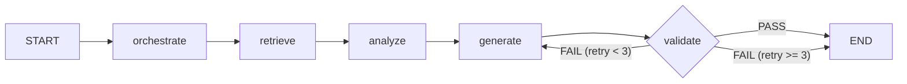

# LangGraph로 Multi-Agent 워크플로우 구축하기

## 배경

AI 기반 디자인 템플릿 생성 시스템을 설계하면서, 단일 LLM 호출로는 해결할 수 없는 문제에 부딪혔다. 사용자 요청을 분석하고, 기존 템플릿에서 참고할 만한 것을 검색하고, 새 디자인을 생성하고, 유효성을 검증하는 과정을 하나의 프롬프트로 처리하면 품질이 떨어진다.

Genspark AI의 Mixture-of-Agents(MoA) 패턴에서 영감을 받았다. 여러 전문 에이전트가 각자 역할을 수행하고 결과를 합쳐 하나의 결과물을 만드는 구조다. 이 패턴을 디자인 템플릿 도메인에 적용하기 위해 LangGraph를 선택했다.

## 왜 LangGraph인가

LangChain 팀이 만든 그래프 기반 에이전트 오케스트레이션 프레임워크다. 선택한 이유는 명확하다.

- **그래프 기반 워크플로우**: 에이전트 간 실행 순서를 노드와 엣지로 명시적 정의
- **상태 관리**: `TypedDict` 기반 공유 상태로 에이전트 간 데이터 전달
- **조건부 라우팅**: 검증 결과에 따라 재생성/완료 분기 처리
- **비동기 지원**: `ainvoke`(일괄), `astream`(스트리밍) async/await 네이티브 실행

## 5개 에이전트 설계

MoA 패턴을 디자인 템플릿 도메인에 맞게 5개 에이전트로 구성했다.

| 에이전트     | LLM                         | 역할                                     |
| ------------ | --------------------------- | ---------------------------------------- |
| Orchestrator | Claude Sonnet               | 프롬프트 분석, 작업 분해, 생산 타입 분류 |
| Retriever    | OpenAI Embedding + pgvector | 유사 템플릿 벡터 검색 (RAG)              |
| Analyzer     | Claude Haiku                | 참조 템플릿 패턴 분석                    |
| Generator    | Claude Sonnet               | XML 템플릿 생성                          |
| Validator    | 규칙 기반 (lxml)            | XML 유효성 검증                          |

Claude API는 **이중 모델 전략**을 사용한다. 복잡한 추론이 필요한 오케스트레이션과 생성에는 Sonnet, 패턴 인식 위주의 분석에는 비용이 낮은 Haiku를 배정했다.

| 모델              | 용도                     | Input        | Output     |
| ----------------- | ------------------------ | ------------ | ---------- |
| Claude Sonnet 4.5 | 오케스트레이션, XML 생성 | $3 / MTok    | $15 / MTok |
| Claude Haiku 4.5  | 패턴 분석, 분류          | $0.80 / MTok | $4 / MTok  |

## 워크플로우 구조



핵심은 validate → generate 재시도 루프다. Validator가 실패를 반환하면, 실패 사유를 Generator에 전달하여 수정된 XML을 재생성한다.

## 공유 상태 (State)

LangGraph의 핵심은 `TypedDict` 기반 공유 상태다. 각 에이전트(노드)가 상태의 일부를 읽고, 자신의 결과를 병합한다.

```python
from typing import NotRequired, TypedDict

class WorkflowState(TypedDict):
    # 입력
    prompt: str
    pod_type: str | None
    retry_count: int

    # Orchestrator → Retriever, Generator
    search_query: NotRequired[str]
    style_requirements: NotRequired[list[str]]
    generation_instructions: NotRequired[str]

    # Retriever → Analyzer
    retrieved_templates: NotRequired[list[dict]]
    reference_xmls: NotRequired[list[str]]

    # Analyzer → Generator
    analysis: NotRequired[dict]

    # Generator → Validator
    generated_xml: NotRequired[str]

    # Validator → (조건부) Generator 또는 END
    validation_passed: NotRequired[bool]
    validation_issues: NotRequired[list[dict]]
    validation_feedback: NotRequired[str]
```

에이전트 간 XML 구조 정보, 스타일 속성, 사용자 선호도가 State를 통해 자연스럽게 공유된다.

## 노드 함수 구현

각 노드는 `WorkflowState`를 받아 부분 상태 업데이트를 반환하는 async 함수다.

```python
async def orchestrate_node(state: WorkflowState) -> dict:
    result = await orchestrator.orchestrate(
        state["prompt"], pod_type=state.get("pod_type")
    )
    return {
        "pod_type": result["pod_type"],
        "search_query": result["search_query"],
        "style_requirements": result.get("style_requirements", []),
        "generation_instructions": result["generation_instructions"],
    }

async def retrieve_node(state: WorkflowState) -> dict:
    results = await retriever.retrieve(
        state.get("search_query", state["prompt"])
    )
    return {
        "retrieved_templates": results,
        "reference_xmls": [r["xml_content"] for r in results if r.get("xml_content")],
    }

async def generate_node(state: WorkflowState) -> dict:
    feedback = (
        state.get("validation_feedback")
        if state.get("retry_count", 0) > 0
        else None
    )
    xml = await generator.generate(
        state.get("generation_instructions", state["prompt"]),
        state.get("analysis", {}),
        state.get("reference_xmls", []),
        feedback=feedback,
    )
    return {"generated_xml": xml}

async def validate_node(state: WorkflowState) -> dict:
    result = validator.validate(state.get("generated_xml", ""))
    if result.valid:
        return {"validation_passed": True, "validation_issues": result.issues}
    feedback = "; ".join(issue["message"] for issue in result.issues)
    return {
        "validation_passed": False,
        "validation_issues": result.issues,
        "validation_feedback": feedback,
        "retry_count": state.get("retry_count", 0) + 1,
    }
```

Generator는 재시도 시 `validation_feedback`을 받아 수정 사항을 반영한다. Validator는 LLM 없이 lxml 기반 규칙 검증으로 비용이 $0이다.

## 그래프 정의

```python
from langgraph.graph import END, StateGraph

def _should_retry(state: WorkflowState) -> str:
    if state.get("validation_passed"):
        return END
    if state.get("retry_count", 0) >= settings.max_retries:
        return END
    return "generate"

def build_graph() -> StateGraph:
    graph = StateGraph(WorkflowState)

    graph.add_node("orchestrate", orchestrate_node)
    graph.add_node("retrieve", retrieve_node)
    graph.add_node("analyze", analyze_node)
    graph.add_node("generate", generate_node)
    graph.add_node("validate", validate_node)

    graph.set_entry_point("orchestrate")
    graph.add_edge("orchestrate", "retrieve")
    graph.add_edge("retrieve", "analyze")
    graph.add_edge("analyze", "generate")
    graph.add_edge("generate", "validate")
    graph.add_conditional_edges("validate", _should_retry)

    return graph
```

`add_conditional_edges`로 validate 노드 이후의 분기를 선언적으로 정의한다. `_should_retry` 함수가 상태를 보고 다음 노드(`"generate"` 또는 `END`)를 결정한다.

## SSE 스트리밍

`astream(stream_mode="updates")`는 각 노드 실행 완료 시마다 상태 업데이트를 yield한다. 이를 SSE 이벤트로 변환하면 프론트엔드에서 진행 상황을 실시간으로 보여줄 수 있다.

```python
compiled = build_graph().compile()

async for chunk in compiled.astream(initial_state, stream_mode="updates"):
    for node_name, state_update in chunk.items():
        stage = NODE_TO_STAGE[node_name]
        yield sse_event({"type": "agent_complete", "stage": stage})
```

노드와 SSE 스테이지의 매핑:

| 노드        | SSE 스테이지  |
| ----------- | ------------- |
| orchestrate | orchestrating |
| retrieve    | retrieving    |
| analyze     | analyzing     |
| generate    | generating    |
| validate    | validating    |

## 에러 처리

각 노드는 외부 서비스(LLM API, DB) 호출 시 에러를 처리한다.

| 에러                 | 대응                                  |
| -------------------- | ------------------------------------- |
| `RateLimitError`     | exponential backoff (1초 → 2초 → 4초) |
| `APIConnectionError` | 에러 종료, SSE error 이벤트           |
| DB 연결 실패         | 빈 결과 반환, 워크플로우 계속         |

## 성능 프로파일

| 단계 | 에이전트                         | 예상 소요 시간 |
| ---- | -------------------------------- | -------------- |
| 1    | Orchestrator (Claude Sonnet)     | ~2초           |
| 2    | Retriever (Embedding + pgvector) | ~1.5초         |
| 3    | Analyzer (Claude Haiku)          | ~3초           |
| 4    | Generator (Claude Sonnet)        | ~10-15초       |
| 5    | Validator (lxml)                 | 0.1초 미만     |

전체 성공 시 ~17-22초, 재시도 1회 시 ~30-37초. Generator가 전체 시간의 50-70%를 차지하는 병목이다.

## 비용 구조

워크플로우 1회 실행 비용:

| 에이전트     | 모델   | Input 토큰 | Output 토큰 | 호출당 비용 |
| ------------ | ------ | ---------- | ----------- | ----------- |
| Orchestrator | Sonnet | ~500       | ~300        | ~$0.006     |
| Analyzer     | Haiku  | ~2,000     | ~500        | ~$0.004     |
| Generator    | Sonnet | ~3,000     | ~4,000      | ~$0.069     |

- 성공 시: ~$0.08
- 재시도 1회: ~$0.15
- 월 1,000회 생성 기준: ~$80-150

Generator가 전체 비용의 80% 이상을 차지한다.

## 정리

LangGraph로 멀티 에이전트 워크플로우를 구현하면서 느낀 점:

- **State 설계가 핵심**: 에이전트 간 데이터 전달 구조를 처음에 잘 잡아야 한다. `TypedDict` 기반이라 타입 안전성도 확보된다.
- **이중 모델 전략의 효과**: Sonnet과 Haiku를 역할별로 분리하여 비용 대비 성능을 최적화할 수 있다.
- **조건부 라우팅의 유연함**: 검증 실패 → 재생성 루프를 `add_conditional_edges` 한 줄로 구현할 수 있다.
- **스트리밍 통합이 자연스러움**: `astream`으로 노드별 진행 상황을 SSE로 전달하는 구조가 프레임워크 레벨에서 지원된다.

단일 LLM 호출 대비 복잡도는 높지만, 각 에이전트가 명확한 책임을 갖기 때문에 디버깅과 개선이 훨씬 수월하다.
