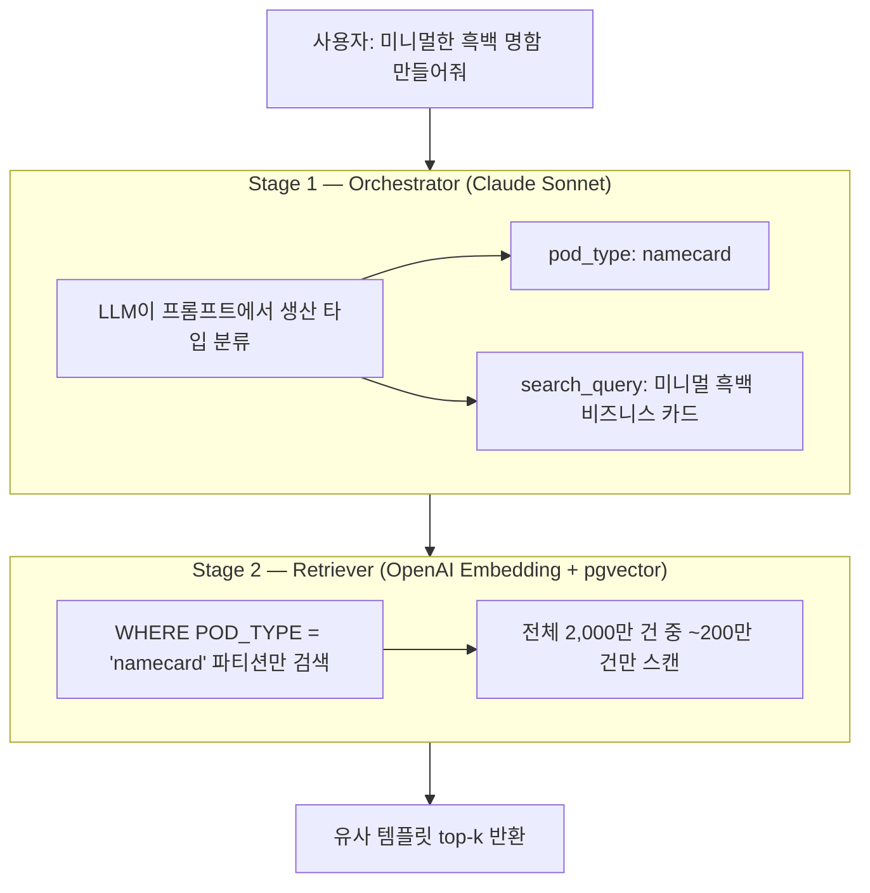
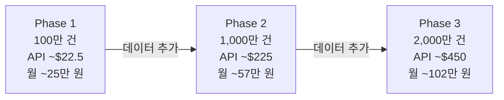

# pgvector 2단계 검색 전략으로 벡터 검색 비용 1/6로 줄이기

## 배경

디자인 템플릿 AI 생성 시스템에서 RAG(검색 증강 생성)를 구현해야 했다. 사용자가 "미니멀한 흑백 명함"이라고 요청하면, DB에서 유사한 기존 템플릿을 검색하여 AI가 참고하도록 하는 구조다.

문제는 규모다. 기본 템플릿 ~1,000만 건, 사용자 커스텀 포함 최대 ~2,000만 건의 XML 디자인 데이터를 벡터 검색해야 한다. 전용 벡터 DB(Milvus, Pinecone)를 도입하면 인프라 복잡도가 올라가고, 메타데이터와의 조인이 번거롭다.

PostgreSQL의 pgvector 확장을 선택했다. 관계형 데이터와 벡터를 단일 DB에서 통합 관리할 수 있기 때문이다. 하지만 2,000만 건 규모의 벡터 인덱스를 메모리에 올리려면 서버 사양이 상당히 높아야 했다. 이 문제를 해결한 것이 **2단계 검색 전략**이다.

## 2단계 검색이란

사용자 입력에서 **생산 타입(POD_TYPE)을 먼저 분류**한 뒤, 해당 파티션 내에서만 벡터 검색을 수행하는 전략이다.



Stage 1의 POD_TYPE 분류는 LLM(Orchestrator)이 수행한다. "명함 만들어줘" → `namecard`, "티셔츠 디자인" → `tshirt`처럼 비교적 단순한 분류 작업이므로, 별도 비용 없이 기존 오케스트레이션 과정에서 함께 처리한다.

## 스키마 설계: halfvec + 파티셔닝

### 핵심 테이블

```sql
-- 생산 타입 마스터 (~50종)
CREATE TABLE "T_POD_TYPE" (
    "TYPE" TEXT PRIMARY KEY,  -- namecard, tshirt, leaflet 등
    "NAME" TEXT NOT NULL
);

-- 템플릿 (메타데이터 + 벡터) — POD_TYPE 파티셔닝
CREATE TABLE "T_TEMPLATE" (
    "SEQNO" SERIAL,
    "POD_TYPE" TEXT NOT NULL REFERENCES "T_POD_TYPE"("TYPE"),
    "NAME" TEXT NOT NULL,
    "XML_CONTENT" TEXT NOT NULL,
    "EMBEDDING" halfvec(3072),
    PRIMARY KEY ("SEQNO", "POD_TYPE")
) PARTITION BY LIST ("POD_TYPE");

-- 파티션 생성
CREATE TABLE t_template_namecard PARTITION OF "T_TEMPLATE"
    FOR VALUES IN ('namecard');
CREATE TABLE t_template_tshirt PARTITION OF "T_TEMPLATE"
    FOR VALUES IN ('tshirt');
-- ... ~50종
```

두 가지 핵심 결정이 있다.

### halfvec(float16)

OpenAI text-embedding-3-large의 3072차원 벡터를 `vector(3072)` 대신 `halfvec(3072)`로 저장한다.

| 타입              | 1건 크기 | 100만 건 | 2,000만 건 |
| ----------------- | -------- | -------- | ---------- |
| vector (float32)  | 12.0 KB  | 11.4 GB  | 229 GB     |
| halfvec (float16) | 6.0 KB   | 5.7 GB   | 114 GB     |

저장 50% 절감이면서, 검색 정확도(recall) 손실은 거의 없다. 또한 halfvec은 HNSW 인덱스에서 4000차원까지 지원하므로, 3072차원에서도 HNSW를 사용할 수 있다 (vector 타입은 2000차원 제한).

### HNSW 인덱스

```sql
CREATE INDEX "IDX_TEMPLATE_EMBEDDING_HNSW"
    ON "T_TEMPLATE" USING hnsw ("EMBEDDING" halfvec_cosine_ops)
    WITH (m = 16, ef_construction = 64);

-- 검색 시 정확도 조절
SET hnsw.ef_search = 100;
```

파티션 테이블에 인덱스를 생성하면 각 파티션별로 자동 생성된다. 인덱스 빌드 메모리도 파티션 단위로 분산된다.

## 검색 쿼리

```sql
SELECT "SEQNO", "NAME", "POD_TYPE",
       1 - ("EMBEDDING" <=> $1::halfvec) AS similarity
FROM "T_TEMPLATE"
WHERE "POD_TYPE" = $2  -- Stage 1에서 LLM이 분류한 생산 타입
ORDER BY "EMBEDDING" <=> $1::halfvec
LIMIT $3;
```

`<=>` 연산자가 코사인 거리다. `WHERE "POD_TYPE" = $2` 조건으로 PostgreSQL이 자동으로 파티션 프루닝을 수행하여, 해당 파티션의 HNSW 인덱스만 사용한다.

Python(asyncpg) 구현:

```python
vector = np.array(query_embedding, dtype=np.float16)
rows = await pool.fetch(
    'SELECT "SEQNO", "NAME", "POD_TYPE", '
    '1 - ("EMBEDDING" <=> $1::halfvec) AS similarity '
    'FROM "T_TEMPLATE" WHERE "POD_TYPE" = $2 '
    'ORDER BY "EMBEDDING" <=> $1::halfvec LIMIT $3',
    vector, pod_type, top_k
)
```

## 인프라 비용 비교: 핵심 효과

2단계 검색의 가장 큰 가치는 **검색 속도 향상이 아닌 인프라 사이징 최적화**다.

HNSW 인덱스는 메모리에 올라가야 성능이 나온다. 2단계 검색이 없으면 전체 데이터 기준으로 서버를 사이징해야 하지만, 2단계 검색을 적용하면 **최대 파티션 크기 기준**으로 사이징하면 된다.

10개 POD_TYPE 균등 분포 기준:

| 전체 데이터 | 파티션당 검색 대상 |
| ----------- | ------------------ |
| 100만 건    | ~10만 건           |
| 1,000만 건  | ~100만 건          |
| 2,000만 건  | ~200만 건          |

### 월 인프라 비용 비교

| 규모       | 2단계 검색 미적용 | 2단계 검색 적용 | 절감률  |
| ---------- | ----------------- | --------------- | ------- |
| 100만 건   | ~57만 원          | ~25만 원        | 56%     |
| 1,000만 건 | ~384만 원         | ~57만 원        | 85%     |
| 2,000만 건 | **~564만 원**     | **~102만 원**   | **82%** |

2,000만 건 기준으로 월 **462만 원** 절감. 연간으로 환산하면 약 5,500만 원이다.

### 검색 성능

| 규모       | 2단계 검색 미적용 | 2단계 검색 적용 |
| ---------- | ----------------- | --------------- |
| 100만 건   | 5~20ms            | 2~5ms           |
| 1,000만 건 | 20~80ms           | 5~15ms          |
| 2,000만 건 | 40~150ms          | 5~20ms          |

검색 레이턴시도 개선되지만, 핵심은 인프라 비용 절감이다.

## 인덱싱 전략별 비교

4가지 전략을 검토했다.

| 전략                         | 차원       | 인덱스          | 특징                              |
| ---------------------------- | ---------- | --------------- | --------------------------------- |
| A. halfvec + HNSW            | 3072 (f16) | HNSW            | 저장 50% 절감, 정확도 유지        |
| B. 파티셔닝 + A + 2단계 검색 | 3072 (f16) | HNSW (파티션별) | **인프라 비용 대폭 절감**         |
| C. 1536차원 + HNSW           | 1536 (f32) | HNSW            | 정확도 ~5% 하락                   |
| D. 전용 Vector DB            | 3072       | 자체            | 인프라 복잡, 현재 규모에서 불필요 |

### 1,000만 건 비교

| 전략                | API (1회) | 월 인프라    | 검색 레이턴시 | Recall@10 |
| ------------------- | --------- | ------------ | ------------- | --------- |
| A. halfvec + HNSW   | $225      | ~384만 원    | 20~80ms       | ~98%      |
| B. 파티셔닝 + 2단계 | $225      | **~57만 원** | 5~15ms        | ~99%      |
| C. 1536 + HNSW      | $225      | ~192만 원    | 15~50ms       | ~94%      |

전략 B가 비용, 성능, 정확도 모든 면에서 우위다. 전략 C는 halfvec 3072와 저장 용량이 같으면서 정확도만 5% 하락하므로 비권장이다.

## 임베딩 비용

| 항목             | 값                            |
| ---------------- | ----------------------------- |
| 모델             | OpenAI text-embedding-3-large |
| 차원             | 3072                          |
| 단가 (Batch API) | $0.065 / 1M tokens            |

| 규모       | 총 토큰 | Standard | Batch (50% 할인) |
| ---------- | ------- | -------- | ---------------- |
| 100만 건   | 3억     | $39      | **$19.5**        |
| 1,000만 건 | 30억    | $390     | **$195**         |

임베딩은 1회성 인덱싱 비용이다. Batch API를 사용하면 50% 할인을 받을 수 있다.

## 단계별 확장 로드맵

처음부터 파티셔닝으로 시작하여, Phase 전환 시 스키마 마이그레이션을 제거했다.



Phase 1부터 파티셔닝을 적용하면 100만 건에서 오버헤드는 무시할 수준이면서, Phase 2/3 전환 시 데이터만 추가하면 된다.

## 정리

2단계 검색 전략의 핵심은 세 가지다.

1. **LLM 분류와 DB 파티셔닝의 결합**: Orchestrator가 이미 수행하는 작업(사용자 의도 분석)에 POD_TYPE 분류를 추가한 것이므로, 별도 비용 없이 검색 범위를 1/10로 줄일 수 있다.

2. **halfvec으로 정확도 유지 + 비용 절감**: float16 저장으로 용량 50% 절감하면서, 3072차원을 유지하여 임베딩 정확도 손실이 없다.

3. **처음부터 파티셔닝으로 시작**: 100만 건이든 2,000만 건이든 동일한 스키마로 운영하여, 확장 시 마이그레이션 비용을 제거했다.

전용 벡터 DB를 도입하지 않고 PostgreSQL 하나로 관계형 데이터와 벡터 검색을 통합한 덕분에, 인프라 운영 복잡도도 최소화할 수 있었다.
