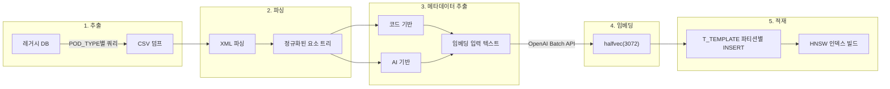

# 100만 건 XML 데이터를 AI 검색 가능하게 만드는 파이프라인

## RAG 데이터 파이프라인: 비정형 데이터의 ETL

RAG(Retrieval-Augmented Generation)에서 검색 품질은 곧 생성 품질이다. 아무리 좋은 LLM을 사용해도, 검색 결과가 부정확하면 출력도 부정확하다. 그래서 RAG 시스템의 성패는 **데이터 파이프라인의 품질**에 달려 있다.

RAG 데이터 파이프라인은 본질적으로 **비정형 데이터를 위한 ETL**이다. 전통적인 ETL이 행(row)과 키(key) 단위로 데이터를 변환한다면, RAG ETL은 청크(chunk)와 임베딩(embedding) 단위로 변환한다. 파이프라인의 주요 단계는 다음과 같다.

| 전통 ETL         | RAG ETL                | 설명                                         |
| ---------------- | ---------------------- | -------------------------------------------- |
| 추출 (Extract)   | 문서 수집·파싱         | PDF, HTML, XML 등에서 텍스트 추출            |
| 변환 (Transform) | 청킹 + 메타데이터 추출 | 텍스트를 적절한 크기로 분할, 메타데이터 부착 |
| 적재 (Load)      | 임베딩 + 벡터 인덱싱   | 텍스트를 벡터로 변환하여 벡터 DB에 적재      |

데이터 소스가 비정형일수록 파싱과 메타데이터 추출의 중요성이 커진다. 특히 XML은 태그와 속성의 노이즈가 임베딩 품질을 떨어뜨리므로, 원본 그대로 임베딩하는 것이 아니라 **구조적 메타데이터를 추출하여 의미 있는 텍스트로 재구성**하는 전처리가 필수다.

이 글에서는 레거시 DB의 XML 디자인 템플릿을 5단계 파이프라인(추출 → 파싱 → 메타데이터 추출 → 임베딩 → 적재)으로 처리하여, 100만 건 인덱싱 비용 $19.5를 달성한 과정을 정리한다.

## 배경

디자인 AI 시스템의 RAG를 위해서는 기존 XML 디자인 템플릿을 벡터 검색 가능한 상태로 만들어야 한다. 레거시 시스템의 DB에 수백만 건의 XML 디자인 데이터가 저장되어 있는데, 이를 그대로 사용할 수 없다. XML 태그와 속성의 노이즈가 임베딩 품질을 떨어뜨리기 때문이다.

목표는 100만 건부터 시작하여 최대 2,000만 건까지 단계적으로 인덱싱하는 것이다. 이를 위해 5단계 ETL 파이프라인을 설계했다.

## 파이프라인 전체 흐름



| 단계   | 입력              | 처리                      | 출력               |
| ------ | ----------------- | ------------------------- | ------------------ |
| 추출   | 레거시 DB         | POD_TYPE별 쿼리           | CSV 덤프           |
| 파싱   | XML 문자열        | lxml 파싱·정규화          | 요소 트리          |
| 변환   | 요소 트리         | 코드 + AI 메타데이터 추출 | 임베딩 입력 텍스트 |
| 임베딩 | 텍스트 (~300 tok) | OpenAI Batch API          | halfvec(3072)      |
| 적재   | 메타데이터 + 벡터 | COPY + executemany        | T_TEMPLATE 파티션  |

## 1단계: 추출 (Extract)

레거시 DB에서 상품 분류(POD_TYPE, 카테고리)와 XML 데이터를 조인하여 추출한다.

```sql
SELECT t.seqno, p.pc_seqno, t.name, t.xml_content, p.pod_type
FROM t_template t
JOIN t_product p ON t.product_seqno = p.seqno
WHERE p.pod_type = 'namecard'
  AND t.xml_content IS NOT NULL
  AND LENGTH(t.xml_content) > 0
ORDER BY t.seqno;
```

POD_TYPE별로 분리된 CSV 파일로 덤프한다. PostgreSQL COPY와의 호환성을 위해 CSV 형식을 사용한다.

```
/data/dump/
├── templates_namecard.csv
├── templates_tshirt.csv
├── templates_leaflet.csv
└── ...
```

## 2단계: 파싱 (Parse)

XML 템플릿은 4가지 요소 타입(`backgroundimage`, `colorbox`, `picturebox`, `textbox`)으로 구성된다. lxml으로 파싱하여 색상, 폰트, 좌표 등 구조적 데이터를 추출한다.

```python
from lxml import etree
from urllib.parse import unquote

def parse_template(xml_content: str) -> etree._Element:
    if not xml_content.strip().startswith("<?xml"):
        xml_content = '<?xml version="1.0" encoding="UTF-8"?>' + xml_content
    return etree.fromstring(xml_content.encode("utf-8"))

def decode_color(value: int) -> str:
    """decimal color → hex 변환 (24-bit RGB / 32-bit ARGB)"""
    if value > 0xFFFFFF:
        r = (value >> 16) & 0xFF
        g = (value >> 8) & 0xFF
        b = value & 0xFF
        return f"#{r:02X}{g:02X}{b:02X}"
    return f"#{value:06X}"
```

정규화 규칙:

- XML 선언 유무에 관계없이 파싱
- 색상값은 decimal → hex 변환 (24-bit RGB / 32-bit ARGB)
- 텍스트 내용은 3중 URL 디코딩 (`unquote(unquote(unquote(encoded)))`)

## 3단계: 메타데이터 추출 — 하이브리드 전략 (Transform)

이 단계가 파이프라인의 핵심이다. **코드 기반 추출과 AI 기반 추출을 결합**하여 비용을 최소화하면서 의미적 품질을 확보한다.

### 코드 기반 추출 (비용 $0)

XML 파싱으로 직접 추출 가능한 구조적 데이터:

```python
from collections import Counter

def extract_metadata_by_code(root: etree._Element) -> dict:
    colors = set()
    for elem in root.iter():
        color_val = elem.get("color")
        if color_val and color_val.isdigit():
            colors.add(decode_color(int(color_val)))

    fonts = {elem.get("fontFamily") for elem in root.iter() if elem.get("fontFamily")}

    element_types = ["backgroundimage", "colorbox", "picturebox", "textbox"]
    composition = Counter(
        elem.tag for elem in root.iter() if elem.tag in element_types
    )

    return {
        "colors": sorted(colors),
        "fonts": sorted(fonts),
        "composition": dict(composition),
        "canvas_size": f"{root.get('width', '0')}x{root.get('height', '0')}",
    }
```

| 필드        | 추출 방법                    | 예시                    |
| ----------- | ---------------------------- | ----------------------- |
| 색상 팔레트 | `color` 속성 수집 → hex 변환 | `#465F67, #FFFFFF`      |
| 폰트 목록   | `fontFamily` 속성 수집       | `NanumGothic, Arial`    |
| 요소 구성   | 태그명별 개수                | `textbox:5, colorbox:3` |
| 배경 타입   | backgroundimage 속성 분석    | `단색`, `이미지`        |

### AI 기반 추출 (Claude Haiku)

코드로 추출할 수 없는 **의미적 메타데이터**는 Claude Haiku로 추출한다. 스타일 키워드, 분위기, 용도 같은 정보다.

| 구성              | 100만 건 비용 | 추출 데이터                          |
| ----------------- | ------------- | ------------------------------------ |
| 코드 기반만       | **$0**        | 색상, 폰트, 요소 구성                |
| AI 기반만         | ~$3.0         | 스타일, 분위기, 용도 + 구조적 데이터 |
| 하이브리드 (권장) | ~$3.0         | 구조적 + 의미적 데이터 모두          |

### 개인정보 마스킹

명함, 카드 등 개인정보가 포함된 XML 템플릿은 AI 전송 전에 마스킹이 필요하다. 하이브리드 전략을 적용했다.

```python
PII_HEAVY_TYPES = {"namecard", "card", "invitation", "envelope"}

async def mask_pii(text: str, pod_type: str) -> str:
    # 1단계: 코드 — 전화번호, 이메일 (모든 POD_TYPE, $0)
    text = mask_pii_by_code(text)

    # 2단계: AI — 이름, 주소 (PII 빈도 높은 유형만)
    if pod_type in PII_HEAVY_TYPES:
        text = await mask_pii_by_ai(text)

    return text
```

전화번호와 이메일은 정규식으로 ~99% 정확도로 감지할 수 있지만, 한국어 이름은 일반 단어와 구분이 어렵다. PII 빈도가 높은 유형(명함, 카드 등 ~10%)만 AI로 처리하여 비용을 $30 수준으로 억제했다.

### 임베딩 입력 텍스트 조립

코드 추출 + AI 추출 결과를 합쳐서 200~500 토큰 목표로 임베딩 입력 텍스트를 구성한다.

```
템플릿명: 심플 비즈니스 명함
생산타입: namecard
카테고리: 비즈니스 > 기업
색상: #465F67, #FFFFFF, #000000
폰트: NanumGothic, Arial
배경: 단색
요소: textbox:5, colorbox:3, picturebox:1
스타일: 미니멀, 모던, 클린
분위기: 깔끔하고 전문적인 비즈니스 느낌
용도: 비즈니스, 기업, 공식
```

XML 원본 자체를 임베딩하지 않는 이유는, XML 태그와 속성의 노이즈가 의미 벡터 품질을 떨어뜨리기 때문이다.

## 4단계: 임베딩 (Embed)

OpenAI text-embedding-3-large로 3072차원 벡터를 생성한다. 2048건씩 배치로 처리한다.

```python
async def embed_batch(texts: list[str]) -> list[list[float]]:
    response = await client.embeddings.create(
        model="text-embedding-3-large",
        input=texts,
        dimensions=3072,
    )
    return [item.embedding for item in response.data]
```

| 규모       | 총 토큰 | Batch API 비용 | 처리 시간 |
| ---------- | ------- | -------------- | --------- |
| 100만 건   | 3억     | **$19.5**      | ~3시간    |
| 1,000만 건 | 30억    | **$195**       | ~28시간   |

Batch API를 사용하면 표준 요금 대비 50% 할인을 받을 수 있다. 처리 완료까지 최대 24시간이지만, 1회성 인덱싱이므로 충분하다.

## 5단계: 적재 (Load)

메타데이터는 PostgreSQL COPY로 빠르게 적재하고, 벡터는 asyncpg `executemany`로 삽입한다.

```python
async def insert_vectors(templates: list[dict], vectors: list[list[float]]):
    records = [
        (t["seqno"], t["pod_type"], np.array(v, dtype=np.float16).tobytes())
        for t, v in zip(templates, vectors)
    ]
    async with pool.acquire() as conn:
        await conn.executemany(
            'UPDATE "T_TEMPLATE" SET "EMBEDDING" = $3::halfvec '
            'WHERE "SEQNO" = $1 AND "POD_TYPE" = $2',
            records,
        )
```

모든 벡터 삽입 완료 후 HNSW 인덱스를 빌드한다.

| 규모     | 파티션당 빌드 시간 |
| -------- | ------------------ |
| 10만 건  | ~3분               |
| 100만 건 | ~30분              |

## 에러 처리: 체크포인트와 격리

100만 건 처리 중 오류가 발생하면 처음부터 다시 하지 않는다. 마지막으로 성공한 SEQNO를 체크포인트로 기록하여 이어서 처리한다.

```python
async def process_all_embeddings(templates, batch_size=2048):
    for i in range(0, len(templates), batch_size):
        batch = templates[i:i + batch_size]
        vectors = await embed_batch([t["embedding_text"] for t in batch])
        await insert_vectors(batch, vectors)
        await save_checkpoint(batch[-1]["seqno"])
```

실패한 건은 별도 에러 로그에 기록하고, 정상 건 처리를 계속 진행한다. 에러 건은 나중에 모아서 재처리한다.

| 단위         | 크기     | 실패 시 처리                 |
| ------------ | -------- | ---------------------------- |
| 임베딩 배치  | 2,048건  | 배치 단위 재시도             |
| DB 삽입 배치 | 5,000건  | 트랜잭션 롤백 후 재시도      |
| 체크포인트   | 10,000건 | 마지막 체크포인트부터 재시작 |

## 단계별 비용

| Phase   | 내용                          | API 비용  | 검색 품질              |
| ------- | ----------------------------- | --------- | ---------------------- |
| Phase 1 | 코드 메타데이터 + 임베딩      | **$19.5** | 구조적 데이터 기반     |
| Phase 2 | + AI 스타일 키워드 + 재임베딩 | $42.0     | + 스타일/분위기 키워드 |
| Phase 3 | + Vision 이미지 분석          | ~$811.5   | + 이미지 분석          |

Phase 1의 검색 품질이 충분하면 Phase 2를 건너뛸 수 있다. Phase 3의 이미지 분석은 비용이 높으므로 텍스트 기반 검색 품질 평가 후 결정한다.

## 정리

이 파이프라인에서 가장 중요한 결정은 **하이브리드 메타데이터 추출 전략**이다.

- XML 구조적 데이터(색상, 폰트, 요소 구성)는 코드로 추출하여 비용 $0
- 의미적 데이터(스타일, 분위기)는 AI로 추출하되, Phase에 따라 선택적 적용
- 개인정보 마스킹도 코드 우선, AI는 PII 빈도 높은 유형만 처리

100만 건 인덱싱이 $19.5로 가능한 것은 이 하이브리드 전략 덕분이다. XML 원본 대신 구조화된 메타데이터 텍스트를 임베딩하는 것도 비용과 품질 양면에서 효과적이었다.
