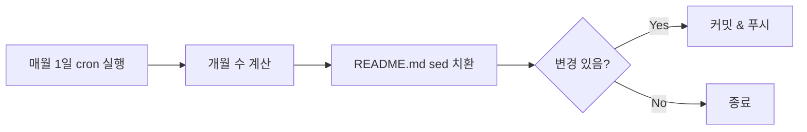

# GitHub 프로필에 N년 M개월차 자동 갱신하기

## GitHub 프로필 README

GitHub는 사용자명과 동일한 이름의 저장소에 `README.md`를 두면, 프로필 페이지 상단에 해당 내용을 표시해준다. 개발자들은 이 공간을 활용해 자기소개, 기술 스택, GitHub 통계 등을 보여준다.

나도 프로필에 경력 정보를 표시하고 있는데, "2년 11개월차"처럼 **현재 시점 기준 경력 기간**을 함께 적어두었다. 문제는 이걸 매달 수동으로 바꿔야 한다는 것이다. 까먹으면 한두 달 밀리기도 하고, 사소하지만 은근히 신경 쓰인다.

그래서 GitHub Actions의 `schedule` 트리거를 사용해서 매월 1일에 자동으로 갱신되도록 만들었다.

## 전체 구조

동작 흐름은 단순하다.

1. 매월 1일 UTC 00:00에 워크플로우 실행
2. 입사일로부터 현재까지의 개월 수 계산
3. README.md에서 기존 `(N년 M개월차)` 또는 `(M개월차)` 패턴을 찾아서 새 값으로 교체
4. 변경사항이 있으면 커밋 & 푸시



## 워크플로우 전체 코드

`.github/workflows/period.yml` 파일 하나로 완성된다.

```yaml
name: Update Work Period

on:
  schedule:
    - cron: "0 0 1 * *" # 매월 1일 00:00 UTC 실행
  workflow_dispatch: # 수동 실행 지원

jobs:
  update:
    runs-on: ubuntu-latest
    steps:
      - uses: actions/checkout@v4

      - name: Calculate years and months
        run: |
          START_DATE="2023-03-02"
          TODAY=$(date +%Y-%m-%d)

          MONTHS=$(( ( $(date -d $TODAY +%s) - $(date -d $START_DATE +%s) ) / 2629743 ))
          YEARS=$((MONTHS / 12))
          REMAINS=$((MONTHS % 12))

          if [ $YEARS -gt 0 ]; then
            PERIOD="${YEARS}년 ${REMAINS}개월차"
          else
            PERIOD="${REMAINS}개월차"
          fi

          echo "새로운 값: $PERIOD"

          sed -i -E \
            "s/\([0-9]+년 [0-9]+개월차\)/(${PERIOD})/g; \
             s/\([0-9]+개월차\)/(${PERIOD})/g" \
            README.md

      - name: Commit changes
        run: |
          git config --global user.name "github-actions[bot]"
          git config --global user.email \
            "github-actions[bot]@users.noreply.github.com"
          if [ -n "$(git status --porcelain)" ]; then
            git commit -am "chore: update work period"
            git push
          else
            echo "No changes to commit"
          fi
```

## 단계별 해설

### 1. 트리거 설정

```yaml
on:
  schedule:
    - cron: "0 0 1 * *"
  workflow_dispatch:
```

`schedule`의 cron 표현식 `0 0 1 * *`은 **매월 1일 00:00 UTC**에 실행한다는 의미다. 한국 시간으로는 오전 9시다.

`workflow_dispatch`를 함께 넣어두면 Actions 탭에서 수동으로도 실행할 수 있어서 테스트에 편리하다.

| 필드 | 값 | 의미 |
|------|-----|------|
| 분 | 0 | 0분 |
| 시 | 0 | 0시 (UTC) |
| 일 | 1 | 1일 |
| 월 | * | 매월 |
| 요일 | * | 모든 요일 |

### 2. 개월 수 계산

```bash
START_DATE="2023-03-02"
TODAY=$(date +%Y-%m-%d)

MONTHS=$(( ( $(date -d $TODAY +%s) - $(date -d $START_DATE +%s) ) / 2629743 ))
YEARS=$((MONTHS / 12))
REMAINS=$((MONTHS % 12))
```

- `date -d $DATE +%s`: 날짜를 **Unix 타임스탬프**(초 단위)로 변환
- `2629743`: 한 달의 평균 초 수 (365.25일 / 12)
- 나누기로 전체 개월 수를 구한 뒤, 12로 나눈 몫이 년, 나머지가 개월

### 3. sed로 README 치환

```bash
sed -i -E \
  "s/\([0-9]+년 [0-9]+개월차\)/(${PERIOD})/g; \
   s/\([0-9]+개월차\)/(${PERIOD})/g" \
  README.md
```

두 가지 패턴을 처리한다.

| 패턴 | 매칭 예시 |
|------|----------|
| `\([0-9]+년 [0-9]+개월차\)` | `(2년 11개월차)` |
| `\([0-9]+개월차\)` | `(8개월차)` |

1년 미만일 때는 "N개월차"만, 1년 이상이면 "N년 M개월차"로 표시하는데, 어떤 형식이든 새 값으로 바뀐다.

### 4. 조건부 커밋

```bash
if [ -n "$(git status --porcelain)" ]; then
  git commit -am "chore: update work period"
  git push
else
  echo "No changes to commit"
fi
```

`git status --porcelain`은 변경사항이 없으면 빈 문자열을 반환한다. 이를 활용해 **실제 변경이 있을 때만** 커밋한다. 매월 1일에 실행되니 거의 항상 값이 바뀌지만, 수동 실행 시 중복 커밋을 방지하는 안전장치다.

커밋 주체는 `github-actions[bot]`으로 설정해서 자동화임을 명확히 했다.

## README 작성 시 주의할 점

워크플로우가 `(N년 M개월차)` 패턴을 sed로 찾아 바꾸기 때문에, README에서 해당 패턴의 형식을 정확히 맞춰야 한다.

```markdown
<!-- 이렇게 작성하면 자동 갱신됨 -->
**TILS.ai** 2023.03.02 ~ 재직중 (2년 11개월차)

<!-- 괄호 안의 숫자+년/개월차 패턴이 핵심 -->
```

다른 곳에 같은 패턴이 있으면 함께 바뀌니, 경력 기간 표시에만 이 형식을 사용하는 것이 좋다.

## 실제 커밋 히스토리

이 워크플로우는 2025년 8월 20일에 처음 만들었다. 이후 매월 1일에 자동 커밋이 생성되고 있다.

```
01f68dc chore: update work period  (2026-02-01)
86226f9 chore: update work period  (2026-01-01)
74a5ab7 chore: update work period  (2025-12-01)
8f3293e chore: update work period  (2025-11-01)
0dfe527 chore: update work period  (2025-10-01)
```

한 번 설정해두면 더 이상 신경 쓸 필요가 없다.

## 응용: 여러 경력을 관리하는 경우

경력이 여러 개라면 `START_DATE`를 배열로 관리하고, 각각에 대해 계산 후 치환하면 된다. 또는 고유한 HTML 주석을 마커로 활용할 수도 있다.

```markdown
<!-- period:tils -->2023.03.02 ~ 재직중 (2년 11개월차)<!-- /period:tils -->
```

```bash
# 마커 기반으로 특정 구간만 치환
sed -i -E \
  "s/(<!-- period:tils -->.*)\([0-9]+년 [0-9]+개월차\)/\1(${PERIOD})/" \
  README.md
```

## 마무리

간단한 shell 스크립트와 GitHub Actions cron만으로 프로필 경력 정보를 자동으로 관리할 수 있다. 핵심은 세 가지다.

1. **schedule cron**: 매월 1일 자동 실행
2. **date + 산술 연산**: 입사일 기준 개월 수 계산
3. **sed 패턴 치환**: README에서 해당 부분만 교체

설정 파일 하나, 커밋 한 번이면 끝이다.
