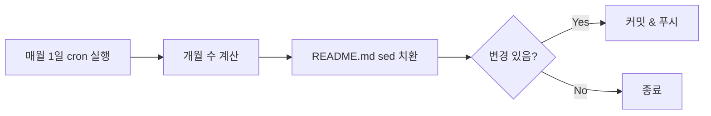
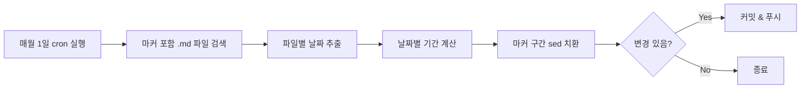

# GitHub 프로필에 N년 M개월차 자동 갱신하기

## GitHub 프로필 README

GitHub는 사용자명과 동일한 이름의 저장소에 `README.md`를 두면, 프로필 페이지 상단에 해당 내용을 표시해준다. 개발자들은 이 공간을 활용해 자기소개, 기술 스택, GitHub 통계 등을 보여준다.

나도 프로필에 경력 정보를 표시하고 있는데, "2년 11개월차"처럼 **현재 시점 기준 경력 기간**을 함께 적어두었다. 문제는 이걸 매달 수동으로 바꿔야 한다는 것이다. 까먹으면 한두 달 밀리기도 하고, 사소하지만 은근히 신경 쓰인다.

그래서 GitHub Actions의 `schedule` 트리거를 사용해서 매월 1일에 자동으로 갱신되도록 만들었다.

## 전체 구조

동작 흐름은 단순하다.

1. 매월 1일 UTC 00:00에 워크플로우 실행
2. 입사일로부터 현재까지의 개월 수 계산
3. README.md에서 기존 `(N년 M개월차)` 또는 `(M개월차)` 패턴을 찾아서 새 값으로 교체
4. 변경사항이 있으면 커밋 & 푸시



## 워크플로우 전체 코드

`.github/workflows/period.yml` 파일 하나로 완성된다.

<small style={{ color: "#fc516f" }}>\* 이후 [마커 기반으로 개선한 버전](#개선-마커-기반-자동-감지)도 있다.</small>

```yaml
name: Update Work Period

on:
  schedule:
    - cron: "0 0 1 * *" # 매월 1일 00:00 UTC 실행
  workflow_dispatch: # 수동 실행 지원

jobs:
  update:
    runs-on: ubuntu-latest
    steps:
      - uses: actions/checkout@v4

      - name: Calculate years and months
        run: |
          START_DATE="2023-03-02"
          TODAY=$(date +%Y-%m-%d)

          MONTHS=$(( ( $(date -d $TODAY +%s) - $(date -d $START_DATE +%s) ) / 2629743 ))
          YEARS=$((MONTHS / 12))
          REMAINS=$((MONTHS % 12))

          if [ $YEARS -gt 0 ]; then
            PERIOD="${YEARS}년 ${REMAINS}개월차"
          else
            PERIOD="${REMAINS}개월차"
          fi

          echo "새로운 값: $PERIOD"

          sed -i -E \
            "s/\([0-9]+년 [0-9]+개월차\)/(${PERIOD})/g; \
             s/\([0-9]+개월차\)/(${PERIOD})/g" \
            README.md

      - name: Commit changes
        run: |
          git config --global user.name "github-actions[bot]"
          git config --global user.email \
            "github-actions[bot]@users.noreply.github.com"
          if [ -n "$(git status --porcelain)" ]; then
            git commit -am "chore: update work period"
            git push
          else
            echo "No changes to commit"
          fi
```

## 단계별 해설

### 1. 트리거 설정

```yaml
on:
  schedule:
    - cron: "0 0 1 * *"
  workflow_dispatch:
```

`schedule`의 cron 표현식 `0 0 1 * *`은 **매월 1일 00:00 UTC**에 실행한다는 의미다. 한국 시간으로는 오전 9시다.

`workflow_dispatch`를 함께 넣어두면 Actions 탭에서 수동으로도 실행할 수 있어서 테스트에 편리하다.

| 필드 | 값  | 의미      |
| ---- | --- | --------- |
| 분   | 0   | 0분       |
| 시   | 0   | 0시 (UTC) |
| 일   | 1   | 1일       |
| 월   | \*  | 매월      |
| 요일 | \*  | 모든 요일 |

### 2. 개월 수 계산

```bash
START_DATE="2023-03-02"
TODAY=$(date +%Y-%m-%d)

MONTHS=$(( ( $(date -d $TODAY +%s) - $(date -d $START_DATE +%s) ) / 2629743 ))
YEARS=$((MONTHS / 12))
REMAINS=$((MONTHS % 12))
```

- `date -d $DATE +%s`: 날짜를 **Unix 타임스탬프**(초 단위)로 변환
- `2629743`: 한 달의 평균 초 수 (365.25일 / 12)
- 나누기로 전체 개월 수를 구한 뒤, 12로 나눈 몫이 년, 나머지가 개월

### 3. sed로 README 치환

```bash
sed -i -E \
  "s/\([0-9]+년 [0-9]+개월차\)/(${PERIOD})/g; \
   s/\([0-9]+개월차\)/(${PERIOD})/g" \
  README.md
```

두 가지 패턴을 처리한다.

| 패턴                        | 매칭 예시        |
| --------------------------- | ---------------- |
| `\([0-9]+년 [0-9]+개월차\)` | `(2년 11개월차)` |
| `\([0-9]+개월차\)`          | `(8개월차)`      |

1년 미만일 때는 "N개월차"만, 1년 이상이면 "N년 M개월차"로 표시하는데, 어떤 형식이든 새 값으로 바뀐다.

### 4. 조건부 커밋

```bash
if [ -n "$(git status --porcelain)" ]; then
  git commit -am "chore: update work period"
  git push
else
  echo "No changes to commit"
fi
```

`git status --porcelain`은 변경사항이 없으면 빈 문자열을 반환한다. 이를 활용해 **실제 변경이 있을 때만** 커밋한다. 매월 1일에 실행되니 거의 항상 값이 바뀌지만, 수동 실행 시 중복 커밋을 방지하는 안전장치다.

커밋 주체는 `github-actions[bot]`으로 설정해서 자동화임을 명확히 했다.

## README 작성 시 주의할 점

워크플로우가 `(N년 M개월차)` 패턴을 sed로 찾아 바꾸기 때문에, README에서 해당 패턴의 형식을 정확히 맞춰야 한다.

```markdown
<!-- 이렇게 작성하면 자동 갱신됨 -->

**{회사명}** 2023.03.02 ~ 재직중 (2년 11개월차)

<!-- 괄호 안의 숫자+년/개월차 패턴이 핵심 -->
```

다른 곳에 같은 패턴이 있으면 함께 바뀌니, 경력 기간 표시에만 이 형식을 사용하는 것이 좋다.

## 실제 커밋 히스토리

이 워크플로우는 2025년 8월 20일에 처음 만들었다. 이후 매월 1일에 자동 커밋이 생성되고 있다.

```
01f68dc chore: update work period  (2026-02-01)
86226f9 chore: update work period  (2026-01-01)
74a5ab7 chore: update work period  (2025-12-01)
8f3293e chore: update work period  (2025-11-01)
0dfe527 chore: update work period  (2025-10-01)
```

한 번 설정해두면 더 이상 신경 쓸 필요가 없다.

## 응용: 여러 경력을 관리하는 경우

경력이 여러 개라면 `START_DATE`를 배열로 관리하고, 각각에 대해 계산 후 치환하면 된다. 또는 고유한 HTML 주석을 마커로 활용할 수도 있다.

```markdown
<!-- period:company-a -->2023.03.02 ~ 재직중 (2년 11개월차)<!-- /period:company-a -->
```

```bash
# 마커 기반으로 특정 구간만 치환
sed -i -E \
  "s/(<!-- period:company-a -->.*)\([0-9]+년 [0-9]+개월차\)/\1(${PERIOD})/" \
  README.md
```

## 개선: 마커 기반 자동 감지

위의 아이디어를 발전시켜 워크플로우 자체를 개선했다. 날짜를 워크플로우에 하드코딩하는 대신, **마크다운 파일 안의 HTML 주석 마커에서 날짜를 자동으로 추출**하는 방식이다.

### 기존 방식의 한계

| 한계            | 설명                                                                           |
| --------------- | ------------------------------------------------------------------------------ |
| 하드코딩된 날짜 | `START_DATE`가 워크플로우에 고정되어 있어서, 경력 추가 시 워크플로우 수정 필요 |
| 단일 파일       | `README.md`만 대상으로 고정                                                    |
| 단일 경력       | 하나의 입사일만 처리 가능                                                      |
| 정규식 리스크   | `(N년 M개월차)` 패턴이 다른 곳에도 매칭될 수 있음                              |

### 개선된 마커 형식

입사일을 워크플로우가 아닌 마크다운 파일에 직접 기록한다.

```markdown
**{회사명}** 2023.03.02 ~ 재직중 <!-- period:2023-03-02 -->(2년 11개월차)<!-- /period -->
```

`<!-- period:YYYY-MM-DD -->` ... `<!-- /period -->` 마커 쌍이 핵심이다. 입사일이 마커 자체에 포함되어 있어서 워크플로우에서 날짜를 관리할 필요가 없다. GitHub에서 렌더링 시 HTML 주석은 보이지 않으므로 `(2년 11개월차)`만 깔끔하게 표시된다.

### 개선된 워크플로우

```yaml
name: Update Work Period

on:
  schedule:
    - cron: "0 0 1 * *"
  workflow_dispatch:

jobs:
  update:
    runs-on: ubuntu-latest
    steps:
      - uses: actions/checkout@v4

      - name: Update periods from markers
        run: |
          TODAY=$(date +%Y-%m-%d)
          TODAY_SEC=$(date -d "$TODAY" +%s)

          FILES=$(grep -rl '<!-- period:' . --include='*.md' || true)

          if [ -z "$FILES" ]; then
            echo "No period markers found"
            exit 0
          fi

          for file in $FILES; do
            grep -oP '<!-- period:\K[0-9]{4}-[0-9]{2}-[0-9]{2}' "$file" \
              | sort -u | while read -r DATE; do
              START_SEC=$(date -d "$DATE" +%s)
              MONTHS=$(( (TODAY_SEC - START_SEC) / 2629743 ))
              YEARS=$((MONTHS / 12))
              REMAINS=$((MONTHS % 12))

              if [ $YEARS -gt 0 ]; then
                PERIOD="${YEARS}년 ${REMAINS}개월차"
              else
                PERIOD="${REMAINS}개월차"
              fi

              sed -i "s|<!-- period:${DATE} -->.*<!-- /period -->|<!-- period:${DATE} -->(${PERIOD})<!-- /period -->|g" "$file"

              echo "$file: $DATE → ($PERIOD)"
            done
          done

      - name: Commit changes
        run: |
          git config --global user.name "anveloper"
          git config --global user.email "90117593+anveloper@users.noreply.github.com"
          if [ -n "$(git status --porcelain)" ]; then
            git commit -am "chore: update work period"
            git push
          else
            echo "No changes to commit"
          fi
```

### 개선된 흐름



### 단계별 해설

#### 1. 마커가 있는 파일 검색

```bash
FILES=$(grep -rl '<!-- period:' . --include='*.md' || true)
```

`grep -rl`로 `<!-- period:` 문자열이 포함된 `.md` 파일을 재귀적으로 검색한다. 마커가 하나도 없으면 빈 문자열이 되어 바로 종료한다.

#### 2. 파일별 날짜 추출

```bash
grep -oP '<!-- period:\K[0-9]{4}-[0-9]{2}-[0-9]{2}' "$file" | sort -u
```

- `-oP`: Perl 정규식으로 매칭되는 부분만 출력
- `\K`: 앞쪽 매칭(`<!-- period:`)을 결과에서 제외하고 날짜만 추출
- `sort -u`: 같은 날짜가 여러 번 나와도 한 번만 처리

#### 3. 마커 구간 치환

```bash
sed -i "s|<!-- period:${DATE} -->.*<!-- /period -->|<!-- period:${DATE} -->(${PERIOD})<!-- /period -->|g" "$file"
```

마커 쌍 사이의 내용만 정확하게 교체한다. 구분자로 `|`를 사용한 이유는 마커 안에 `/`와 `>`가 포함되어 있기 때문이다.

### 변경점 비교

| 항목         | 이전                  | 개선 후                   |
| ------------ | --------------------- | ------------------------- |
| 날짜 관리    | 워크플로우에 하드코딩 | 마크다운 마커에 기록      |
| 대상 파일    | `README.md` 고정      | 모든 `.md` 파일 자동 검색 |
| 다중 경력    | 미지원 (단일 날짜)    | 파일당 복수 마커 지원     |
| 치환 방식    | 정규식 패턴 매칭      | 마커 쌍 기반 정확한 치환  |
| 경력 추가 시 | 워크플로우 수정 필요  | 마크다운에 마커만 추가    |
| 커밋 주체    | `github-actions[bot]` | 본인 계정                 |

### README 작성 예시

```markdown
## 경력

| 회사         | 기간             | 경력                                                     |
| ------------ | ---------------- | -------------------------------------------------------- |
| **{회사명}** | 2023.03 ~ 재직중 | <!-- period:2023-03-02 -->(2년 11개월차)<!-- /period --> |
```

경력이 추가되면 마크다운에 마커만 하나 더 넣으면 된다. 워크플로우는 건드릴 필요가 없다.

> **주의**: 퇴사한 경력에 마커를 달면 오늘 기준으로 기간이 계속 갱신된다. 퇴사한 경력은 마커 없이 고정값으로 작성하는 것이 좋다.

## 마무리

간단한 shell 스크립트와 GitHub Actions cron만으로 프로필 경력 정보를 자동으로 관리할 수 있다.

처음에는 하드코딩된 날짜와 정규식 패턴 매칭으로 시작했지만, HTML 주석 마커 기반으로 개선하면서 더 유연하고 안전한 구조가 되었다. 핵심은 네 가지다.

1. **schedule cron**: 매월 1일 자동 실행
2. **date + 산술 연산**: 입사일 기준 개월 수 계산
3. **HTML 주석 마커**: 날짜를 마크다운에 직접 기록하고 자동 감지
4. **마커 쌍 sed 치환**: 정확한 위치만 교체

설정 파일 하나, 마크다운에 마커 한 줄이면 끝이다.
