# Agentic Workflow: 디자인 패턴과 아키텍처

## Agentic Workflow란

기존 LLM 사용 방식은 "질문 → 답변"의 단일 턴(Single-turn)이다. 사용자가 프롬프트를 입력하면 LLM이 텍스트를 생성하고, 그것으로 끝이다. 복잡한 작업은 사람이 직접 여러 번 반복하며 결과를 조합해야 한다.

Agentic Workflow는 이와 다르다. LLM이 **자율적으로 판단하고, 도구를 사용하며, 반복적으로 문제를 해결**하는 워크플로우다.

| 구분 | 기존 방식 (Single-turn) | Agentic Workflow |
| --- | --- | --- |
| 흐름 | 질문 → 답변 (1회) | 질문 → 계획 → 실행 → 관찰 → 반복 |
| 도구 사용 | 없음 | 외부 도구/API 호출 |
| 자율성 | 수동적 응답 | 능동적 판단과 행동 |
| 복잡도 | 단순 질의응답 | 다단계 복합 작업 |
| 결과물 | 텍스트 응답 | 실제 작업 수행 결과 |

### 왜 Agentic Workflow인가

LLM에는 근본적인 한계가 있다. 학습 데이터 이후의 정보를 모르고, 텍스트 생성만 가능하며, 복잡한 문제를 한 번에 해결하기 어렵고, 환각(Hallucination)이 발생한다. Agentic Workflow는 이를 도구 사용, 코드 실행, 반복적 개선, 자기 검증으로 극복한다.

Andrew Ng은 2024년 이렇게 말했다.

> *"AI agentic workflows will drive massive AI progress this year"*

핵심 메시지는 세 가지다. GPT-3.5를 Agentic으로 쓰면 GPT-4 Zero-shot보다 성능이 좋을 수 있고, 한 번에 완벽한 답을 기대하지 말고 반복적으로 개선해야 하며, 이는 사람이 초안 → 검토 → 수정 → 완성하는 과정과 동일하다.

## 핵심 구성 요소

Agentic Workflow는 4가지 구성 요소로 이루어진다.

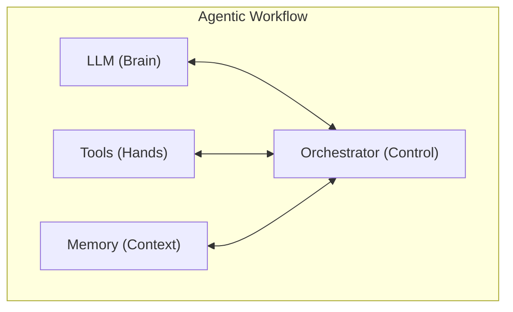

| 구성 요소 | 역할 | 예시 |
| --- | --- | --- |
| **LLM (Brain)** | 자연어 이해, 추론, 계획 수립 | Claude, GPT |
| **Tools (Hands)** | 외부 도구/API 호출 | 웹 검색, 코드 실행, 파일 조작 |
| **Memory (Context)** | 단기/장기/작업 기억 | 대화 컨텍스트, 벡터 DB |
| **Orchestrator (Control)** | 전체 흐름 관리, 에러 핸들링 | 루프, 분기, 종료 조건 |

기본 루프는 **Plan → Act → Observe**다. 사용자 입력을 받으면 계획을 세우고, 도구를 호출하거나 코드를 실행하고, 결과를 관찰한다. 완료될 때까지 이 루프를 반복한다.

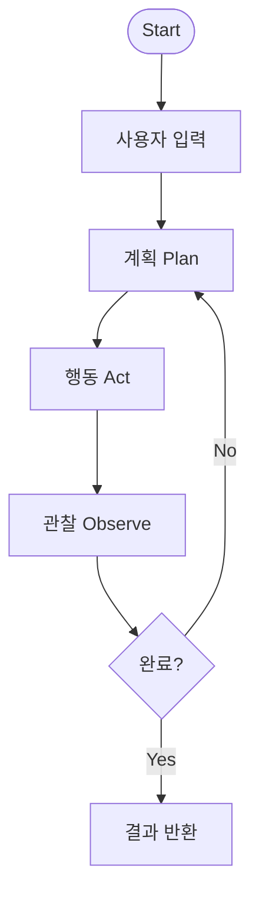

## 4가지 Agentic 디자인 패턴

Andrew Ng이 제안한 4가지 핵심 패턴이다. 각각 독립적으로 사용할 수도 있고, 조합하여 더 강력한 시스템을 만들 수도 있다.

### Reflection (자기 성찰)

LLM이 자신의 출력을 **스스로 평가하고 개선**하는 패턴이다.

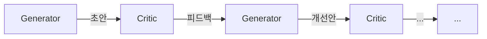

동작 방식은 생성(Generate) → 평가(Critique) → 개선(Refine) → 반복이다. 품질 기준을 충족할 때까지 이 과정을 반복한다.

변형으로 **Self-Refine**(단일 LLM이 생성과 평가를 모두 수행), **Reflexion**(실행 결과를 관찰하여 반영), **CRITIC**(도구로 결과를 검증 후 개선)이 있다.

### Tool Use (도구 사용)

LLM이 **외부 도구를 호출하여 능력을 확장**하는 패턴이다.

| 도구 유형 | 예시 | 역할 |
| --- | --- | --- |
| 정보 검색 | Web Search, RAG | 최신 정보 획득 |
| 코드 실행 | Python REPL, Sandbox | 계산, 데이터 처리 |
| 파일 조작 | Read/Write/Edit | 파일 생성 및 수정 |
| 외부 API | REST API, GraphQL | 서비스 연동 |
| 데이터베이스 | SQL, Vector DB | 데이터 조회/저장 |

Anthropic이 제안한 **MCP(Model Context Protocol)**는 다양한 도구를 통일된 인터페이스로 LLM에 연결하는 표준 프로토콜이다.

### Planning (계획 수립)

LLM이 복잡한 작업을 **단계별로 분해하고 순서를 정하는** 패턴이다. 가장 대표적인 구현이 **ReAct(Reasoning + Acting)**다.

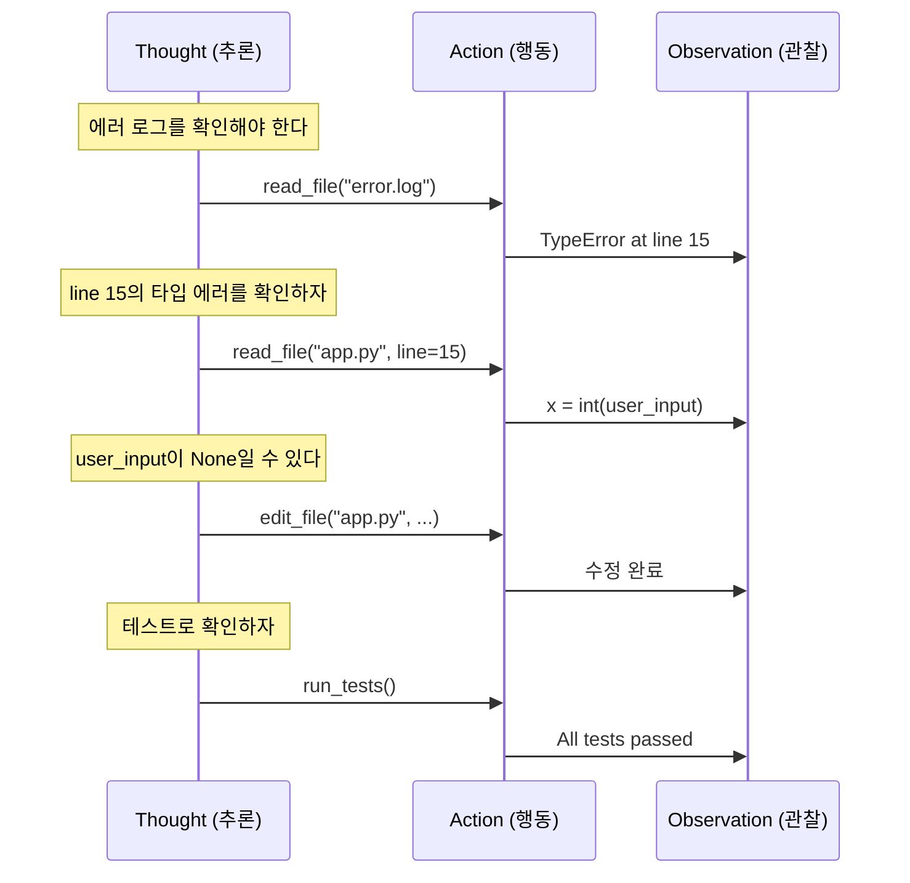

Thought(추론) → Action(행동) → Observation(관찰)을 반복하며 단계적으로 문제를 해결한다.

### Multi-Agent (다중 에이전트)

여러 에이전트가 **역할을 나누어 협업**하는 패턴이다. 구조 유형은 세 가지다.

**수평적 협업**: 에이전트들이 동등한 위치에서 상호작용한다.

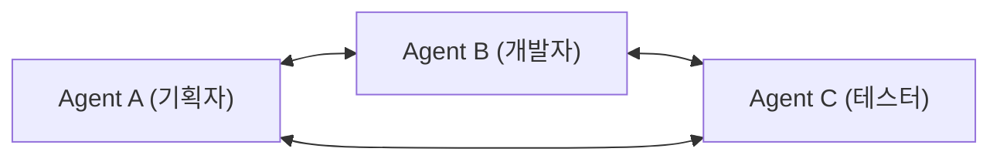

**계층적 관리**: Supervisor가 Worker들에게 작업을 분배한다.

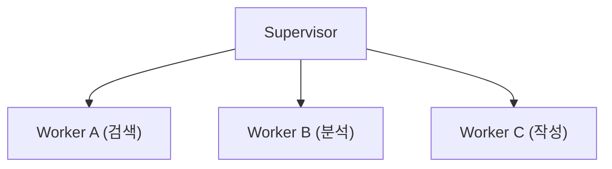

**파이프라인**: 에이전트들이 순차적으로 작업을 전달한다.

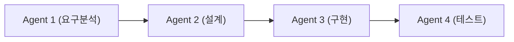

실제 프로젝트에서는 이 4가지 패턴을 **조합**하여 사용한다. 예를 들어 Agent A가 Planning + Tool Use를 수행하고, Agent B가 Reflection + Tool Use로 결과를 검증하는 식이다.

## Agent 아키텍처 스펙트럼

Anthropic의 "Building Effective Agents" 가이드는 Agent 아키텍처를 복잡도 순으로 정리한다. 핵심 원칙은 **가능한 한 가장 단순한 구조를 사용하라**는 것이다.

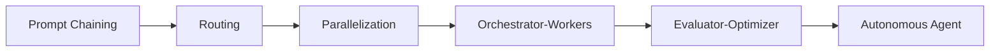

### Level 1: Prompt Chaining

LLM 호출을 **순차적으로 연결**하는 가장 단순한 구조다. 이전 출력이 다음 입력이 된다. 각 단계 사이에 게이트(검증)를 추가할 수 있다.

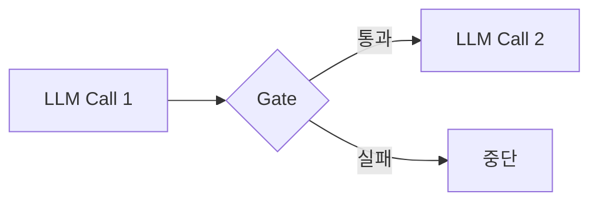

마케팅 카피 생성(특징 분석 → 키워드 추출 → 카피 생성)처럼 단계가 명확하고 독립적인 작업에 적합하다.

### Level 2: Routing

입력을 **분류하여 적절한 처리 경로로 분기**하는 구조다. 각 경로에 전문화된 프롬프트나 모델을 사용할 수 있어 비용을 최적화할 수 있다.

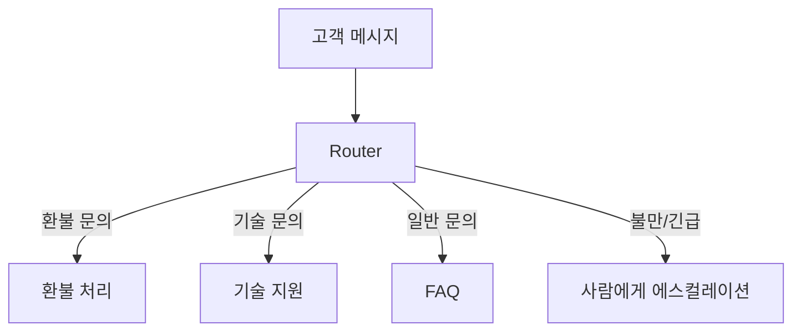

### Level 3: Parallelization

여러 LLM 호출을 **동시에 실행**하는 구조다. 두 가지 방식이 있다.

**Sectioning(분할)**: 하나의 입력을 여러 관점에서 동시에 처리한다. 예를 들어 코드 리뷰에서 보안, 성능, 가독성 검사를 병렬로 수행한다.

**Voting(투표)**: 같은 입력에 여러 LLM이 독립적으로 답변하고, 다수결로 최종 결과를 정한다.

### Level 4: Orchestrator-Workers

중앙 오케스트레이터가 **동적으로 작업을 분배**하고 결과를 종합하는 구조다.

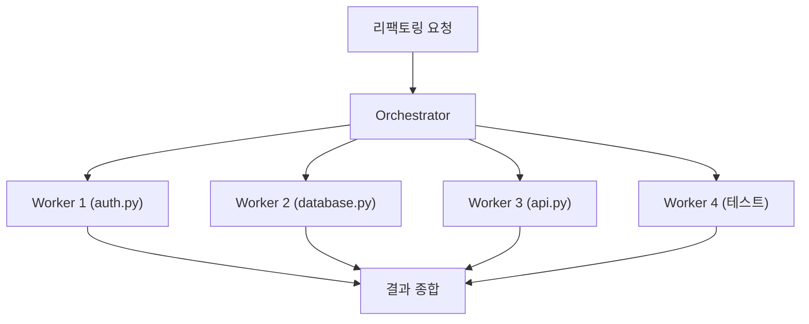

Prompt Chaining과의 핵심 차이는 단계가 사전에 고정되지 않고 **입력에 따라 동적으로 결정**된다는 점이다.

| 구분 | Prompt Chaining | Orchestrator-Workers |
| --- | --- | --- |
| 단계 | 사전 고정 | 동적으로 결정 |
| 병렬 | 불가 | 가능 |
| 유연성 | 낮음 | 높음 |

### Level 5: Evaluator-Optimizer

생성과 평가를 **분리**하여 반복적으로 품질을 향상시키는 구조다. Reflection 패턴의 구체적인 아키텍처 구현이다.

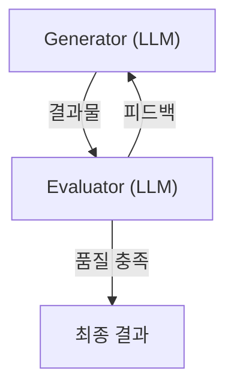

Generator와 Evaluator를 다른 프롬프트나 모델로 분리하여 각각의 역할에 최적화할 수 있다.

### 아키텍처 선택 가이드

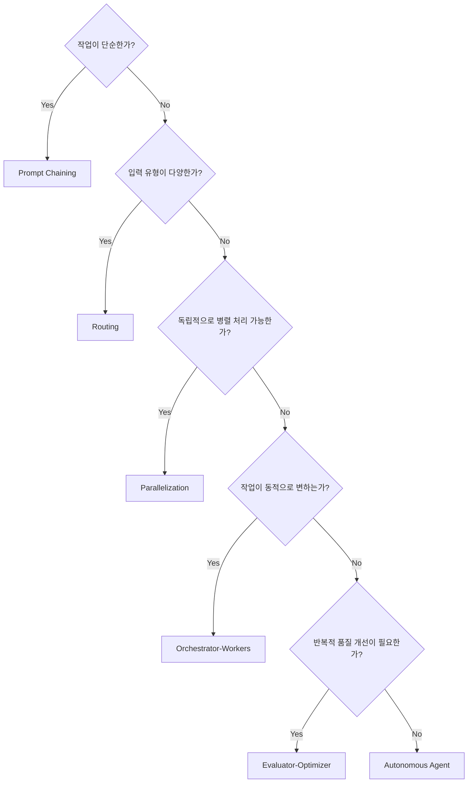

| 아키텍처 | 핵심 | 적합한 경우 |
| --- | --- | --- |
| Prompt Chaining | 순차 연결 | 단계가 명확한 작업 |
| Routing | 분류 후 분기 | 입력 유형이 다양 |
| Parallelization | 동시 실행 | 독립적 하위 작업 |
| Orchestrator-Workers | 동적 분배 | 복잡하고 유동적인 작업 |
| Evaluator-Optimizer | 반복 개선 | 높은 품질 요구 |

## 실사례: Genspark AI

Genspark은 2025년 AI 검색 엔진에서 **Agentic AI Workspace**로 전환한 대표적인 사례다. 4가지 패턴을 모두 조합하여 L4 자율 에이전트를 구현했다.

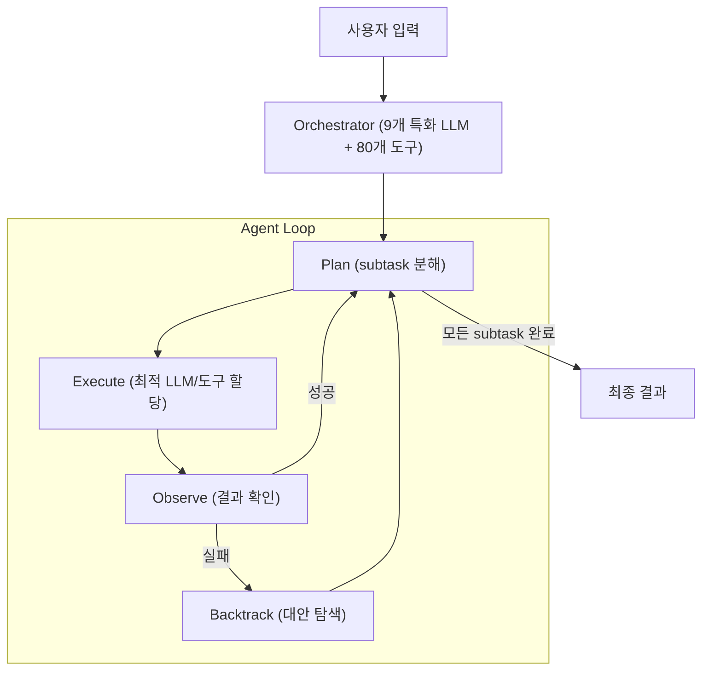

| 패턴 | 적용 방식 |
| --- | --- |
| Planning | 사용자 입력을 자동으로 subtask로 분해 |
| Tool Use | 80개 이상 도구 통합 (전화, 슬라이드, 영상, 검색 등) |
| Multi-Agent (Routing) | 9개의 특화 LLM 중 작업에 최적인 모델로 자동 라우팅 |
| Reflection | Backtrack 단계에서 실패 시 대안 접근법을 탐색하여 재시도 |

핵심 철학은 **"Less Control, More Tools"**다. 사전 정의된 워크플로우 대신 Agent가 자율적으로 경로를 결정하고, 실패해도 Backtrack으로 복구한다. 이 접근법으로 출시 45일 만에 ARR $36M을 달성하고 Series B $275M 투자를 유치했다.

## 정리

Agentic Workflow의 4가지 디자인 패턴은 각각 품질 향상(Reflection), 능력 확장(Tool Use), 복잡도 관리(Planning), 확장성(Multi-Agent)을 담당한다. Agent 아키텍처는 Prompt Chaining부터 Autonomous Agent까지 복잡도 스펙트럼이 존재하며, 핵심 원칙은 **가능한 한 가장 단순한 구조를 사용하는 것**이다.

실제 프로덕션에서는 이 패턴과 아키텍처를 조합하여 사용한다. Genspark AI처럼 Planning + Tool Use + Routing + Reflection을 결합하면 단일 패턴으로는 달성할 수 없는 수준의 자율성과 품질을 확보할 수 있다. 중요한 것은 복잡한 아키텍처를 무작정 도입하는 것이 아니라, 문제의 성격에 맞는 최소한의 구조를 선택하는 것이다.
