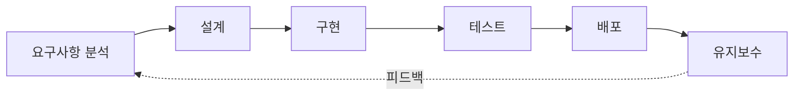
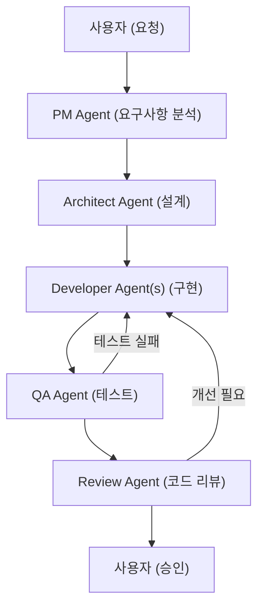
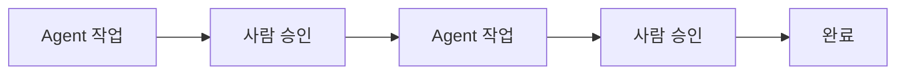
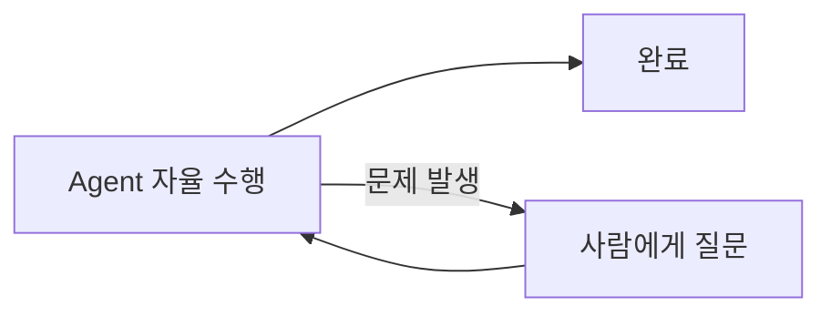
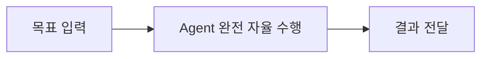
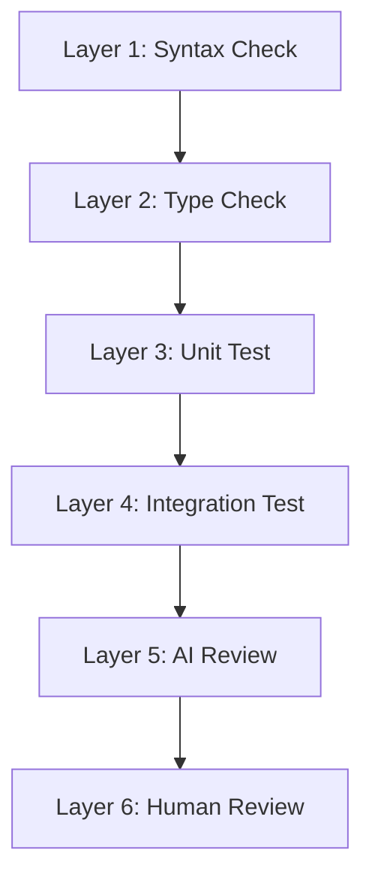

# SDLC와 AI: AI-Assisted에서 Agentic까지

## SDLC 개요

**SDLC(Software Development Life Cycle)**는 소프트웨어를 계획, 개발, 테스트, 배포, 유지보수하는 전체 생명주기 프로세스다.



| 단계          | 활동                    | 산출물                |
| ------------- | ----------------------- | --------------------- |
| 요구사항 분석 | 무엇을 만들 것인가 정의 | 요구사항 명세서 (SRS) |
| 설계          | 어떻게 만들 것인가 설계 | 아키텍처/설계 문서    |
| 구현          | 실제 코드 작성          | 소스 코드             |
| 테스트        | 품질 검증               | 테스트 결과 보고서    |
| 배포          | 사용자에게 전달         | 릴리스, 배포 환경     |
| 유지보수      | 버그 수정, 기능 개선    | 패치, 업데이트        |

### SDLC 모델의 발전

SDLC 모델은 Waterfall → Agile → DevOps로 발전해왔다. 핵심은 **피드백 주기의 단축**이다.

| 기준        | Waterfall        | Agile           | DevOps         |
| ----------- | ---------------- | --------------- | -------------- |
| 접근 방식   | 순차적           | 반복적          | 지속적         |
| 변경 대응   | 어려움           | 유연            | 매우 유연      |
| 피드백 주기 | 프로젝트 종료 시 | 스프린트(2-4주) | 실시간         |
| 팀 구조     | 단계별 분리      | 크로스펑셔널    | Dev + Ops 통합 |
| 릴리스      | 한 번            | 스프린트마다    | 지속적         |

Waterfall은 순차적이고 문서 중심이라 되돌아가기 어렵다. Agile은 반복적이고 점진적이라 변화에 유연하다. DevOps는 Dev와 Ops를 통합하고 CI/CD 자동화로 무한 루프를 구현한다. 여기에 AI가 가세하면서 새로운 패러다임이 등장했다.

## AI-Assisted SDLC

모든 SDLC 단계에 AI가 **공동 작업자(Co-pilot)**로 참여하는 방식이다.

| 단계     | AI 핵심 활용            | 도구 예시               | 효과           |
| -------- | ----------------------- | ----------------------- | -------------- |
| 요구분석 | 요구사항 자동 정리/분류 | ChatGPT, Claude         | 시간 절약      |
| 설계     | 아키텍처 제안, ERD 설계 | Claude, GPT             | 의사결정 지원  |
| 구현     | 코드 생성/완성/리뷰     | Copilot, Cursor, Claude | 생산성 향상    |
| 테스트   | 테스트 케이스 자동 생성 | AI + pytest             | 커버리지 향상  |
| 배포     | CI/CD 설정, IaC 생성    | AI + GitHub Actions     | 안정성 향상    |
| 유지보수 | 버그 분석, 코드 설명    | AI + Sentry             | 대응 속도 향상 |

GitHub의 2024년 조사 결과에 따르면, AI 코딩 도구는 코딩 속도 55% 향상, 개발자 만족도 75% 향상의 효과가 있다.

하지만 한계도 분명하다.

- AI 생성 코드는 반드시 검토가 필요하다
- 보안 취약점이 포함될 수 있다
- 비즈니스 로직의 정확성은 사람이 판단해야 한다
- AI에 과도한 의존은 기술 역량 저하 위험이 있다

AI-Assisted는 AI가 보조하고 **사람이 주도**한다. 매 단계마다 사람이 개입하고, 도구 사용도 제한적이다.

## Agentic SDLC

Agentic SDLC는 AI-Assisted의 다음 단계다. AI Agent가 **자율적으로** SDLC 단계를 수행한다.

두 방식의 차이를 예시로 보면 명확하다.

```
AI-Assisted SDLC:
  사람: "이 함수에 대한 테스트 코드 작성해줘"
  AI:   "여기 테스트 코드입니다" (1회 응답)
  사람:  (직접 실행, 수정, 반복)

Agentic SDLC:
  사람: "이 프로젝트의 테스트 커버리지를 80%로 올려줘"
  Agent: 1. 현재 커버리지 측정 (65%)
         2. 커버리지 낮은 모듈 식별
         3. 테스트 코드 작성
         4. 테스트 실행 → 실패 시 수정
         5. 커버리지 재측정 (78%)
         6. 추가 테스트 작성
         7. 최종 확인 (82%) ✓
```

| 구분      | AI-Assisted       | Agentic                    |
| --------- | ----------------- | -------------------------- |
| 주도권    | 사람              | AI Agent                   |
| 상호작용  | 매 단계 사람 개입 | 목표만 제시하면 자율 수행  |
| 복잡도    | 단일 작업         | 다단계 복합 작업           |
| 도구 사용 | 제한적            | 적극적 (파일, 터미널, API) |
| 반복      | 사람이 반복       | Agent가 자동 반복          |

### 전체 흐름

Agentic SDLC의 전체 흐름은 멀티 에이전트 파이프라인으로 구성된다.



사용자가 자연어로 요청하면 PM Agent가 요구사항을 분석하고, Architect Agent가 설계하고, Developer Agent가 코드를 작성하고, QA Agent가 테스트하고, Review Agent가 코드 리뷰한다. 테스트 실패나 리뷰 피드백이 있으면 Developer Agent로 돌아가 수정한다.

## 현실의 Agentic SDLC 도구

현재 사용 가능한 Agentic SDLC 도구를 비교한다.

| 도구                        | 형태                 | 핵심 기능                                            |
| --------------------------- | -------------------- | ---------------------------------------------------- |
| **Claude Code** (Anthropic) | 터미널 기반 AI Agent | 코드베이스 탐색/수정, Git 연동, MCP, 자율적 디버깅   |
| **Cursor / Windsurf**       | AI-native IDE        | 멀티파일 에이전트, 코드베이스 인덱싱, 에러 자동 수정 |
| **Devin** (Cognition)       | AI Software Engineer | 독립 개발 환경, 이슈→코드→테스트→PR 자율 수행        |
| **SWE-Agent / OpenHands**   | 오픈소스 SWE Agent   | GitHub Issue 자동 해결, SWE-Bench 상위 성능          |

Claude Code는 터미널에서 동작하는 AI Agent로, 코드베이스를 직접 탐색하고 수정하며 Git과 연동한다. Cursor와 Windsurf는 IDE 자체에 AI를 통합한 형태다. Devin은 독립적인 개발 환경에서 이슈부터 PR까지 자율적으로 수행하는 AI 소프트웨어 엔지니어를 지향한다.

## 아키텍처 패턴

Agentic SDLC를 적용할 때 사람의 개입 수준에 따라 세 가지 패턴이 있다.

### Human-in-the-Loop

핵심 결정 지점에서 사람이 승인한다.



프로덕션 코드, 중요 시스템에 적합하다. Agent가 작업을 수행하되, 주요 결정 지점마다 사람의 검토와 승인을 받는다.

### Agent-in-the-Loop

Agent가 자율적으로 수행하고, 문제가 발생했을 때만 사람이 개입한다.



반복적 작업, 테스트 작성, 코드 마이그레이션에 적합하다. 대부분의 작업을 Agent가 자율적으로 처리하고, 판단이 어려운 상황에서만 사람에게 도움을 요청한다.

### Fully Autonomous

Agent가 처음부터 끝까지 자율적으로 수행한다.



프로토타이핑, 보일러플레이트, PoC에 적합하다. 빠른 결과물이 필요하지만, 결과 품질 검증이 반드시 필요하다.

## 품질 보장: 다층 검증 레이어

Agentic SDLC에서 품질을 보장하려면 다층 검증 레이어가 필수다.



문법 검사 → 타입 검사 → 단위 테스트 → 통합 테스트 → AI 리뷰 → 사람 리뷰 순으로 자동화 레이어를 쌓는다. 앞 단계에서 기계적으로 검증할 수 있는 부분을 최대한 걸러내고, 마지막에 사람이 비즈니스 로직과 아키텍처 관점에서 최종 검토한다.

## 현재 수준 (2025-2026)

Agentic SDLC의 현재 성숙도를 솔직하게 평가하면 다음과 같다.

| 영역               | 수준                       |
| ------------------ | -------------------------- |
| 코드 생성/수정     | 실용 수준                  |
| 테스트 작성        | 실용 수준                  |
| 버그 수정          | 간단한 버그 자율 해결 가능 |
| 아키텍처 설계      | 보조 수준                  |
| 요구분석           | 정리/정형화 수준           |
| 복잡한 시스템 설계 | 아직 사람 필요             |
| 비즈니스 결정      | 사람 영역                  |

코드 생성, 테스트 작성, 단순 버그 수정은 이미 실용적으로 사용 가능하다. 하지만 복잡한 시스템 설계나 비즈니스 결정은 여전히 사람의 영역이다. 현재 Agentic SDLC는 "모든 것을 대체"하는 것이 아니라, **사람이 더 중요한 일에 집중할 수 있도록 반복적이고 기계적인 작업을 자동화**하는 단계에 있다.

## 정리

SDLC에 AI가 참여하는 방식은 크게 세 단계로 진화하고 있다.

| 단계                 | 설명                                | 사람의 역할    |
| -------------------- | ----------------------------------- | -------------- |
| AI-Assisted          | AI가 Co-pilot으로 각 단계 보조      | 모든 단계 주도 |
| Agentic (HITL)       | Agent가 자율 수행, 핵심 결정은 사람 | 의사결정, 승인 |
| Agentic (Autonomous) | Agent가 완전 자율 수행              | 결과 검증      |

현실적인 선택은 **Human-in-the-Loop**다. Agent에게 반복적인 작업을 맡기고, 아키텍처 결정과 비즈니스 로직 검증은 사람이 담당한다. 다층 검증 레이어를 통해 품질을 보장하면서, AI의 생산성 향상 효과를 최대한 활용하는 것이 현 시점에서 가장 합리적인 접근이다.
