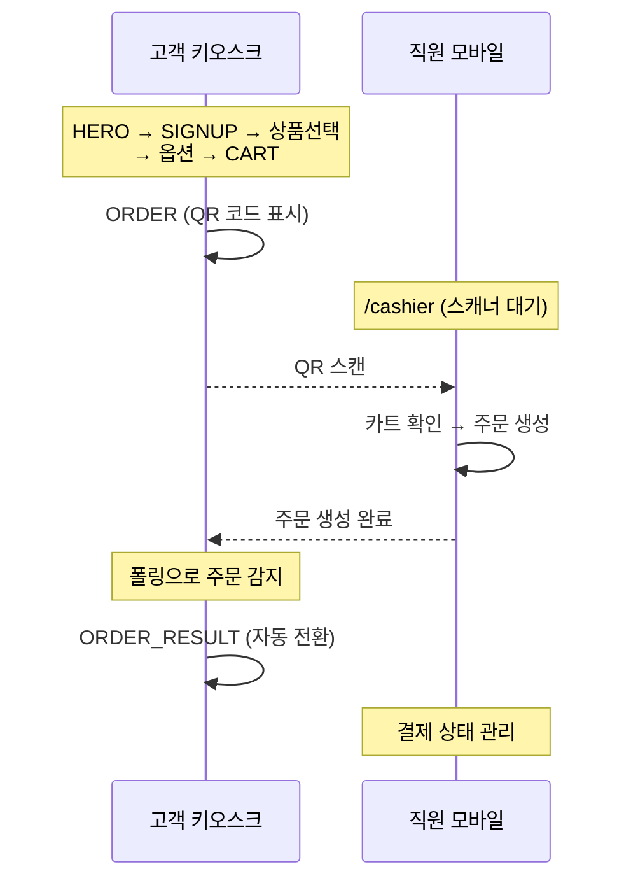
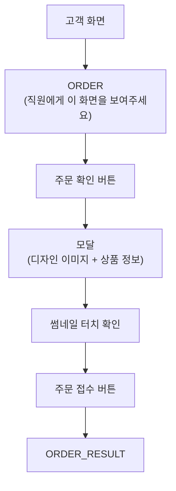
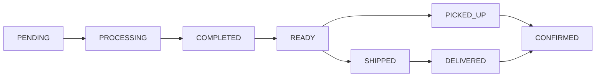

# 주문형 커스텀 상품 플랫폼의 주문 흐름 설계

## 기본 주문 흐름

커스텀 상품(티셔츠, 폰케이스 등) 플랫폼의 주문 흐름은 일반 이커머스와 다르다. 상품 선택 후 **옵션 선택 → 디자인 편집 → 장바구니 → 주문서**라는 고유한 단계가 있다.


각 단계는 페이지 타입으로 정의되어 있고, 활성화/비활성화가 가능하다. 비활성화된 페이지는 자동으로 건너뛴다.

### afterAddAction 분기

옵션 선택 완료 후 동작을 테넌트 설정으로 제어한다.

| 설정값     | 동작               | API                      |
| ---------- | ------------------ | ------------------------ |
| `cart`     | 장바구니로 이동    | `POST /api/cart/items`   |
| `continue` | 상품 목록으로 복귀 | `POST /api/cart/items`   |
| `order`    | 바로 주문 생성     | `POST /api/orders/quick` |

`order` 모드에서는 장바구니를 거치지 않고 즉시 주문이 생성된다.

## 현장결제 (On-Site Payment)

팝업 스토어에서 고객이 키오스크로 상품을 선택하고, 매장에서 직접 결제하는 워크플로우다.

`TenantPolicyConfig`에서 활성화한다.

```typescript
interface TenantPolicyConfig {
  onSitePayment?: boolean; // 현장결제 활성화
  onSitePaymentMethod?: "qr" | "direct"; // 결제 방식
  pickupStorageDays?: number; // 현장 보관 기간 (기본: 14일)
}
```

### QR 코드 방식

별도의 직원 기기(cashier)로 고객의 QR 코드를 스캔하여 주문을 처리한다.



QR 데이터는 JSON을 직접 인코딩한다.

```json
{ "v": 1, "t": "tenantName", "c": "customerId", "i": ["cartItemId1"] }
```

고객 화면은 3초마다 카트 아이템 수를 폴링하여, 0이 되면(직원이 주문 생성) 자동으로 주문 완료 페이지로 전환한다.

### 직접 확인 방식

별도 기기 없이, 고객 화면에서 직원이 직접 주문 내역과 디자인을 확인하고 접수한다.



디자인 확인은 **썸네일 터치 방식**을 도입했다. 직원이 각 아이템의 디자인 이미지를 직접 탭해야 하며, 모든 아이템을 확인해야 "주문 접수" 버튼이 활성화된다. 이미지 드래그/선택을 방지하여 실수로 확인되는 것을 막는다.

### ORDER_FORM 비활성화 시

ORDER_FORM 페이지가 비활성화되면 장바구니에서 직접 주문을 처리한다. 장바구니 UI가 변경되어 2단계 플로우를 제공한다.

- **STEP 01**: 옵션/수량 선택 (개별 카드 레이아웃, 큰 이미지)
- **STEP 02**: "매장 직원에게 본 화면을 보여주세요" 안내
- "디자인 확인하기" 버튼 → `OrderConfirmModal`

## 디자인 퍼스트 모드

기존 흐름은 "옵션 선택 → 디자인"이지만, 디자인 퍼스트 모드에서는 순서를 뒤바꾼다.

| 항목                | 기존                    | 디자인 퍼스트    |
| ------------------- | ----------------------- | ---------------- |
| 에디터 진입         | 옵션 선택 완료 후       | 상품 클릭 즉시   |
| 템플릿 결정         | 선택한 SKU 기반         | 첫 번째 SKU 고정 |
| 옵션 선택 위치      | 상품 상세 페이지        | 장바구니         |
| 옵션 변경 시 디자인 | 초기화 (템플릿 변경 시) | 유지             |

### 첫 번째 SKU 자동 선택

옵션 트리(`optionTree`)를 `optionOrder` 순서대로 탐색하여 첫 번째 리프 노드(SKU)를 찾는다. 이 SKU의 템플릿으로 에디터를 즉시 실행한다.

```
optionOrder: ["사이즈", "색상"]
optionTree: { "S": { "화이트": { sku: "TS-S-W", price: 20000 } ... } }
→ 첫 번째 SKU: "TS-S-W" (S / 화이트)
```

### 장바구니에서 옵션 변경

디자인 퍼스트 모드에서는 장바구니 아이템이 옵션 미선택(`selectedOptions: {}`) 상태로 들어간다. 장바구니의 "옵션 변경" 기능으로 실제 옵션을 선택한다.

**단일 옵션 그룹**인 경우(예: "사이즈"만 있는 상품), 하단 모달 대신 카드 내에 인라인 셀렉트 박스를 렌더링한다.

**다중 옵션 미선택 시**에는 시각적 강조(amber 색상 바)를 표시하고, 주문 시도 시 해당 아이템의 옵션 변경 시트를 자동으로 열어준다.

핵심 결정: 옵션 변경 시 디자인 초기화를 **건너뛴다**. 기존에는 `pcSeqno`(디자인 템플릿 ID)가 달라지면 확인 모달이 표시되었지만, 디자인 퍼스트 모드에서는 기존 `wepnpSeqno`와 미리보기 이미지를 유지한다.

## 배송비 정책

주문 생성 시 4가지 배송비 정책을 지원한다.

| 정책         | `Order.shippingAmount`   | `OrderItem.shippingPrice` |
| ------------ | ------------------------ | ------------------------- |
| `combined`   | 최대 배송비 1회          | 0                         |
| `individual` | 전체 배송비 합계         | 각 아이템 배송비          |
| `free`       | 0                        | 0                         |
| `freeOver`   | 기준 미달 시 최대 배송비 | 0                         |

## 주문 상태 관리



현장결제 활성화 시 `SHIPPED`, `DELIVERED` 상태를 숨긴다 (배송이 없으므로). 상태 전이 규칙은 양방향이 가능하되, 논리적으로 맞는 전이만 허용한다.

READY 상태 전환 시 알림톡이 자동 발송된다 ("상품 준비 완료, 매장에서 수령 가능합니다").

## 마무리

이 시스템의 설계 원칙은 **같은 코드베이스에서 다양한 주문 흐름을 지원**하는 것이다. 온라인 배송, 현장 수령(QR), 현장 확인(직접), 디자인 퍼스트 — 모두 같은 `Order`, `OrderItem`, `Payment` 모델을 사용하면서 `TenantPolicyConfig`의 플래그 조합으로 분기한다.

페이지 활성화/비활성화와 결합하면 더 많은 변형이 가능하다. CART를 비활성화하면 빠른 주문, ORDER_FORM을 비활성화하면 장바구니 직접 주문이 된다. 이런 조합적 유연성은 초기 설계 시 의도한 것이 아니라, 팝업 스토어 현장의 다양한 요구사항에 대응하면서 자연스럽게 발전한 결과다.
