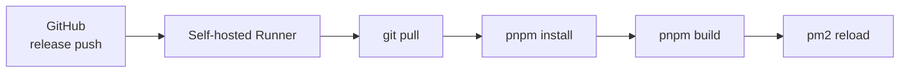
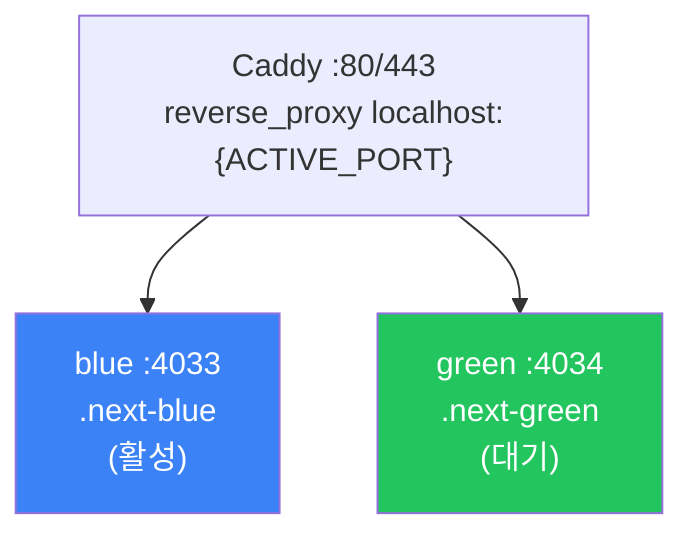
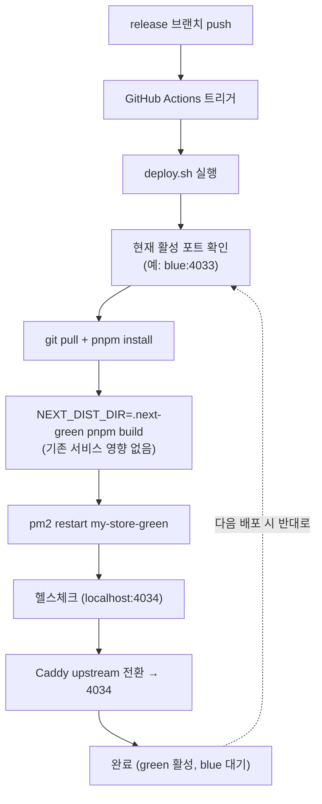

# PM2 + Caddy 무중단 배포 (Blue-Green)

## 문제: 빌드 중 서비스 중단

기존 배포 방식은 단순했다.



단일 인스턴스(`my-store`, 포트 4033)에서 `pm2 reload`로 graceful restart하지만, 두 가지 문제가 있었다.

1. Next.js 빌드가 `.next/` 디렉토리를 덮어쓰므로, **빌드 중 기존 프로세스에 영향**
2. 빌드 중 **메모리 부족(OOM) 발생 시 서비스 중단**

## 목표

- 빌드 중에도 기존 서비스 정상 운영
- 새 버전 준비 완료 후 즉시 전환
- 실패 시 즉시 롤백
- Docker 없이 PM2 + Caddy만으로 구현

## 아키텍처



| 항목          | blue            | green            |
| ------------- | --------------- | ---------------- |
| 포트          | 4033            | 4034             |
| 빌드 디렉토리 | `.next-blue`    | `.next-green`    |
| PM2 이름      | `my-store-blue` | `my-store-green` |

## 구현

### Next.js 빌드 디렉토리 분리

`next.config.ts`에서 환경변수로 `distDir`을 제어한다.

```typescript
const nextConfig: NextConfig = {
  distDir: process.env.NEXT_DIST_DIR || ".next",
};
```

이렇게 하면 blue 빌드와 green 빌드가 서로 다른 디렉토리를 사용하므로, 빌드 중에 실행 중인 인스턴스에 영향을 주지 않는다.

### PM2 설정

```javascript
// ecosystem.config.js
module.exports = {
  apps: [
    {
      name: "my-store-blue",
      script: "npx",
      args: "next start -p 4033",
      cwd: "/home/my-store",
      interpreter: "none",
      env: { NEXT_DIST_DIR: ".next-blue", NODE_ENV: "production" },
    },
    {
      name: "my-store-green",
      script: "npx",
      args: "next start -p 4034",
      cwd: "/home/my-store",
      interpreter: "none",
      env: { NEXT_DIST_DIR: ".next-green", NODE_ENV: "production" },
    },
  ],
};
```

`script: "npx"` + `interpreter: "none"`을 사용해야 한다. `script: "node_modules/.bin/next"`로 설정하면 PM2가 쉘 스크립트를 Node.js로 실행하려 해서 `SyntaxError`가 발생한다.

### Caddy 포트 변수화

Caddyfile의 고정 포트를 환경변수로 변경한다.

```caddyfile
store.example.com {
    reverse_proxy localhost:{$ACTIVE_PORT}
}

*.example-store.com {
    tls { on_demand }
    reverse_proxy localhost:{$ACTIVE_PORT}
}

:443 {
    tls { on_demand }
    reverse_proxy localhost:{$ACTIVE_PORT}
}
```

환경변수 파일과 systemd override로 주입한다.

```bash
# 환경변수 파일
echo "ACTIVE_PORT=4033" | sudo tee /etc/caddy/active-port.env

# systemd override
sudo systemctl edit caddy
# [Service]
# EnvironmentFile=/etc/caddy/active-port.env

sudo systemctl daemon-reload
sudo systemctl restart caddy
```

### 배포 스크립트

```bash
#!/bin/bash
# /home/my-store/deploy.sh
set -e
export HOME=/root

APP_DIR="/home/my-store"
BLUE_PORT=4033
GREEN_PORT=4034
PORT_FILE="/etc/caddy/active-port.env"
cd "$APP_DIR"

# 현재 활성 포트 확인
CURRENT_PORT=$(grep -oP 'ACTIVE_PORT=\K\d+' "$PORT_FILE")

if [ "$CURRENT_PORT" = "$BLUE_PORT" ]; then
  TARGET_NAME="my-store-green"
  TARGET_PORT=$GREEN_PORT
  TARGET_DIST=".next-green"
else
  TARGET_NAME="my-store-blue"
  TARGET_PORT=$BLUE_PORT
  TARGET_DIST=".next-blue"
fi

echo "현재 활성: :$CURRENT_PORT → 배포 대상: $TARGET_NAME (:$TARGET_PORT)"

# 1. 코드 업데이트 + 의존성 설치
git restore . && git pull origin release
pnpm install --frozen-lockfile

# 2. 대상 빌드 (기존 서비스 영향 없음)
NEXT_DIST_DIR="$TARGET_DIST" pnpm build

# 3. 대상 인스턴스 재시작
pm2 restart "$TARGET_NAME"

# 4. 헬스체크 (최대 30초)
for i in $(seq 1 30); do
  STATUS=$(curl -s -o /dev/null -w '%{http_code}' \
    "http://localhost:$TARGET_PORT" 2>/dev/null || echo "000")
  if [ "$STATUS" = "200" ] || [ "$STATUS" = "307" ]; then
    echo "헬스체크 성공 (HTTP $STATUS)"
    break
  fi
  [ "$i" = "30" ] && echo "헬스체크 실패!" && exit 1
  sleep 1
done

# 5. Caddy 전환
echo "ACTIVE_PORT=$TARGET_PORT" | sudo tee "$PORT_FILE" > /dev/null
sudo systemctl reload caddy

echo "배포 완료: :$TARGET_PORT"
```

### 롤백 스크립트

```bash
#!/bin/bash
# /home/my-store/rollback.sh
set -e
PORT_FILE="/etc/caddy/active-port.env"
CURRENT_PORT=$(grep -oP 'ACTIVE_PORT=\K\d+' "$PORT_FILE")

ROLLBACK_PORT=$( [ "$CURRENT_PORT" = "4033" ] && echo 4034 || echo 4033 )

# 이전 인스턴스 생존 확인
STATUS=$(curl -s -o /dev/null -w '%{http_code}' \
  "http://localhost:$ROLLBACK_PORT" 2>/dev/null || echo "000")
[ "$STATUS" = "000" ] && echo "이전 인스턴스 응답 없음. 롤백 불가." && exit 1

echo "ACTIVE_PORT=$ROLLBACK_PORT" | sudo tee "$PORT_FILE" > /dev/null
sudo systemctl reload caddy
echo "롤백 완료: :$ROLLBACK_PORT"
```

Caddy의 `systemctl reload`만으로 트래픽이 전환되므로, 롤백은 수 초 내에 완료된다.

### GitHub Actions

```yaml
name: Deploy to Production
on:
  push:
    branches: [release]
jobs:
  deploy:
    runs-on: self-hosted
    steps:
      - name: Deploy (Blue-Green)
        run: |
          cd /home/my-store
          bash deploy.sh
```

## 주의사항

| 항목               | 내용                                                                                                                     |
| ------------------ | ------------------------------------------------------------------------------------------------------------------------ |
| 디스크             | `.next-blue` + `.next-green` 두 빌드 유지 (각 ~200MB)                                                                    |
| 메모리             | 빌드 중 2.5GB + 실행 중 인스턴스 메모리 필요                                                                             |
| node_modules       | 공유 디렉토리이므로 `pnpm install`이 실행 중 인스턴스에 영향 가능 — frozen lockfile로 최소화                             |
| HOME 환경변수      | GitHub Actions self-hosted runner에서 `HOME`이 미설정될 수 있음. PM2가 프로세스를 찾지 못하므로 `export HOME=/root` 필수 |
| 스크립트 자기 갱신 | `deploy.sh` 내부에서 `git pull`로 파일이 업데이트되지만, 이미 bash 메모리에 로드된 스크립트에는 반영되지 않음            |

## 배포 흐름 요약



## 마무리

Docker 없이도 Blue-Green 배포를 구현할 수 있다. 핵심은 세 가지다.

1. **빌드 디렉토리 분리**: `NEXT_DIST_DIR` 환경변수로 `.next-blue`/`.next-green` 사용
2. **포트 분리**: PM2로 두 인스턴스를 다른 포트에서 실행
3. **트래픽 전환**: Caddy의 환경변수 파일 + `systemctl reload`로 즉시 전환

이 구성에서 빌드는 대기 중인 인스턴스의 디렉토리에서 수행되므로, 빌드 중에도 활성 인스턴스는 영향을 받지 않는다. 헬스체크를 통과해야만 트래픽이 전환되므로, 빌드 실패나 OOM 시에도 기존 서비스가 유지된다.
