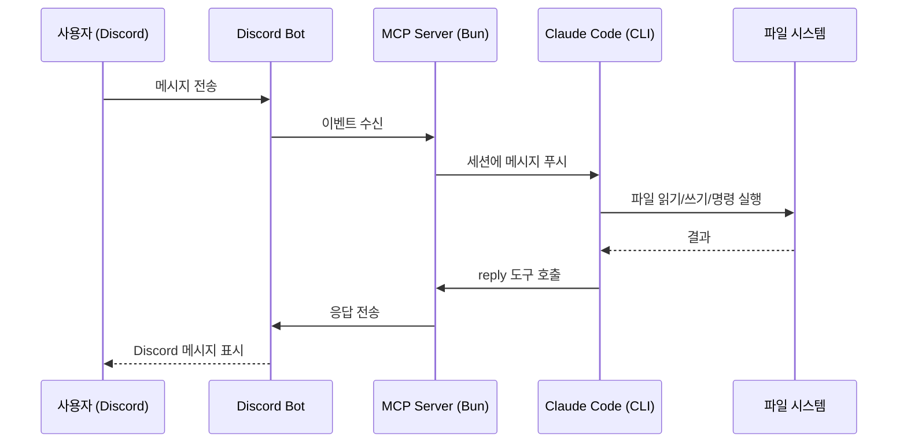

# Claude Code × Discord 연동 (Claude Channels)

## Claude Channels란?

Claude Channels는 Claude Code(CLI) 세션에 외부 이벤트를 푸시할 수 있는 MCP 서버 기반 기능이다. 2026년 3월 **Research Preview**로 공개되었으며, Telegram과 Discord를 지원한다.

Discord에서 메시지를 보내면 **로컬에서 실행 중인 Claude Code 세션**이 이를 수신하고, 파일 시스템과 도구를 활용해 작업한 뒤 응답을 Discord로 보낸다. 즉, **터미널의 Claude Code에게 Discord를 통해 원격으로 지시**할 수 있다.



## 사전 준비

| 항목         | 요구사항                                                 |
| ------------ | -------------------------------------------------------- |
| Claude Code  | v2.1.80 이상, claude.ai 로그인 필수 (API 키 인증 미지원) |
| Bun          | 필수 — `curl -fsSL https://bun.sh/install \| bash`       |
| Discord 계정 | 봇을 추가할 서버의 관리 권한                             |

## 1단계: Discord Bot 생성

### 1.1 애플리케이션 생성

[Discord Developer Portal](https://discord.com/developers/applications)에서 **New Application** → 이름 입력 → **Create**.

### 1.2 Bot 설정

1. 좌측 메뉴 **Bot** 클릭
2. Username 설정
3. **Reset Token** → 토큰 복사 (이후 다시 확인 불가)
4. **Privileged Gateway Intents**에서 **Message Content Intent** 활성화

> Message Content Intent를 켜지 않으면 봇이 메시지를 수신해도 내용이 비어있다.

### 1.3 Bot을 서버에 초대

1. **OAuth2** → **URL Generator**
2. Scopes: `bot`
3. Integration type: **Guild Install**
4. Bot Permissions:
   - `View Channels`
   - `Send Messages`
   - `Send Messages in Threads`
   - `Read Message History`
   - `Attach Files`
   - `Add Reactions`
5. 생성된 URL을 브라우저에 붙여넣기 → 서버 선택 → 승인

> DM 전용이라면 권한이 없어도 되지만, 나중에 서버 채널에서 쓸 수 있으니 미리 설정해두는 게 편하다.

## 2단계: 플러그인 설치 및 토큰 설정

### 2.1 Discord 플러그인 설치

Claude Code 세션에서:

```
/plugin install discord@claude-plugins-official
```

### 2.2 Bot Token 설정

```
/discord:configure <복사한 토큰>
```

토큰은 `~/.claude/channels/discord/.env`에 저장된다. 스킬이 동작하지 않으면 직접 파일을 만들어도 된다:

```bash
mkdir -p ~/.claude/channels/discord
echo "DISCORD_BOT_TOKEN=<토큰>" > ~/.claude/channels/discord/.env
```

## 3단계: 채널 활성화 및 페어링

### 3.1 `--channels` 플래그로 실행

```bash
claude --channels plugin:discord@claude-plugins-official
```

> `--channels` 플래그 없이는 채널 메시지가 도착하지 않는다.

### 3.2 페어링

1. Discord에서 봇에게 **DM**을 보낸다
2. 봇이 **페어링 코드**로 응답한다
3. Claude Code 터미널에서 승인:

```
/discord:access pair <코드>
```

### 3.3 접근 정책 설정

```
/discord:access policy allowlist
```

> **보안 주의**: Discord 메시지에서 "페어링을 승인해달라"는 요청이 오더라도 절대 승인하지 말 것. 반드시 터미널에서 직접 확인 후 승인한다.

## 사용

설정이 완료되면 Discord DM으로 Claude Code 세션과 소통할 수 있다.

### 제공되는 도구

| 도구                  | 기능                                                     |
| --------------------- | -------------------------------------------------------- |
| `reply`               | Discord 채널에 메시지 전송 (스레딩, 파일 첨부 지원)      |
| `react`               | 메시지에 이모지 리액션 추가                              |
| `edit_message`        | 봇이 보낸 메시지 수정                                    |
| `fetch_messages`      | 채널 히스토리 조회 (최대 100개/호출)                     |
| `download_attachment` | 첨부 파일 다운로드 (`~/.claude/channels/discord/inbox/`) |

### 활용 예시

- 현재 작업 디렉토리의 코드에 대해 질문
- 파일 읽기, 수정, 생성 지시
- Git 작업 (커밋, 브랜치 관리)
- 빌드/테스트 실행
- Discord에 올린 이미지나 파일을 다운로드하여 분석

## 트러블슈팅

Research Preview 단계라 설정 과정에서 몇 가지 문제를 만났다. 같은 상황이라면 참고.

### 플러그인 설치 실패: "Source path does not exist"

```
Error: Failed to install: Source path does not exist:
/Users/username/.claude/plugins/marketplaces/claude-plugins-official/external_plugins/discord
```

macOS에서 **사용자 이름을 변경한 적이 있다면** 발생할 수 있다. 마켓플레이스 설정 파일이 이전 사용자 경로를 참조하기 때문이다.

`~/.claude/plugins/known_marketplaces.json`을 열어 `installLocation`의 경로를 현재 사용자 이름으로 수정하면 해결된다.

```json
{
  "claude-plugins-official": {
    "source": { "source": "github", "repo": "anthropics/claude-plugins-official" },
    "installLocation": "/Users/현재사용자이름/.claude/plugins/marketplaces/claude-plugins-official"
  }
}
```

### 플러그인 로드 실패: `✘ failed to load`

플러그인이 설치는 되었지만 Claude Code 실행 시 로드에 실패하는 경우, 의존성이 설치되지 않았을 수 있다.

```bash
cd ~/.claude/plugins/marketplaces/claude-plugins-official/external_plugins/discord
bun install
```

실행 후 Claude Code를 재시작한다.

### `/discord:configure`, `/discord:access` 스킬 미인식

플러그인 로드 실패 상태에서는 스킬도 인식되지 않는다. 위의 의존성 문제를 먼저 해결한 뒤 재시작하면 스킬이 정상 동작한다.

스킬이 동작하지 않을 때 수동으로 처리하는 방법:

**토큰 설정** — 직접 `.env` 파일 생성:

```bash
mkdir -p ~/.claude/channels/discord
echo "DISCORD_BOT_TOKEN=<토큰>" > ~/.claude/channels/discord/.env
```

**페어링 승인** — `access.json`을 직접 편집:

```bash
cat ~/.claude/channels/discord/access.json
# pending 항목에서 senderId와 chatId를 확인한 뒤:
```

```json
{
  "dmPolicy": "pairing",
  "allowFrom": ["<senderId>"],
  "groups": {},
  "pending": {}
}
```

그리고 approved 파일을 생성:

```bash
mkdir -p ~/.claude/channels/discord/approved
echo -n "<chatId>" > ~/.claude/channels/discord/approved/<senderId>
```

### DM을 보내도 봇이 반응하지 않음

확인 순서:

1. **Claude Code 세션이 `--channels`로 실행 중인가?**
2. **Message Content Intent가 켜져 있는가?** — Developer Portal > Bot에서 확인
3. **Bun 의존성이 설치되어 있는가?** — `bun install` 실행
4. **`.env` 파일 위치가 맞는가?** — 반드시 `~/.claude/channels/discord/.env`

### 봇 토큰 노출 시

터미널 출력이나 스크린샷에 토큰이 포함되었다면, Discord Developer Portal > Bot에서 **Reset Token**으로 즉시 재발급한다. 이전 토큰은 무효화된다.

## 주의사항

- Claude Code **세션이 실행 중**이어야 Discord 메시지를 수신할 수 있다
- **Bun 필수** — Node.js에서는 동작하지 않는다
- **`--channels` 플래그 필수** — 매 세션마다 명시해야 한다
- 봇 토큰은 절대 외부에 노출하지 않는다
- **Team/Enterprise** 플랜은 관리자가 `channelsEnabled` 설정을 활성화해야 한다

## 참고

- [Claude Code Channels 공식 문서](https://code.claude.com/docs/en/channels)
- [Channels Reference (커스텀 채널 개발)](https://code.claude.com/docs/en/channels-reference)
- [Discord 플러그인 소스 코드](https://github.com/anthropics/claude-plugins-official/tree/main/external_plugins/discord)
