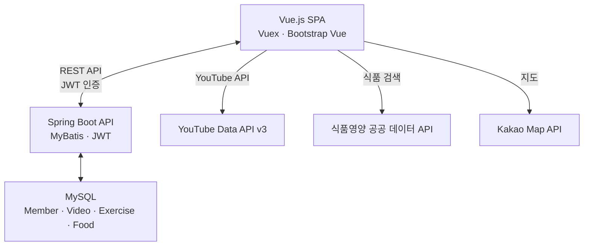

# SSAFIT

## 개요

SSAFIT은 운동 영상, 운동 기록, 식단 관리를 하나로 통합한 피트니스 웹 애플리케이션입니다. YouTube API로 운동 영상을 검색·관리하고, 캘린더 기반으로 운동 기록을 추적하며, 공공 데이터 API를 활용한 식단 칼로리 관리까지 제공합니다.

SSAFY 7기 관통 프로젝트로 2인 페어로 약 5주간 개발했습니다.

## 주요 기능

### 운동 영상 관리

- YouTube API v3 연동으로 피트니스 영상 검색·등록
- 부위별 필터링 (가슴, 등, 하체 등 partCode 기반)
- 키워드 검색, 조회수 트래킹
- 찜(즐겨찾기) 기능으로 영상 북마크
- 영상별 댓글·대댓글

### 운동 기록 추적

- 캘린더 기반 일별 운동 로그 기록
- 운동별 무게·횟수·세트·볼륨 입력
- 운동 부위별 분류 및 개인 최고 기록 관리
- Chart.js 기반 운동 진행 상황 시각화

### 식단 관리

- 사용자 신체 정보 기반 일일 권장 칼로리 계산
- 식품영양 공공 데이터 API로 음식 검색
- 탄수화물·단백질·지방·칼로리 영양소 추적
- 일일 섭취량 대비 목표 칼로리 모니터링

### 소셜·편의 기능

- JWT 기반 회원 인증 (로그인·회원가입)
- 팔로우/언팔로우, 마이페이지
- Kakao Map API 연동 주변 체육시설 검색

## 기술 스택

| 분류 | 기술 |
|------|------|
| Frontend | Vue.js 2, Vuex, Vue Router, Bootstrap Vue, Chart.js, Axios |
| Backend | Java 8, Spring Boot 2.6, MyBatis, JWT |
| Database | MySQL 8.0 (13개 테이블, 6회 스키마 이터레이션) |
| 외부 API | YouTube API v3, 식품영양 공공 데이터 API, Kakao Map API |

## 아키텍처

## 담당 역할

프론트엔드를 담당했습니다.

- **페이지 구현**: Home, Video, Calendar, Food, Member 뷰 및 하위 컴포넌트 개발
- **상태 관리**: Vuex 스토어 설계 (videos, logonMember, records, foodList 등)
- **외부 API 연동**: YouTube API, 식품영양 공공 데이터 API, Kakao Map API 클라이언트 구현
- **차트 시각화**: Chart.js + vue-chartjs로 운동 기록 차트 컴포넌트 구현
- **인증 플로우**: JWT 토큰 관리, Axios 인터셉터 설정, 라우터 가드

## 회고

SSAFY 관통 프로젝트로 Vue.js와 Spring Boot를 연동한 첫 풀스택 프로젝트입니다. YouTube API, 공공 데이터 API, Kakao Map API 등 다양한 외부 API를 프론트엔드에서 통합하는 경험을 쌓았고, Vuex를 활용한 상태 관리와 JWT 기반 인증 플로우를 직접 구현하며 SPA 아키텍처의 기본기를 익혔습니다.
