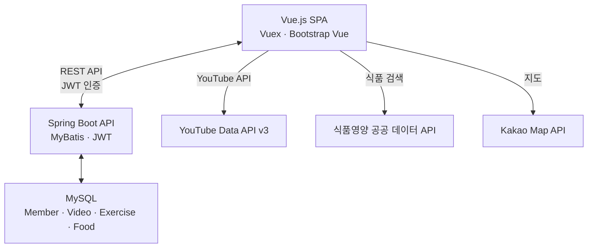

# SSAFIT

## 개요

SSAFIT은 운동 영상, 운동 기록, 식단 관리를 하나로 통합한 피트니스 웹 애플리케이션입니다. YouTube API로 운동 영상을 검색·관리하고, 캘린더 기반으로 운동 기록을 추적하며, 식품안전나라 식품영양성분 API를 활용한 식단 칼로리 관리까지 제공합니다.

SSAFY 7기 관통 프로젝트로 2인 페어로 약 5주간 개발했습니다.

## 주요 기능

### 운동 영상 관리

- YouTube API v3 연동으로 피트니스 영상 검색·등록
- 부위별 필터링 (가슴, 등, 하체 등 partCode 기반)
- 키워드 검색, 조회수 트래킹
- 찜(즐겨찾기) 기능으로 영상 북마크
- 영상별 댓글·대댓글

### 운동 기록 추적

- 캘린더 기반 일별 운동 로그 기록
- 운동별 무게·횟수·세트·볼륨 입력
- 운동 부위별 분류 및 개인 최고 기록 관리
- Chart.js 기반 운동 진행 상황 시각화

### 식단 관리

- 사용자 신체 정보 기반 일일 권장 칼로리 계산
- 식품안전나라 식품영양성분 API(I2790)로 음식 검색
- 탄수화물·단백질·지방·칼로리 영양소 추적
- 일일 섭취량 대비 목표 칼로리 모니터링

### 소셜·편의 기능

- JWT 기반 회원 인증 (로그인·회원가입)
- 팔로우/언팔로우, 마이페이지
- Kakao Map API 연동 주변 체육시설 검색

## 기술 스택

| 분류     | 기술                                                                |
| -------- | ------------------------------------------------------------------- |
| Frontend | Vue.js 2, Vuex, Vue Router, Bootstrap Vue, Chart.js, Axios          |
| Backend  | Java 8, Spring Boot 2.6, MyBatis, JWT                               |
| Database | MySQL 8.0 (13개 테이블, 6회 스키마 이터레이션)                      |
| 외부 API | YouTube API v3, 식품안전나라 식품영양성분 API(I2790), Kakao Map API |

## 아키텍처

```mermaid
flowchart TD
  Frontend["Vue.js SPA\nVuex · Bootstrap Vue"] <-->|"REST API\nJWT 인증"| Backend["Spring Boot API\nMyBatis · JWT"]
  Backend <--> MySQL["MySQL\nMember · Video · Exercise · Food"]
  Frontend -->|"YouTube API"| YouTube["YouTube Data API v3"]
  Frontend -->|"식품 검색"| FoodAPI["식품영양 공공 데이터 API"]
  Frontend -->|"지도"| KakaoMap["Kakao Map API"]
```

## 담당 역할

2인 페어에서 도메인을 수직 분할해, **회원·영상·인증(JWT) 도메인을 백엔드부터 프론트엔드까지 풀스택으로 담당**했습니다. (페어는 운동 기록·식단 도메인 담당)

- **백엔드(인증 인프라)**: JWT 발급/검증(JWTUtil·JWTInterceptor), 회원 CRUD API(ApiMemberController), CORS·인터셉터 설정, 커스텀 예외 처리. 회원 정보 수정/삭제 시 토큰의 id와 요청 id를 비교해 타인 리소스 접근 차단
- **백엔드(영상·소셜)**: YouTube 영상 DB 저장, 미분류 영상 partCode 분류, 조회수·검색 API(ApiVideoController), 찜(zzim)·팔로우 API 및 MyBatis 매퍼
- **프론트엔드**: Home·Video·Member 뷰와 회원 컴포넌트, 찜 사이드바, Kakao Map 주변 체육시설 뷰
- **상태 관리·인증 플로우**: Vuex 스토어 설계(videos, logonMember 등), 로그인 시 Axios 인스턴스 헤더 토큰 주입, 라우터 가드(checkLogin·beforeEnter)
- **협업 프로세스**: 첫날 브랜치 전략(master > develop > feature) 수립·문서화, 2인 프로젝트에 PR 85건의 리뷰-머지 플로우 운영

## 회고

프론트와 백엔드를 처음으로 둘 다 만들어 본 프로젝트입니다. JWT를 백엔드 인터셉터·토큰 검증부터 프론트 라우터 가드·헤더 주입까지 직접 붙였는데, 토큰이 어디서 만들어져 어디까지 흘러가는지 한 번 끝까지 따라가 본 것이 남았습니다. 회원 정보를 수정할 때 토큰의 id와 요청의 id를 비교하는 처리도 이때 넣었습니다.

2인 페어였지만 기능을 반씩 나누지 않고 회원·영상·인증 도메인을 통째로 맡는 방식으로 갈랐습니다. 화면만 만들거나 API만 만들면 중간에서 계속 서로를 기다리게 돼서, 한 도메인을 DB부터 화면까지 혼자 끌고 가는 편이 빨랐습니다.
