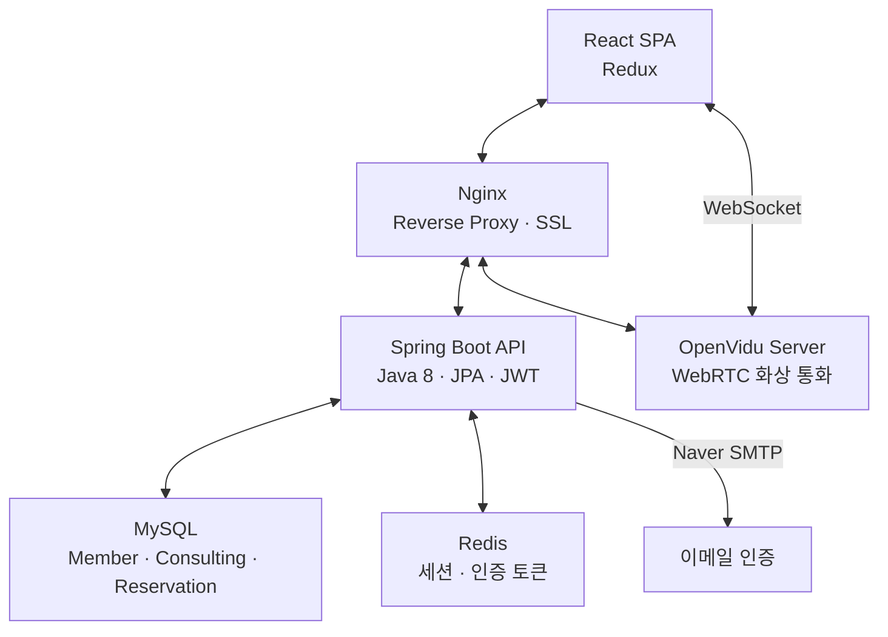

# 당신의 계절

## 개요

당신의 계절은 온라인 퍼스널 컬러 진단 서비스입니다. 전문 컨설턴트와 1:1 화상 상담으로 진단받거나, 셀프 진단 모드로 직접 분석할 수 있습니다.

React 프론트엔드와 Spring Boot 백엔드, OpenVidu WebRTC 서버로 구성되어 있으며, SSAFY 7기 공통 프로젝트로 6인 팀("치명적인 당신")에서 약 7주간 개발했습니다.

## 주요 기능

### 1:1 화상 컨설팅

- OpenVidu 기반 실시간 화상 통화
- 가상 컬러 드레이프 오버레이 (Canvas 기반)
- 밝기·채도·색조 조절 컨트롤
- WebSocket 실시간 채팅
- Best/Worst 컬러 선택 및 진단 결과 캡처

### 셀프 진단

- 컨설턴트 없이 직접 퍼스널 컬러 분석
- 컬러 비교 도구로 톤 판별
- Best/Worst 컬러 선택 후 결과 저장
- 톤 비율 분석 (봄/여름/가을/겨울)

### 컨설턴트 탐색·예약

- 인기순, 평점순, 리뷰순, 가격순 정렬
- 컨설턴트 이름 검색
- 캘린더 기반 날짜·시간 예약
- 자격증·경력 확인

### 진단 결과·리뷰

- 과거 진단 이력 및 컬러 팔레트 조회
- 시즌 톤 분류 결과 (봄 웜톤, 여름 쿨톤 등)
- 컨설팅 별점·후기 작성
- 결과 이미지 다운로드

## 기술 스택

| 분류        | 기술                                               |
| ----------- | -------------------------------------------------- |
| Frontend    | React 18, JavaScript, Redux Toolkit, Emotion       |
| 실시간 통신 | OpenVidu 2.19 (WebRTC), WebSocket (채팅)           |
| Backend     | Java 8, Spring Boot 2.7, Spring Security, JPA, JWT |
| Database    | MySQL 8.0, Redis (세션·이메일 인증 토큰)           |
| 인프라      | AWS EC2, Docker, Nginx, Let's Encrypt SSL          |

## 아키텍처

## 데이터 모델

| 엔티티           | 설명                                                |
| ---------------- | --------------------------------------------------- |
| Member           | 기본 회원 (Customer / Consultant 상속)              |
| Consultant       | 컨설턴트 프로필, 자격증(License), 휴무일(ClosedDay) |
| Customer         | 일반 고객                                           |
| Reservation      | 예약 (고객 ↔ 컨설턴트, 날짜·시간)                   |
| Consulting       | 화상 상담 세션 (OpenVidu sessionId)                 |
| ConsultingResult | 진단 결과 (BestColorSet, WorstColorSet)             |
| SelfConsulting   | 셀프 진단 결과 (톤 비율 Percentage)                 |
| Review           | 별점·후기 (고객 → 컨설턴트)                         |
| Tone / Color     | 시즌 톤 및 컬러 팔레트                              |

## 담당 역할

프론트엔드 파트 리더를 맡았습니다.

- **프론트엔드 아키텍처**: Feature 기반 디렉토리 구조 설계, Redux 상태 관리 구조 수립
- **OpenVidu 화상 통화**: WebRTC 세션 연결, 비디오 컴포넌트 구현, 카메라 테스트
- **컬러 드레이프 시스템**: Canvas 기반 컬러 필터 오버레이, RGB 변환 유틸리티
- **컬러 팔레트 UI**: 시즌별 컬러셋 선택·표시 컴포넌트, Best/Worst 컬러 인터페이스

## 회고

WebRTC를 활용한 실시간 화상 서비스를 처음 구현한 프로젝트입니다. OpenVidu를 도입하여 시그널링 서버 복잡도를 줄이면서도 화상 통화 위에 컬러 드레이프 오버레이를 구현하는 것이 기술적 도전이었습니다.

프론트엔드 파트 리더로서 3명의 팀원 간 Feature 단위로 작업을 분리하고, Redux 슬라이스 구조를 통일하여 상태 관리 일관성을 유지하는 데 집중했습니다.
