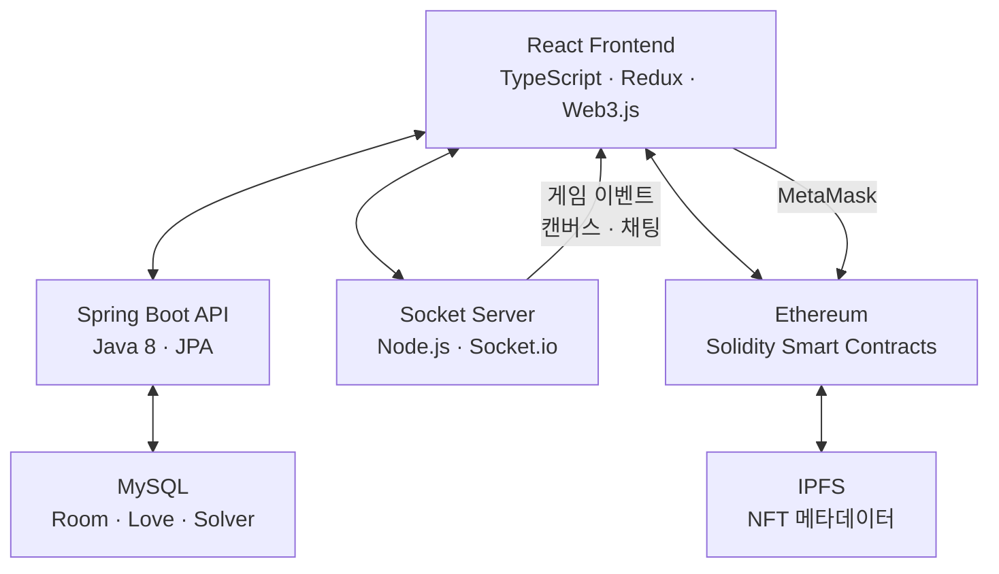

# README

## 개요

README는 "놀면서 만드는 NFT"라는 콘셉트의 블록체인 기반 게이미피케이션 플랫폼입니다. 실시간 그림 퀴즈 게임을 통해 그린 그림을 NFT로 민팅하고, 내장 마켓플레이스에서 거래할 수 있습니다.

React 프론트엔드, Spring Boot 백엔드, Node.js 소켓 서버, Solidity 스마트 컨트랙트로 구성된 멀티 서비스 아키텍처이며, SSAFY 7기 특화 프로젝트로 6인 팀에서 7주간 개발했습니다.

## 주요 기능

### 실시간 그림 퀴즈 게임

- Socket.io 기반 멀티플레이어 게임룸 생성·참여
- 출제자가 그림을 그리면 참여자가 채팅으로 정답 맞추기
- Canvas 실시간 동기화, 채팅 정답 자동 감지
- 첫 정답자 인식 및 보상 시스템

### NFT 민팅

- 게임에서 그린 그림을 ERC721 NFT로 변환
- IPFS에 NFT 메타데이터 저장
- Hashlips Art Engine 기반 배치 민팅 지원
- MetaMask 지갑 연동으로 블록체인 트랜잭션 처리

### NFT 마켓플레이스

- NFT 구매·판매·가격 설정
- 이벤트 옥션 (시간 제한 판매)
- 좋아요(찜) 기능
- 소유 NFT 인벤토리 관리 (마이페이지)

### Web3 인증 및 튜토리얼

- MetaMask 지갑 기반 로그인·인증
- Ethereum 네트워크 설정 가이드
- 블록체인 개념 교육 튜토리얼

## 기술 스택

| 분류 | 기술 |
|------|------|
| Frontend | React 18, TypeScript, Redux Toolkit, Socket.io Client, Web3.js |
| Backend | Java 8, Spring Boot 2.5, JPA, MySQL, Swagger |
| WebSocket | Node.js 16, Express, Socket.io, PM2 |
| Smart Contract | Solidity 0.8, Truffle, OpenZeppelin 4.7 |
| 저장소 | IPFS (NFT 메타데이터), MySQL (앱 데이터) |
| 인프라 | AWS EC2, Docker, Jenkins CI/CD, Nginx, Let's Encrypt SSL |

## 아키텍처

## 스마트 컨트랙트

| 컨트랙트 | 역할 |
|----------|------|
| MintReadmeToken | ERC721 NFT 생성 및 소유권 관리 |
| SaleReadmeToken | 마켓플레이스 거래 로직 |
| GetReadmeToken | NFT 데이터 조회 인터페이스 |
| DrawToken | 이벤트 보상 토큰 배포 |
| SsafyToken | ERC20 테스트 토큰 |

## 담당 역할

프론트엔드 파트 리더를 맡았습니다.

- **Socket.io 게임 클라이언트**: 실시간 그림 퀴즈 게임 기능 구현, 캔버스 동기화 및 채팅 정답 감지
- **Redux 상태 관리**: Feature 기반 슬라이스 설계 (auth, game, mint, nft), redux-persist 세션 관리
- **게임 UI 구현**: 게임룸 생성·참여, 실시간 드로잉 캔버스, 스코어보드
- **프론트엔드 아키텍처**: 페이지·컴포넌트 구조 설계, API 레이어 구성

## 회고

블록체인과 실시간 통신이라는 두 가지 도전적인 기술을 동시에 다룬 프로젝트입니다. Socket.io를 활용한 실시간 캔버스 동기화와 채팅 정답 감지 로직 구현이 기술적으로 가장 흥미로웠고, Web3.js를 통해 프론트엔드에서 직접 스마트 컨트랙트와 상호작용하는 경험을 쌓았습니다.

프론트엔드 파트 리더로서 Redux 기반 상태 관리 설계와 Feature 단위 디렉토리 구조를 주도하며, 3명의 프론트엔드 팀원 간 작업 분리와 코드 충돌 최소화에 집중했습니다.
