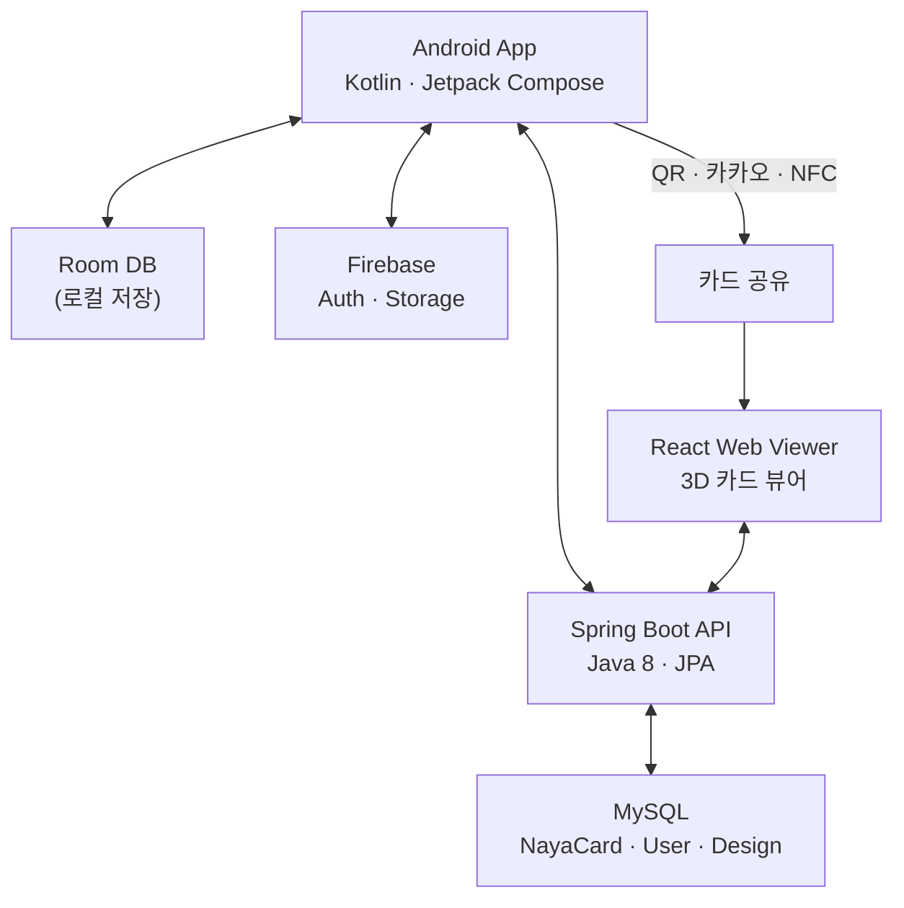

# NAYA

## 개요

NAYA는 "NA(나)를 소개하는 가장 쉬운 방법"이라는 콘셉트의 소개 카드 관리 서비스입니다. 멀티미디어 소개 카드(Naya)와 명함(Business Card)을 제작하고, QR코드·카카오톡·NFC 등 다양한 채널로 공유할 수 있습니다.

Android 앱을 중심으로 React 웹 뷰어와 Spring Boot 백엔드를 결합한 크로스 플랫폼 구조이며, SSAFY 7기 자율 프로젝트로 6인 팀에서 개발하여 Google Play Store에 출시했습니다. **최우수상(1위)** 수상.

## 주요 기능

### Naya 소개 카드 제작

- CameraX 기반 촬영 또는 갤러리에서 이미지 선택
- 드로잉(DrawBox), 텍스트, 스티커 오버레이로 커스터마이징
- 색상 피커, 폰트 선택, 카드 프레임 자동 인식
- 제작된 카드는 Room DB + MediaStore에 저장

### 명함 OCR 인식

- DocumentScanner로 명함 앞·뒷면 촬영
- ML Kit (Korean) + Tesseract 이중 OCR 파이프라인
- 이름, 이메일, 전화번호, 회사, 직함 등 자동 필드 추출
- 인식 결과 확인 후 수정·저장

### 다채널 카드 공유

- **QR코드**: ZXing 라이브러리로 생성, 웹 URL 연동
- **카카오톡**: Kakao Link API 연동
- **NFC**: 태그 쓰기로 오프라인 공유
- **Facebook**: 소셜 공유 연동
- 웹에서 3D 원근 효과로 공유된 카드 조회 (마우스/터치 기반 회전)

### 일정 관리

- 커스텀 캘린더 UI (Kalendar 라이브러리)
- 스케줄 생성·수정·삭제, 알람 설정
- 참석자에 명함(Nuya) 연동
- 위치 정보 연동 (Google Maps)

## 기술 스택

| 분류      | 기술                                                                  |
| --------- | --------------------------------------------------------------------- |
| Android   | Kotlin, Jetpack Compose, CameraX, Room, Hilt, Navigation Compose      |
| Frontend  | React 18, TypeScript, Redux Toolkit, Styled Components, Framer Motion |
| Backend   | Java 8, Spring Boot 2.7, JPA, MySQL                                   |
| OCR       | ML Kit (Korean Text Recognition), Tesseract                           |
| 공유      | ZXing (QR), Kakao SDK, NFC, Facebook SDK                              |
| 미디어    | ExoPlayer (Media3), Glide, Coil, DrawBox                              |
| 인증/저장 | Firebase Auth, Firebase Storage                                       |
| 인프라    | Docker, Jenkins CI/CD, Nginx, Let's Encrypt SSL                       |

## 아키텍처

## 카드 유형

| 유형          | 설명                               |
| ------------- | ---------------------------------- |
| Naya          | 내가 만든 멀티미디어 소개 카드     |
| Nuya          | 상대방이 공유한 소개 카드          |
| Business Naya | 내 명함 (OCR 또는 템플릿으로 등록) |
| Business Nuya | 상대방이 공유한 명함               |

## 담당 역할

Android 개발을 담당했습니다.

- **카드 제작 UI**: Jetpack Compose 기반 카드 커스터마이징 화면, 이미지 편집 기능 구현
- **CameraX 연동**: 촬영, 렌즈 전환, EXIF 회전 처리, 프론트 카메라 미러링
- **OCR 파이프라인**: ML Kit + Tesseract 이중 인식, 필드 자동 추출 로직
- **Room DB 설계**: Card, Schedule, Member, Alarm 엔티티 및 DAO 설계
- **공유 기능**: QR코드 생성, NFC 태그 쓰기, 카카오톡 공유 연동
- **네비게이션**: Navigation Compose 기반 화면 전환 그래프 설계

## 회고

SSAFY 자율 프로젝트에서 최우수상(1위)을 수상한 프로젝트입니다. Jetpack Compose가 아직 초기 단계였던 시점에 전면 도입하여 선언형 UI의 생산성을 경험했고, CameraX와 ML Kit를 활용한 명함 OCR 파이프라인 구현이 기술적으로 도전적이었습니다.

특히 QR코드·카카오톡·NFC라는 서로 다른 공유 채널을 하나의 일관된 플로우로 통합한 설계와, Room DB를 활용한 로컬 우선 아키텍처가 오프라인 환경에서도 원활한 사용 경험을 제공하는 데 기여했습니다.
