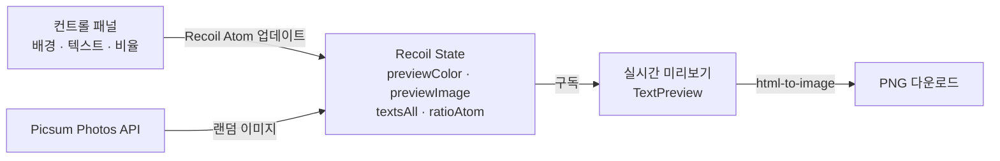

# Simple Thumbnail

## 개요

Simple Thumbnail은 디자인 경험 없이도 3초 만에 블로그·유튜브용 썸네일을 만들 수 있는 웹 애플리케이션입니다. 배경(단색·그라데이션·이미지), 텍스트(폰트·크기·색상·레이아웃), 비율을 조합하고 실시간 미리보기로 확인한 뒤 원클릭으로 PNG 다운로드할 수 있습니다.

테오의 스프린트 14(2023.02.22~02.27)에서 7인 팀(디자이너 1명 + FE 6명)으로 6일간 개발했습니다.

## 주요 기능

### 배경 커스터마이징

- 단색 팔레트 + ChromePicker 커스텀 색상 선택
- 7종 프리셋 그라데이션 + 랜덤 그라데이션 생성
- Picsum Photos API 연동 랜덤 이미지 배경
- 로컬 이미지 업로드 (HEIC→JPEG 변환으로 iOS 지원)
- 밝기 조절 오버레이

### 텍스트 편집

- 최대 3개 텍스트 레이어
- 폰트 선택 (SUIT, 어그로체, 산돌 삼립호빵체)
- 레이어별 크기·굵기·색상 개별 설정
- 캐러셀 기반 텍스트 레이아웃(정렬·배치) 선택

### 미리보기·내보내기

- 비율 선택 (1:1, 4:3, 16:9)
- 모든 설정 변경이 실시간 미리보기에 즉시 반영
- html-to-image + downloadjs로 PNG 원클릭 다운로드

## 기술 스택

| 분류        | 기술                                                    |
| ----------- | ------------------------------------------------------- |
| Frontend    | React 18, TypeScript, Vite 6                            |
| 스타일링    | Tailwind CSS 3, CSS Modules                             |
| 상태 관리   | Recoil (atom, atomFamily)                               |
| 이미지 처리 | html-to-image, downloadjs, heic2any                     |
| UI          | react-color (ChromePicker), react-icons, react-toastify |
| 배포        | Cloudflare Workers                                      |

## 아키텍처

## 담당 역할

프론트엔드 개발을 담당했습니다.

- **상태 관리 설계**: Recoil atom 구조 설계 (배경 색상·이미지, 텍스트 내용·스타일, 비율, 폰트, 레이아웃)
- **컨트롤러 연동 로직**: 텍스트·배치·색상·이미지·사이즈 조절 시 미리보기에 실시간 반영되는 데이터 플로우 구현
- **이미지 다운로드**: html-to-image로 미리보기 DOM을 PNG로 변환·다운로드하는 내보내기 기능
- **랜덤 이미지**: Picsum Photos API 연동으로 랜덤 배경 이미지 기능 구현

## 회고

6일이라는 짧은 스프린트 기간 동안 7명이 협업한 프로젝트입니다. Recoil의 atom/atomFamily를 활용하여 배경·텍스트·비율 등 다양한 상태를 분리 관리하면서도, 미리보기 컴포넌트에서 모든 변경사항이 실시간으로 반영되는 반응형 데이터 플로우를 설계한 것이 핵심이었습니다. html-to-image 라이브러리를 활용해 DOM을 그대로 이미지로 변환하는 접근 방식이 간결하면서도 효과적이었습니다.
