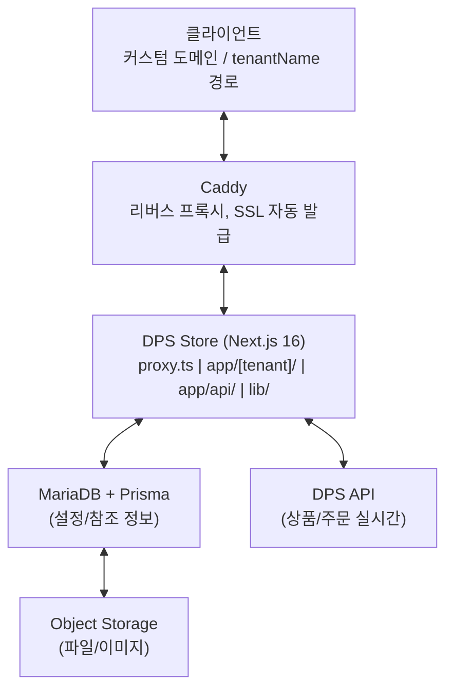

# DPS Store (디플샵 스토어)

## 개요

DPS Store는 업체(테넌트)별 독립적인 온라인 스토어를 운영할 수 있는 멀티테넌트 팝업 스토어 플랫폼입니다. DPS API와 연동하여 상품·주문을 실시간으로 동기화하며, 테넌트별로 테마·페이지·정책을 자유롭게 커스터마이징할 수 있습니다.

고정형(JSON 레이아웃), 자유형(노드 기반 비주얼 빌더), 생성형(AI 자동 생성) 3가지 테넌트 타입을 지원하여 다양한 스토어 구축 니즈에 대응합니다.

## 주요 기능

### 멀티테넌트 아키텍처

- `tenantName` 경로 또는 커스텀 도메인으로 테넌트 식별
- Next.js 16 proxy.ts 기반 도메인 라우팅 처리
- 테넌트별 독립적인 테마(로고, 컬러, 폰트), 정책, 페이지, 약관 설정
- 16개 DB 테이블로 테넌트·상품·주문·고객 데이터 분리 관리

### 3가지 테넌트 타입

- **고정형(FIXED)**: JSON 기반 레이아웃/스타일 설정 + 관리자 에디터로 페이지 구성
- **자유형(FLEXIBLE)**: 노드 기반 드래그앤드롭 비주얼 빌더로 자유로운 페이지 구축
- **생성형(GENERATIVE)**: AI가 자동으로 페이지 생성

### 노드 기반 비주얼 빌더

- 드래그앤드롭으로 페이지 요소 배치·편집하는 비주얼 에디터
- 트리 구조 노드 시스템으로 중첩 레이아웃 표현
- 노드별 속성 편집 (텍스트, 이미지 업로드, Props, 스타일)
- 다국어(한/영/일) 텍스트 콘텐츠 편집 지원
- 보안 검증 (허용 요소/CSS 제한) 및 스타일 정제 처리

### 페이지 시스템

8개 페이지 타입으로 고객 플로우 구성:

| 페이지 | 설명 |
|--------|------|
| HERO | 스토어 메인 진입 화면 |
| SIGNUP | 간편 회원가입 (전화번호/이메일) |
| PRODUCT_LIST | 카테고리별 상품 목록 |
| OPTION_SELECT | 옵션 선택 + 외부 에디터 연동 |
| CART | 장바구니 |
| ORDER_FORM | 주문서 작성 |
| ORDER_RESULT | 주문 완료 |
| MY_PAGE | 내 주문 조회 |

페이지별 활성화/비활성화 설정이 가능하며, 비활성화된 페이지는 자동으로 건너뜁니다.

### 상품·주문 관리

- DPS API 연동 상품 동기화 및 실시간 조회
- 트리 구조 옵션 시스템 (옵션 그룹 → 옵션값 → SKU)
- 장바구니 → 주문서 → 주문 완료 전체 플로우
- DPS 양방향 주문 동기화
- 작업지시서 PDF 생성 + 디자인 파일 일괄 다운로드 (ZIP)

### 다국어 (i18n)

- 한국어, 영어, 일본어 3개 언어 지원
- UI 텍스트, 약관, 상품명, 옵션명까지 전체 다국어 대응
- 언어 선택 localStorage 유지

### 관리자 페이지

- 페이지 에디터 (레이아웃/스타일/콘텐츠 설정)
- 상품·전시·카테고리 관리 (드래그앤드롭 정렬)
- 테마 설정 (로고, 컬러, 폰트, 공통 스타일)
- 정책 설정 (배송비, 에디터 탭, 세션 타임아웃 등)
- 약관 관리 (다국어, 4가지 타입)

## 기술 스택

| 분류 | 기술 |
|------|------|
| Framework | Next.js 16 (App Router, Turbopack) |
| Language | TypeScript (strict mode) |
| UI | React 19, Tailwind CSS 3 |
| ORM | Prisma 7 (MariaDB) |
| 인증 | NextAuth 5 (관리자/고객 세션 분리) |
| 스토리지 | Object Storage (S3 호환, AWS SDK) |
| 인프라 | Caddy (리버스 프록시, SSL 자동 발급) |
| PDF | jsPDF, html-to-image |
| 로깅 | Winston (Daily Rotate) |
| 배포 | PM2 |

## 아키텍처

## 담당 역할

1인 풀스택 개발로 기획부터 설계, 개발, 배포까지 전체를 담당했습니다.

- **시스템 설계**: 멀티테넌트 아키텍처 설계, DB 스키마 설계 (16개 테이블), API 설계
- **프론트엔드**: 8개 페이지 타입별 고객 UI, 관리자 에디터, 노드 기반 비주얼 빌더
- **백엔드**: Next.js API 라우트, DPS API 양방향 동기화, 파일 업로드/다운로드
- **인프라**: Caddy 리버스 프록시 설정, PM2 배포, Object Storage 연동

## 회고

약 1개월이라는 짧은 기간 안에 멀티테넌트 스토어 플랫폼을 구축한 프로젝트입니다. 특히 고정형/자유형/생성형 3가지 테넌트 타입을 설계하면서, JSON 기반 레이아웃과 노드 기반 비주얼 빌더라는 서로 다른 접근 방식을 하나의 시스템에서 유연하게 지원하는 구조를 만든 것이 의미 있었습니다.

Next.js 16의 proxy(구 middleware) 변경사항을 도입하면서 도메인 기반 멀티테넌트 라우팅을 구현한 경험과, Prisma 7의 브라우저 안전 Enum 활용 등 최신 기술 스택의 실전 적용 경험을 쌓을 수 있었습니다.
