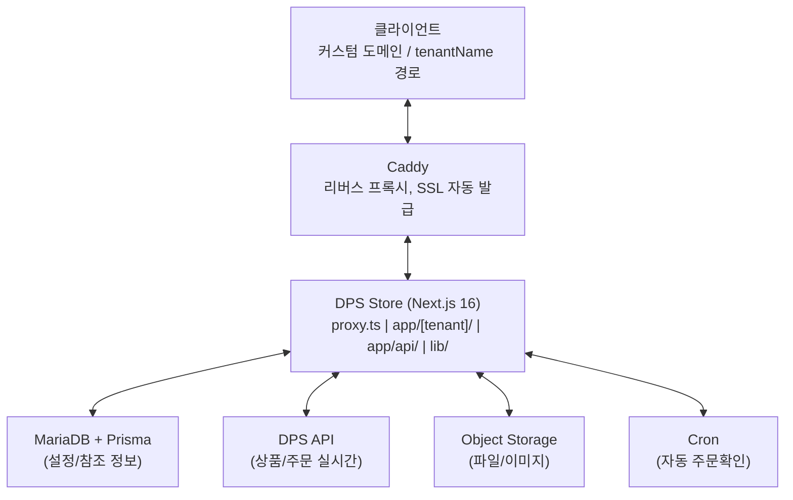
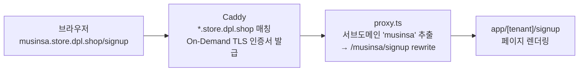

# DPS Store (디플샵 스토어)

## 개요

DPS Store는 업체(테넌트)별 독립적인 온라인 스토어를 운영할 수 있는 멀티테넌트 팝업 스토어 플랫폼입니다. DPS API와 연동하여 상품·주문을 실시간으로 동기화하며, 테넌트별로 테마·페이지·정책을 자유롭게 커스터마이징할 수 있습니다.

고정형(JSON 레이아웃), 자유형(노드 기반 비주얼 빌더), 생성형(AI 자동 생성) 3가지 테넌트 타입을 지원하여 다양한 스토어 구축 니즈에 대응합니다.

온라인 스토어를 넘어, 팝업 매장 현장에서 운영되는 **출력장비(접수증·가먼트·머그 프린터)와 키오스크**까지 연동하는 방향으로 최근 크게 확장했습니다. 웹 주문이 현장 장비에서 자동으로 출력·제작으로 이어지는 O2O 운영 파이프라인을 구축했습니다.

## 주요 기능

### 멀티테넌트 아키텍처

- 테넌트별 독립적인 테마(로고, 컬러, 폰트), 정책, 페이지, 약관 설정
- 20개+ DB 테이블로 테넌트·상품·주문·고객·스탬프 데이터 분리 관리
- 4가지 도메인 접근 방식 지원:

| 방식           | 예시                     | 설명                           |
| -------------- | ------------------------ | ------------------------------ |
| 경로 기반      | `store.dpl.shop/musinsa` | 기본 접근 방식                 |
| 3차 서브도메인 | `musinsa.store.dpl.shop` | 와일드카드 DNS + On-Demand TLS |
| 서브도메인     | `musinsa.dpl-shop.store` | 복수 호스트 지원               |
| 커스텀 도메인  | `popup.musinsa.com`      | 테넌트가 직접 등록             |

- Next.js 16 `proxy.ts`에서 호스트명 분석 → 서브도메인 추출 → 내부 경로 rewrite
- Caddy On-Demand TLS로 서브도메인/커스텀 도메인 자동 SSL 인증서 발급
- `/api/caddy/check-domain` 엔드포인트로 도메인 유효성 검증 (DB 조회 기반)

### 3가지 테넌트 타입

- **고정형(FIXED)**: JSON 기반 레이아웃/스타일 설정 + 관리자 에디터로 페이지 구성
- **자유형(FLEXIBLE)**: 노드 기반 드래그앤드롭 비주얼 빌더로 자유로운 페이지 구축
- **생성형(GENERATIVE)**: AI가 자동으로 페이지 생성

### 노드 기반 비주얼 빌더

- 드래그앤드롭으로 페이지 요소 배치·편집하는 비주얼 에디터
- 트리 구조 노드 시스템으로 중첩 레이아웃 표현
- 노드별 속성 편집 (텍스트, 이미지 업로드, Props, 스타일)
- 다국어(한/영/일/베) 텍스트 콘텐츠 편집 지원
- 보안 검증 (허용 요소/CSS 제한) 및 스타일 정제 처리

### 페이지 시스템

10개 페이지 타입으로 고객 플로우 구성:

| 페이지         | 설명                            |
| -------------- | ------------------------------- |
| HERO           | 스토어 메인 진입 화면           |
| SIGNUP         | 간편 회원가입 (전화번호/이메일) |
| PRODUCT_LIST   | 카테고리별 상품 목록            |
| PRODUCT_DETAIL | 개별 상품 상세 정보             |
| OPTION_SELECT  | 옵션 선택 + 외부 에디터 연동    |
| CART           | 장바구니                        |
| ORDER_FORM     | 주문서 작성                     |
| ORDER_RESULT   | 주문 완료                       |
| MY_PAGE        | 내 주문 조회                    |
| ORDER_STATUS   | 주문 처리 현황 (작업자/캐셔용)  |

페이지별 활성화/비활성화 설정이 가능하며, 비활성화된 페이지는 자동으로 건너뜁니다.

### 상품·주문 관리

- DPS API 연동 상품 동기화 및 실시간 조회
- 트리 구조 옵션 시스템 (옵션 그룹 → 옵션값 → SKU)
- 장바구니 → 주문서 → 주문 완료 전체 플로우
- DPS 양방향 주문 동기화
- 작업지시서 PDF 생성 + 디자인 파일 일괄 다운로드 (ZIP)

### 현장 결제 및 캐셔 시스템

- QR 코드 기반 현장 결제 프로세스
- 캐셔 전용 인터페이스 (장바구니 확인 + 결제 확인)
- 작업자(Worker) 전용 페이지로 주문 처리

### 출력장비 연동 (프린터 클라이언트)

팝업 매장 현장의 전용 프린터를 웹 주문과 직접 연동했습니다. 관리자가 브라우저에서 수동 출력하던 방식을 넘어, 현장 장비가 서버 큐를 자동 풀링해 직접 출력하는 구조로 확장했습니다.

- **3종 프린터 모듈**: 접수증/라벨(감열), 가먼트(Brother GTX-4 DTG), 머그 전사지 프린터를 각각 전용 Windows 클라이언트(Watcher/Agent)로 연동
- **출력 큐 시스템**: 서버에 `ReceiptPrintQueue` / `GarmentPrintQueue` / 머그 큐를 두고 상태 머신(PENDING → PRINTING/DOWNLOADING → PRINTED/SENT, FAILED/RESOLVE_FAILED)으로 관리
- **자동 풀링 출력**: 클라이언트가 `/api/printer` 엔드포인트를 폴링 → 프린터를 직접 제어해 출력 → 출력/실패/다운로드 상태를 서버에 콜백
- **출력 관리 페이지**: 관리자 사이드바에 접수증·가먼트 큐를 통합 조회, 상태별 필터·재출력 기능 제공
- **설치형 데스크톱 앱**: 현장 PC 설치를 단순화하기 위한 Electron 기반 데스크톱 앱(`dps-store-desktop`) 병행

### 장비 인증 (Device Authorization Flow)

전용 프린터 클라이언트는 admin 세션 대신 **장비 전용 API 키**로 인증합니다. OAuth Device Authorization Flow(흔히 보는 "기기 코드 로그인") 패턴을 차용했습니다.

1. 클라이언트가 `POST /api/printer/auth/request` → `deviceCode` / `userCode` / 인증 URL 발급, 콘솔에 표시
2. 관리자가 브라우저에서 인증 URL 접속 → admin 로그인 → 인증 코드 확인 후 승인
3. 클라이언트는 `POST /api/printer/auth/poll`을 2초 간격으로 폴링하다가 승인 시 API 키(`pk_...`) 수령
4. 이후 모든 출력 API 호출에 API 키 사용, 만료 토큰은 Cron으로 정리

### 키오스크 / 현장 운영

- **키오스크 모드**: PWA 기반 키오스크에서 세션 타임아웃 시 자동 로그아웃으로 다음 고객 보호
- **현장 결제·캐셔·작업자 분리**: QR 현장 결제 → 캐셔 결제 확인 → 작업자 게이팅 출력으로 이어지는 현장 운영 플로우
- **웹 주문 → 현장 출력 일원화**: 온라인/현장 주문이 동일한 출력 큐로 수렴해 장비에서 자동 제작

### 스탬프 수집 시스템

- 고객 로열티 스탬프 적립 및 관리
- 관리자 스탬프 통계 대시보드
- 브랜드별 스탬프 설정

### 다국어 (i18n)

- 한국어, 영어, 일본어, 베트남어 4개 언어 지원
- UI 텍스트, 약관, 상품명, 옵션명까지 전체 다국어 대응
- 테넌트별 지원 언어 및 기본 언어 설정
- MyMemory API 연동 자동 번역 기능

### 관리자 페이지

- 페이지 에디터 (레이아웃/스타일/콘텐츠 설정)
- 상품·전시·카테고리 관리 (드래그앤드롭 정렬)
- 테마 설정 (로고, 컬러, 폰트, 공통 스타일)
- 정책 설정 (배송비, 에디터 탭, 세션 타임아웃 등)
- 약관 관리 (다국어, 4가지 타입)
- 알림 수신자 관리 (SMS/이메일)
- 언어 설정 (지원 언어, 기본 언어)
- 스탬프 통계 대시보드
- 폰트 관리

### PWA 지원

- 멀티테넌트 매니페스트 엔드포인트
- 서비스 워커 기반 오프라인 지원
- 키오스크 모드 대응 (자동 로그아웃)

## 기술 스택

| 분류      | 기술                                 |
| --------- | ------------------------------------ |
| Framework | Next.js 16 (App Router, Turbopack)   |
| Language  | TypeScript (strict mode)             |
| UI        | React 19, Tailwind CSS 3             |
| ORM       | Prisma 7 (MariaDB)                   |
| 인증      | NextAuth 5 (관리자/고객 세션 분리)   |
| 스토리지  | Object Storage (S3 호환, AWS SDK)    |
| 인프라    | Caddy (리버스 프록시, SSL 자동 발급) |
| PDF       | jsPDF, html-to-image                 |
| 로깅      | Winston (Daily Rotate)               |
| 배포      | PM2 (Blue-Green 무중단 배포)         |
| PWA       | Service Worker, 멀티테넌트 Manifest  |

## 아키텍처

```mermaid
flowchart TD
  Client["클라이언트\n커스텀 도메인 / tenantName 경로"] <--> Caddy["Caddy\n리버스 프록시, SSL 자동 발급"]
  Caddy <--> Store["DPS Store (Next.js 16)\nproxy.ts | app/[tenant]/ | app/api/ | lib/"]
  Store <--> DB["MariaDB + Prisma\n(설정/참조 정보)"]
  Store <--> API["DPS API\n(상품/주문 실시간)"]
  Store <--> S3["Object Storage\n(파일/이미지)"]
  Store <--> Cron["Cron\n(자동 주문확인)"]
```

### 도메인 라우팅 플로우

```mermaid
flowchart LR
  Browser["브라우저\nmusinsa.store.dpl.shop/signup"]
  --> Caddy["Caddy\n*.store.dpl.shop 매칭\nOn-Demand TLS 인증서 발급"]
  --> Proxy["proxy.ts\n서브도메인 'musinsa' 추출\n→ /musinsa/signup rewrite"]
  --> App["app/[tenant]/signup\n페이지 렌더링"]
```

### 배포 아키텍처

Blue-Green 무중단 배포 방식을 적용했습니다.

- PM2로 Blue(:4033), Green(:4034) 두 인스턴스를 각각 독립 빌드 디렉토리(`.next-blue`, `.next-green`)로 운영
- 배포 시 비활성 인스턴스에 빌드 → 헬스 체크(30초 타임아웃, 307/308 리다이렉트 허용) → Caddy `ACTIVE_PORT` 환경변수 전환 → `systemctl reload caddy`
- Cron 프로세스(자동 주문확인)도 배포 시 재등록하여 활성 포트 반영
- 롤백 스크립트로 이전 인스턴스 헬스 체크 후 즉시 트래픽 복구

## 담당 역할

1인 풀스택 개발로 기획부터 설계, 개발, 배포까지 전체를 담당했습니다.

- **시스템 설계**: 멀티테넌트 아키텍처 설계, DB 스키마 설계 (20개+ 테이블), API 설계 (70개+ 엔드포인트)
- **프론트엔드**: 10개 페이지 타입별 고객 UI, 관리자 에디터, 노드 기반 비주얼 빌더, 4개 언어 다국어 대응
- **백엔드**: Next.js API 라우트, DPS API 양방향 동기화, 파일 업로드/다운로드, 스탬프/알림 시스템
- **장비 연동**: 접수증·가먼트·머그 프린터 출력 큐 설계, 장비 Device Auth(API 키) 플로우, 출력 관리 페이지, 키오스크 모드 — 웹 주문과 현장 출력장비를 잇는 O2O 파이프라인 구축
- **인프라**: Caddy 리버스 프록시 설정, PM2 Blue-Green 무중단 배포, Object Storage 연동, PWA 구성

## 트러블슈팅

### 서브도메인 경로 중복 문제

- **상황**: `musinsa.store.dpl.shop/signup` 접속 시 내부 링크가 `/musinsa/signup`으로 생성되어 경로가 중복됨
- **원인**: 도메인 판별 로직에서 MAIN_DOMAINS를 하드코딩하여 서브도메인 호스트를 메인 도메인으로 오인
- **해결**: 환경변수 기반으로 `MAIN_DOMAINS`/`SUBDOMAIN_HOSTS`를 분리하고, `useTenantPath` 훅에서 서브도메인 접속 시 테넌트 prefix를 생략하도록 수정

### Caddy On-Demand TLS 인증서 미발급

- **상황**: 커스텀 도메인 등록 후 HTTPS 접속 시 인증서 오류 발생
- **원인**: Caddy의 `on_demand_tls.ask` 엔드포인트가 비활성 포트를 바라보고 있어 검증 실패
- **해결**: Caddy의 `{$ACTIVE_PORT}` 환경변수를 systemd `EnvironmentFile`로 주입하여 배포 시 자동 반영되도록 구성

## 회고

약 2개월간 멀티테넌트 스토어 플랫폼을 설계부터 배포까지 1인으로 구축한 프로젝트입니다. 고정형/자유형/생성형 3가지 테넌트 타입을 설계하면서, JSON 기반 레이아웃과 노드 기반 비주얼 빌더라는 서로 다른 접근 방식을 하나의 시스템에서 유연하게 지원하는 구조를 만든 것이 의미 있었습니다.

Next.js 16의 proxy(구 middleware) 변경사항을 도입하면서 도메인 기반 멀티테넌트 라우팅을 구현한 경험과, Prisma 7의 브라우저 안전 Enum 활용 등 최신 기술 스택의 실전 적용 경험을 쌓을 수 있었습니다. 이후 현장 결제(QR/캐셔) 시스템, 스탬프 로열티 프로그램, 4개 언어 다국어 지원, PWA, Blue-Green 무중단 배포까지 확장하면서 실제 운영 환경에서의 안정성과 확장성을 확보했습니다.

최근에는 웹 플랫폼을 넘어 **현장 출력장비와 키오스크 연동**으로 범위를 크게 넓혔습니다. 접수증·가먼트·머그 프린터를 전용 클라이언트로 연동하고, 출력 큐와 장비 Device Auth(API 키) 플로우를 설계하면서, 단순 온라인 스토어가 아니라 팝업 매장의 주문–제작–출력을 하나로 잇는 O2O 운영 시스템으로 진화시킨 것이 이 프로젝트에서 가장 의미 있는 확장이었습니다.
