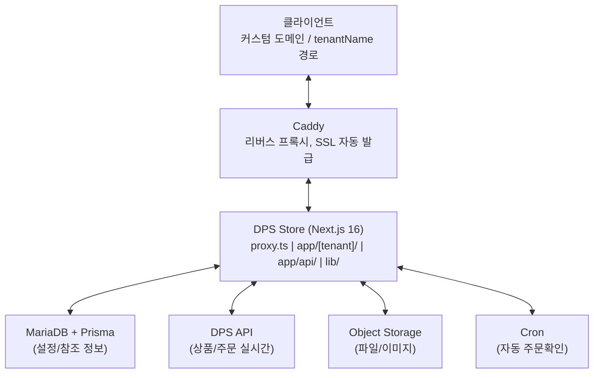
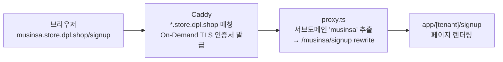

# DPS Store (디플샵 스토어)

## 개요

DPS Store는 업체(테넌트)별 독립적인 온라인 스토어를 운영할 수 있는 멀티테넌트 팝업 스토어 플랫폼입니다. DPS API와 연동하여 상품·주문을 실시간으로 동기화하며, 테넌트별로 테마·페이지·정책을 자유롭게 커스터마이징할 수 있습니다.

고정형(JSON 레이아웃)과 자유형(노드 기반 비주얼 빌더) 두 가지 방식으로 스토어를 구축합니다. 현재 46개 Prisma 모델 / 138개 API 라우트 규모입니다.

온라인 스토어를 넘어, 팝업 매장 현장에서 운영되는 **출력장비(접수증·가먼트·머그 프린터)와 키오스크**까지 연동하는 방향으로 크게 확장했습니다. 웹 주문이 현장 장비에서 자동으로 출력·제작으로 이어지는 O2O 운영 파이프라인을 구축했고, 이후 키오스크에 **연동 카드단말(카드리더기) 결제**를 붙여 주문·승인·취소·출력 회수까지 한 상태 머신으로 묶었습니다.

## 주요 기능

### 멀티테넌트 아키텍처

- 테넌트별 독립적인 테마(로고, 컬러, 폰트), 정책, 페이지, 약관 설정
- 46개 DB 테이블로 테넌트·상품·주문·결제·고객·스탬프·출력큐·카드단말 데이터 분리 관리
- 4가지 도메인 접근 방식 지원:

| 방식           | 예시                     | 설명                           |
| -------------- | ------------------------ | ------------------------------ |
| 경로 기반      | `store.dpl.shop/musinsa` | 기본 접근 방식                 |
| 3차 서브도메인 | `musinsa.store.dpl.shop` | 와일드카드 DNS + On-Demand TLS |
| 서브도메인     | `musinsa.dpl-shop.store` | 복수 호스트 지원               |
| 커스텀 도메인  | `popup.musinsa.com`      | 테넌트가 직접 등록             |

- Next.js 16 `proxy.ts`에서 호스트명 분석 → 서브도메인 추출 → 내부 경로 rewrite
- Caddy On-Demand TLS로 서브도메인/커스텀 도메인 자동 SSL 인증서 발급
- `/api/caddy/check-domain` 엔드포인트로 도메인 유효성 검증 (DB 조회 기반)

### 테넌트 타입

- **고정형(FIXED)**: JSON 기반 레이아웃/스타일 설정 + 관리자 에디터로 페이지 구성
- **자유형(FLEXIBLE)**: 노드 기반 드래그앤드롭 비주얼 빌더로 자유로운 페이지 구축
- **생성형(GENERATIVE)**: 타입 선택지와 렌더링 분기만 준비된 확장 슬롯. 현재 렌더링은 자유형과 동일 경로를 사용하며, AI 자동 생성은 도입하지 않았습니다.

<div align="center">
  
</div>

> 관리자 페이지 빌더. 왼쪽에서 탭·색상·다국어 텍스트를 설정하면 오른쪽 미리보기가 모바일·태블릿·키오스크·PC 4개 뷰포트로 즉시 반영됩니다. (테넌트 상호는 모자이크 처리)

### 노드 기반 비주얼 빌더

- 드래그앤드롭으로 페이지 요소 배치·편집하는 비주얼 에디터
- 트리 구조 노드 시스템으로 중첩 레이아웃 표현
- 노드별 속성 편집 (텍스트, 이미지 업로드, Props, 스타일)
- 다국어(한/영/일/베/중) 텍스트 콘텐츠 편집 지원
- 보안 검증 (허용 요소/CSS 제한) 및 스타일 정제 처리

### 페이지 시스템

8개 페이지 타입으로 고객 플로우 구성:

| 페이지        | 설명                            |
| ------------- | ------------------------------- |
| HERO          | 스토어 메인 진입 화면           |
| SIGNUP        | 간편 회원가입 (전화번호/이메일) |
| PRODUCT_LIST  | 카테고리별 상품 목록            |
| OPTION_SELECT | 옵션 선택 + 외부 에디터 연동    |
| CART          | 장바구니                        |
| ORDER_FORM    | 주문서 작성                     |
| ORDER_RESULT  | 주문 완료                       |
| MY_PAGE       | 내 주문 조회                    |

페이지별 활성화/비활성화 설정이 가능하며, 비활성화된 페이지는 자동으로 건너뜁니다.

<div align="center">
  
  
</div>

> 같은 플랫폼 위에서 테넌트마다 다른 테마·페이지 구성으로 열린 실서비스 스토어 두 곳. (테넌트 상호·로고는 모자이크 처리)

### 상품·주문 관리

- DPS API 연동 상품 동기화 및 실시간 조회
- 트리 구조 옵션 시스템 (옵션 그룹 → 옵션값 → SKU)
- 상품 이미지 라이브러리·상세 페이지 분리, 옵션값별 썸네일
- 장바구니 → 주문서 → 주문 완료 전체 플로우
- DPS 양방향 주문 동기화
- 작업지시서 PDF 생성 + 디자인 파일 일괄 다운로드 (ZIP)
- 주문 항목(OrderItem)별 제작 상태를 주문 상태와 분리 관리하고, 상태 이력을 남겨 주문 상태에 자동 반영
- 배송·수령 완료 주문의 자동 구매확정 (cron)
- **다면 디자인 미리보기**: 양면·목뒤·어깨처럼 인쇄 면이 여러 개인 디자인을 정규화 유틸(`parsePreviewImages`)과 순환 표시 컴포넌트로 통일 처리. 장바구니·주문서·내 주문·작업자·캐셔·관리자·작업지시서 PDF까지 전 표면에서 인쇄 면 전부를 노출
- **접수 라인 매핑**(`TerminalLineMapping`): 주문 단말(키오스크)과 가먼트 PC를 라인으로 묶어, 접수한 단말 기준으로 출력 장비를 배정. 주문 목록·상세에 접수 장비명을 표기하고 라인별 탭으로 조회

### 고객 인증

- 전화번호/이메일 기반 간편 회원가입 + 인증코드(알림톡·이메일) 검증
- 카카오·네이버·구글 소셜 로그인 (자체 OAuth 프로바이더 구현, `CustomerSocialAccount` 연결)
- 관리자/작업자/고객 세션 완전 분리 (NextAuth 4-세션 구조)
- **게스트 세션**: 간편 가입 화면조차 쓰지 않는 현장 전용 매장을 위해, 진입 시 `guest_{tenantId}_{uuid}` 식별자로 세션을 자동 발급. Server Action으로 발급하며 페이지 활성 토글과 정책이 양방향 동기화되고, 게스트 식별자가 수령인 연락처 자리로 새지 않도록 노출 지점을 차단

### 현장 결제 및 캐셔 시스템

- QR 코드 기반 현장 결제 프로세스
- 캐셔 전용 인터페이스 (장바구니 확인 + 결제 확인)
- 작업자(Worker) 전용 페이지로 주문 처리
- **Innopay 간편결제(Epay) 연동**: 결제 세션(`InnopaySession`) 상태 관리, 콜백·실패 라우트, 결제 이력 적재
- **결제 취소 자동화**: 주문 취소(단건·일괄) 시 Innopay 결제를 함께 취소하고 캐셔 화면에 가드 적용

### 고객 이미지 업로드

- 주문 과정에서 고객이 자신의 휴대폰으로 이미지를 올릴 수 있도록 QR 기반 업로드 링크(`/upload/[hash]`) 제공
- 업로드 토큰(`CustomerUploadToken`)·주문 접근 토큰(`OrderAccessToken`)으로 접근 범위를 제한
- 업로드된 이미지는 Jarvis 디자인 에디터로 이어져 제작 파일로 사용

### 키오스크 연동 카드단말 결제 (KSNET)

무인 키오스크에서 직원을 부르지 않고 결제를 끝내도록, 키오스크 PC에 카드리더기를 직결했습니다. 설치형 앱과 VAN 승인 데몬(KSnCAT)이 같은 PC에서 localhost TCP로 통신하고, 웹은 단말 판별 훅과 결제 진행 오버레이로 기존 주문 흐름에 분기만 얹는 구조입니다.

```
Windows 키오스크 PC
├─ DPS Store Desktop (Electron 셸)   ← 주문 화면, 승인 요청, 승인 저널
├─ KSnCAT (VAN 승인 데몬)             ← 카드리더기 제어 · EMV · 승인
└─ 카드리더기 / 서명패드              ← USB·시리얼
```

- **테넌트 단위 토글**: 정책(`kioskTerminal`)과 단말별 TID로 제어해, TID를 입력한 단말만 리더기 결제를 호출하고 나머지는 기존 직원 결제로 동작합니다. 두 방식이 한 매장에서 병행됩니다.
- **관리자 카드단말 탭**: 결제 사업자·가맹점 번호(MID)·단말별 TID·전자서명·부가세 처리 설정, 단말 상태 배지와 결제 통계, 설치 안내 가이드, 계약 전 검증용 테스트 TID 채우기.
- **하트비트·결제 이벤트**: 단말 하트비트와 승인/실패 이벤트를 서버에 적재해, 원격에서 매장 단말 상태를 확인합니다.
- **원격 취소**: 관리자가 주문 상세에서 카드 취소를 요청하면 단말이 폴링으로 수령해 실행합니다. 수령 시 `PENDING → PROCESSING`을 원자적으로 선점해 중복 실행을 막고, 실행 중 상태를 관리자 화면에 표시합니다.
- **취소 부수효과**: 전액 카드 취소 시 미출력 큐(접수증·가먼트·머그)를 FAILED로 회수하고 주문을 CANCELLED로 내린 뒤 DPS에 상태 이벤트를 전달합니다. 자동 구매확정 cron도 취소·환불 주문을 제외합니다.

#### 승인 저널과 복구 상태 머신

Codex 서브에이전트 3대로 결제뿐 아니라 주문 플로우 전체를 전수 감사한 결과, 승인 결과가 렌더러 메모리에만 있어 새로고침·크래시 시 이중 결제가 가능한 구멍이 나왔습니다. 셸에 **영속 승인 저널**을 도입해 닫았습니다.

| 단계      | 처리                                                                                 |
| --------- | ------------------------------------------------------------------------------------ |
| 송신 전   | 주문 ID·주문번호·금액·전문일련번호를 `approving`으로 기록                            |
| 승인 직후 | 서버 반영보다 먼저 `approved`로 영속화                                               |
| 승인 가드 | 저널이 남아 있는 동안 새 승인 차단, 같은 주문의 승인 건은 저장 결과를 재전달         |
| 결과불명  | 승인 통신 오류 시 승인번호 없는 망취소를 즉시 시도, 미도달이면 저널 유지             |
| 복구 루프 | 20초 주기·부팅 15초 후 재시도. 승인 반영은 **렌더러 생사와 무관하게 셸이 직접** 수행 |
| 확정 거부 | 타 거래 결제·취소됨·금액 불일치는 `conflict`로 전환하고 관리자에게 노출              |

- 서버 쪽도 **승인 반영을 PENDING 상태에서만** 허용하도록 좁혀, 취소 후 지연 도착한 승인이 결제를 되살리던 경로를 막았습니다.
- 어댑터는 승인·취소·망취소 전 구간에 단일 락을 걸고, 상태 조회(ping)는 거래 중이면 "정상"으로 단락시킵니다.
- 승인 오버레이가 승인 직전 설정을 재확인해, 결제 사용을 끄거나 TID를 지운 직후의 레이스를 차단합니다.
- 결제가 완료되지 않은 채 주문만 접수된 경우 결과 화면에 별도 배너를 띄워, "주문 접수"와 "결제 완료"를 구분해 보여줍니다.

### 지연 생성(롱텀) 디자인

디자인 생성이 주문 시점에 끝나지 않는 상품을 위해, 주문 생성 시 롱텀 여부를 기록하고 상태 판정과 Jarvis 조회를 공통화했습니다. 주문 목록·상세에 상태 배지를 노출하고, 디자인이 빠진 다운로드는 확인창·안내와 함께 상태 전환에서 제외합니다. 출력 큐 재조회는 시간 기준으로 분리해 준비되지 않은 건을 반복 조회하지 않습니다.

### 관리자 도움말 시스템

운영자가 문서를 찾지 않고 화면에서 바로 판단하도록, 설정 항목 옆에 붙는 도움말을 표준으로 만들었습니다.

- 공통 컴포넌트(`SettingHelp`)와 도움말 사전을 두고, 기본·테마·공통·정책·페이지·상품·주문·출력·장비 5탭·폰트·에디터·알림·고객·통계까지 전 화면에 순차 적용
- 조작 화면 변형 규칙과 화면별 체크리스트를 문서 표준으로 고정해, 새 화면이 붙을 때 도움말이 빠지지 않도록 관리
- 카드단말·현장 결제처럼 두 방식이 병행되는 영역은 도움말에서 차이를 함께 안내

### 알림 수신 거부·주문 조회 링크

- **수신 거부**: 서명 토큰 기반 확인 페이지와 원클릭 엔드포인트를 두고, 알림 발송 시 수신 거부 여부를 확인하고 링크를 본문에 주입합니다.
- **주문 조회 링크**: 알림톡·메일로 나가는 짧은 링크에 유효 창을 두고, 정책 3종으로 인증 생략 여부를 테넌트가 고릅니다. 연락처 종류별 안내 문구와 다국어를 함께 붙였습니다.

### 출력장비 연동 (프린터 클라이언트)

팝업 매장 현장의 전용 프린터를 웹 주문과 직접 연동했습니다. 관리자가 브라우저에서 수동 출력하던 방식을 넘어, 현장 장비가 서버 큐를 자동 풀링해 직접 출력하는 구조로 확장했습니다.

- **3종 프린터 모듈**: 접수증/라벨(감열), 가먼트(Brother GTX-4 DTG), 머그 전사지 프린터를 각각 전용 Windows 클라이언트로 연동
- **출력 큐 시스템**: 서버에 `ReceiptPrintQueue` / `GarmentPrintQueue` / `MugTransferPrintQueue` 3종 큐를 두고 상태 머신(PENDING → PRINTING/DOWNLOADING → PRINTED/SENT, FAILED/RESOLVE_FAILED)으로 관리
- **자동 풀링 출력**: 클라이언트가 `/api/printer/{receipt|garment|mug}` 엔드포인트를 폴링 → 프린터를 직접 제어해 출력 → `printed`/`failed`/`downloaded` 콜백으로 상태 반환
- **작업자 게이팅 출력**: 가먼트는 다운로드와 전송을 분리해, 작업자가 준비된 건만 장비로 보내는 수동 전송 워크플로우 지원
- **관리자 운영 화면**: 출력 큐 통합 조회(상태별 필터·재출력), 장비 설정(라벨기·가먼트·머그·설치형 4개 탭), 장비 인증 승인 화면 제공

### 장비 클라이언트 (별도 레포 5종)

현장 장비 쪽은 DPS Store 서버와 짝을 이루는 별도 레포로 개발하고, 설계·운영 문서는 `dps-store`에서 통합 관리합니다.

| 레포                  | 장비                        | 구현                                                                                                         |
| --------------------- | --------------------------- | ------------------------------------------------------------------------------------------------------------ |
| `equip-sync-l-module` | SLK TS200 감열 라벨 프린터  | 접수증 자동 출력. 담당자 수기 기입란, 고객 사본에 주문 상세 QR 렌더링                                        |
| `equip-sync-g-module` | Brother GTX-4 가먼트 프린터 | GTX4CMD 연동(direct/gtx4cmd 모드), 다중 프린터·플래튼/잉크 파라미터, 작업지시서 A4 출력 병행                 |
| `equip-sync-m-module` | 머그 전사지 프린터          | 좌우 반전 출력, A4 가로 2-up 합본 배치(전사지 절약), `_qtyN` 수량 규칙, 합본 오버레이                        |
| `dps-store-garment`   | Brother GTX-4 가먼트 프린터 | 위 Python 모듈의 Electron 대체판. 자동 업데이트, 다중 장비 분배, 웹과 같은 HTML을 그대로 인쇄                |
| `dps-store-desktop`   | 현장 PC 설치형 셸           | Electron 기반, 테넌트 고정 접속·부팅 시 프린터 자가복구/워밍업·캐시 무력화 단축키, 카드단말 어댑터·승인 저널 |

- 3개 장비 모듈은 Python + PyInstaller로 **Watcher와 Agent를 단일 EXE**로 통합했고, GUI(설정·실시간 큐 대시보드·테마)를 공통 규칙으로 통일했습니다.
- 태그 push 시 GitHub Actions가 자동 빌드·릴리즈하여 현장 배포를 단순화했습니다.
- 폴더 감시(Watcher) 방식과 서버 API 풀링(Agent) 방식을 한 프로그램에서 함께 지원해, 네트워크 상황이나 장비 특성에 따라 선택할 수 있습니다.

#### 가먼트 클라이언트 Electron 전환

Python 판을 운영하며 드러난 구조적 부담 세 가지를 정리하려고, 가먼트 모듈만 Electron으로 다시 만들고 있습니다.

- **자동 업데이트**: 현장 재설치 없이 태그 push → GitHub Actions 빌드 → 릴리즈로 갱신됩니다. 확인 시점은 앱 시작 시와 수동 버튼뿐이고, 받아둔 업데이트도 자동 재시작하지 않습니다. 출력 도중 재시작을 부추기지 않기 위한 선택입니다.
- **작업지시서 사본 제거**: Python 판은 웹의 HTML을 reportlab 좌표로 옮겨 적은 PDF 사본을 만들었고, 그 과정의 폰트 임베딩 문제로 인쇄물 글자가 통째로 비는 사고가 났습니다(CFF `.otf`가 reportlab에서 로드되지 않아 CID 폰트로 폴백). Electron 판은 사본을 만들지 않고 **웹과 같은 HTML을 숨은 창에서 그대로 인쇄**합니다.
- **설정 보존**: 설치 폴더의 `config.ini` 대신 사용자 데이터 폴더의 `config.json`을 씁니다. 설치 폴더는 쓰기가 막힐 수 있고 자동 업데이트로 통째로 교체되므로, 그대로 두면 갱신마다 API 키와 프린터 설정이 날아갑니다.
- **다중 장비**: 장비마다 실행 줄을 하나씩 두어 같은 장비에는 순차로, 장비끼리는 동시에 보냅니다. 상태 조회·관리 명령은 대표 장비 한 대에만 보내 응답이 섞이지 않게 했습니다.
- 레포가 공개라 벤더 원본 파일명을 git에 남기지 않고 중립 이름으로 복원하는 빌드 단계를 두었습니다. 매니페스트가 없으면 장비 전송이 빠진 빌드가 나오되 빌드 자체는 막지 않아, 벤더 자산 없이도 나머지를 확인할 수 있습니다.

#### 작업지시서 양식 개편

세 프린터 모듈이 같은 작업지시서를 뿌리므로, 양식을 한 번에 개편하고 폰트 임베딩을 전수 점검했습니다.

- 세트 주문 식별을 강화하고, 이미지 영역에 생산 이미지와 썸네일을 나란히 배치
- 썸네일을 다운로드 단계에서 미리 확보해 출력 시점에 네트워크를 타지 않도록 변경
- 번들 폰트를 임베딩 가능한 TTF로 교체하고 폴백 순서를 고정(임베딩 우선, CID는 최후 수단 + 경고)
- PNG 알파 그라데이션이 원색으로 뭉개지던 문제를 알파 이진화 대신 실제 알파 합성으로 수정하고, PNG·JPG 원본은 무보정으로 통과시켜 흰 배경 평탄화를 PDF 경로로 한정

### 장비 인증 (Device Authorization Flow)

전용 프린터 클라이언트는 admin 세션 대신 **장비 전용 API 키**로 인증합니다. OAuth Device Authorization Flow(흔히 보는 "기기 코드 로그인") 패턴을 차용했습니다.

1. 클라이언트가 `POST /api/printer/auth/request` → `deviceCode` / `userCode` / 인증 URL 발급, 콘솔에 표시
2. 관리자가 브라우저에서 인증 URL 접속 → admin 로그인 → 인증 코드 확인 후 승인
3. 클라이언트는 `POST /api/printer/auth/poll`을 2초 간격으로 폴링하다가 승인 시 API 키(`pk_...`) 수령
4. 이후 모든 출력 API 호출에 API 키 사용, 만료 토큰은 Cron으로 정리

### 키오스크 / 현장 운영

- **키오스크 모드**: PWA 기반 키오스크에서 세션 타임아웃 시 자동 로그아웃으로 다음 고객 보호
- **현장 결제·캐셔·작업자 분리**: QR 현장 결제 → 캐셔 결제 확인 → 작업자 게이팅 출력으로 이어지는 현장 운영 플로우
- **웹 주문 → 현장 출력 일원화**: 온라인/현장 주문이 동일한 출력 큐로 수렴해 장비에서 자동 제작

### 스탬프 수집 시스템

- 고객 로열티 스탬프 적립 및 관리
- 관리자 스탬프 통계 대시보드 (브랜드·캐릭터별 사용량 집계)
- 브랜드별 스탬프 설정과 테넌트별 스탬프 그룹 매핑
- Jarvis 디자인 에디터의 라이브러리 카테고리 API와 연동해, 주문 디자인에 실제 사용된 스탬프를 역추적 집계
- 한 주문에 여러 디자인이 담긴 경우 식별자를 분해해 개별 조회하고, 브랜드가 매핑되지 않은 스탬프는 "미분류" 행으로 누락 없이 집계

### 다국어 (i18n)

- 한국어, 영어, 일본어, 베트남어, 중국어 5개 언어 지원
- UI 텍스트, 약관, 상품명, 옵션명까지 전체 다국어 대응
- 테넌트별 지원 언어 및 기본 언어 설정
- MyMemory API 연동 자동 번역 기능

### 관리자 페이지

- 페이지 에디터 (레이아웃/스타일/콘텐츠 설정)
- 상품·전시·카테고리 관리 (드래그앤드롭 정렬), 이미지 라이브러리
- 주문 관리 (상태·제작 상태, 취소·결제 취소, 작업지시서/디자인 다운로드)
- 고객 관리 및 고객 업로드 이미지 관리
- 테마 설정 (로고, 컬러, 폰트, 공통 스타일)
- 정책 설정 (배송비, 에디터 탭, 세션 타임아웃, 간편 가입 사용 여부 등)
- 약관 관리 (다국어, 4가지 타입)
- 알림 수신자 관리 (알림톡/이메일)
- 언어 설정 (지원 언어, 기본 언어)
- 출력 큐·장비 설정·장비 인증 승인
- 스탬프 통계 대시보드
- 폰트 관리

### PWA 지원

- 멀티테넌트 매니페스트 엔드포인트 (테넌트별 홈 화면 설치)
- 서비스 워커 등록 (즉시 활성화: `skipWaiting`/`clients.claim`)
- 키오스크 모드 대응 (자동 로그아웃)

## 기술 스택

| 분류            | 기술                                                                                                  |
| --------------- | ----------------------------------------------------------------------------------------------------- |
| Framework       | Next.js 16 (App Router, Turbopack)                                                                    |
| Language        | TypeScript 6 (strict mode)                                                                            |
| UI              | React 19, Tailwind CSS 4, lucide-react                                                                |
| ORM             | Prisma 7 (MariaDB 어댑터)                                                                             |
| 인증            | NextAuth 5 (관리자·작업자·캐셔·고객 세션 분리)                                                        |
| 결제            | Innopay 간편결제(Epay), KSNET 연동 카드단말(KSnCAT, localhost TCP)                                    |
| 스토리지        | Object Storage (S3 호환, AWS SDK) + sharp 이미지 처리                                                 |
| QR              | qrcode(생성), html5-qrcode·jsQR(스캔)                                                                 |
| 인프라          | Caddy (리버스 프록시, On-Demand TLS)                                                                  |
| PDF             | jsPDF, html-to-image                                                                                  |
| 배포            | PM2 (Blue-Green 무중단 배포)                                                                          |
| PWA             | Service Worker, 멀티테넌트 Manifest                                                                   |
| 장비 클라이언트 | Python + PyInstaller (Watcher/Agent 단일 EXE), Electron (설치형 셸 · 가먼트 대체판, electron-updater) |

## 아키텍처


```mermaid
flowchart TD
  Client["클라이언트\n커스텀 도메인 / tenantName 경로"] <--> Caddy["Caddy\n리버스 프록시, SSL 자동 발급"]
  Caddy <--> Store["DPS Store (Next.js 16)\nproxy.ts | app/[tenant]/ | app/api/ | lib/"]
  Store <--> DB["MariaDB + Prisma\n(설정/참조 정보)"]
  Store <--> API["DPS API\n(상품/주문 실시간)"]
  Store <--> S3["Object Storage\n(파일/이미지)"]
  Store <--> Cron["Cron\n(자동 주문확인)"]
```

### 도메인 라우팅 플로우


```mermaid
flowchart LR
  Browser["브라우저\nmusinsa.store.dpl.shop/signup"]
  --> Caddy["Caddy\n*.store.dpl.shop 매칭\nOn-Demand TLS 인증서 발급"]
  --> Proxy["proxy.ts\n서브도메인 'musinsa' 추출\n→ /musinsa/signup rewrite"]
  --> App["app/[tenant]/signup\n페이지 렌더링"]
```

### 배포 아키텍처

Blue-Green 무중단 배포 방식을 적용했습니다.

- PM2로 Blue(:4033), Green(:4034) 두 인스턴스를 각각 독립 빌드 디렉토리(`.next-blue`, `.next-green`)로 운영
- 배포 시 비활성 인스턴스에 빌드 → 헬스 체크(30초 타임아웃, 307/308 리다이렉트 허용) → Caddy `ACTIVE_PORT` 환경변수 전환 → `systemctl reload caddy`
- Cron 프로세스(자동 주문확인)도 배포 시 재등록하여 활성 포트 반영
- 롤백 스크립트로 이전 인스턴스 헬스 체크 후 즉시 트래픽 복구

## 담당 역할

1인 풀스택 개발로 기획부터 설계, 개발, 배포까지 전체를 담당했습니다. 웹 서버(전체 커밋의 약 96%)와 장비 클라이언트 4개 레포를 함께 개발했습니다.

- **시스템 설계**: 멀티테넌트 아키텍처 설계, DB 스키마 설계 (46개 테이블), API 설계 (138개 라우트)
- **프론트엔드**: 8개 페이지 타입별 고객 UI, 관리자 에디터, 노드 기반 비주얼 빌더, 5개 언어 다국어 대응
- **백엔드**: Next.js API 라우트, DPS API 양방향 동기화, 소셜 로그인·게스트 세션, Innopay 결제·취소 연동, 파일 업로드/다운로드, 스탬프/알림 시스템
- **장비 연동**: 접수증·가먼트·머그 3종 출력 큐 설계, 장비 Device Auth(API 키) 플로우, 장비 클라이언트 3종(Python)과 설치형 데스크톱 앱·가먼트 Electron 대체판 직접 개발. 웹 주문과 현장 출력장비를 잇는 O2O 파이프라인 구축
- **카드단말 결제**: KSNET 연동 카드단말 도입 설계, 승인 저널·복구 상태 머신·망취소·원격 취소 구현, 취소 시 출력 큐 회수와 주문 상태 연동, 매장 셋업 매뉴얼·장애 런북·원격 지원 SOP 작성
- **인프라**: Caddy 리버스 프록시 설정, PM2 Blue-Green 무중단 배포, Object Storage 연동, PWA 구성, GitHub Actions 장비 EXE 릴리즈 자동화

## 트러블슈팅

### 서브도메인 경로 중복 문제

- **상황**: `musinsa.store.dpl.shop/signup` 접속 시 내부 링크가 `/musinsa/signup`으로 생성되어 경로가 중복됨
- **원인**: 도메인 판별 로직에서 MAIN_DOMAINS를 하드코딩하여 서브도메인 호스트를 메인 도메인으로 오인
- **해결**: 환경변수 기반으로 `MAIN_DOMAINS`/`SUBDOMAIN_HOSTS`를 분리하고, `useTenantPath` 훅에서 서브도메인 접속 시 테넌트 prefix를 생략하도록 수정

### Caddy On-Demand TLS 인증서 미발급

- **상황**: 커스텀 도메인 등록 후 HTTPS 접속 시 인증서 오류 발생
- **원인**: Caddy의 `on_demand_tls.ask` 엔드포인트가 비활성 포트를 바라보고 있어 검증 실패
- **해결**: Caddy의 `{$ACTIVE_PORT}` 환경변수를 systemd `EnvironmentFile`로 주입하여 배포 시 자동 반영되도록 구성

## 회고

멀티테넌트 스토어 플랫폼을 설계부터 배포까지 사실상 전담한 프로젝트입니다. 고정형(JSON 레이아웃)과 자유형(노드 기반 비주얼 빌더)은 페이지를 만드는 방식이 전혀 다른데, 이 둘을 별도 제품으로 가르지 않고 한 시스템 안에서 타입으로만 갈라지도록 잡은 것이 초기 설계의 대부분이었습니다.

도메인 기반 라우팅은 Next.js 16에서 middleware가 proxy로 바뀐 직후라 참고할 사례가 거의 없었고, Host를 파싱해 내부 경로로 rewrite하는 방식을 직접 잡아야 했습니다. Prisma 7의 브라우저 안전 Enum도 이때 처음 썼습니다.

이후 현장 결제(QR·캐셔), 스탬프 로열티, 5개 언어, PWA, Blue-Green 무중단 배포가 차례로 붙었습니다.

이후에는 웹 플랫폼을 넘어 **현장 출력장비와 키오스크 연동**으로 범위를 크게 넓혔습니다. 접수증·가먼트·머그 프린터를 전용 클라이언트로 연동하고, 출력 큐와 장비 Device Auth(API 키) 플로우를 설계하면서, 단순 온라인 스토어가 아니라 팝업 매장의 주문·제작·출력을 하나로 잇는 O2O 운영 시스템으로 진화시킨 것이 이 프로젝트에서 가장 의미 있는 확장이었습니다.

웹은 TypeScript, 장비 클라이언트는 Python(PyInstaller), 설치형 셸은 Electron으로 서로 다른 세 런타임을 오가며 하나의 출력 파이프라인을 맞추는 경험도 남았습니다. 특히 장비 쪽은 현장에서 사람이 직접 쓰는 프로그램이라, 설정 즉시 반영·프린터 목록 자동 탐지·부팅 시 자가복구처럼 "운영자가 개발자를 부르지 않아도 되는" 장치를 계속 추가하게 됐습니다.

첫 배포 이후 반년 넘게 운영하면서 소셜 로그인·간편결제·결제 취소·게스트 세션처럼 실제 매장 요구에서 출발한 기능이 계속 붙었고, 그때마다 멀티테넌트 정책 토글로 흡수해 기존 테넌트 동작을 깨지 않고 확장하는 방식을 유지했습니다.

카드단말을 붙이면서는 성격이 또 달라졌습니다. 돈이 오가고 물리 장비가 끼면 "실패했을 때 어디까지 되돌릴 수 있는가"가 기능 목록보다 중요해집니다. 승인 결과를 렌더러 메모리에 두면 새로고침 한 번에 이중 결제가 난다는 것을 감사에서 확인하고, 승인 저널과 복구 루프를 셸 쪽에 두어 화면이 죽어도 반영이 이어지도록 옮겼습니다. 취소도 결제만 되돌리는 것이 아니라 미출력 큐를 회수하고 주문 상태와 DPS 이벤트까지 함께 내려야 정합이 맞는다는 것을, 실제로 어긋난 건을 추적하고 나서야 정리할 수 있었습니다.

가먼트 클라이언트를 Electron으로 다시 만든 이유도 비슷합니다. 웹의 HTML을 PDF 좌표로 옮겨 적는 사본 구조가 폰트 임베딩 사고로 이어졌는데, 사본을 없애고 원본 HTML을 그대로 인쇄하니 그 층의 문제가 통째로 사라졌습니다. 현장 프로그램은 갱신도 사람이 가야 하는 비용이라, 자동 업데이트와 사용자 데이터 폴더 설정 보존처럼 "다음에 안 가도 되는" 장치를 우선순위로 두게 됐습니다.
