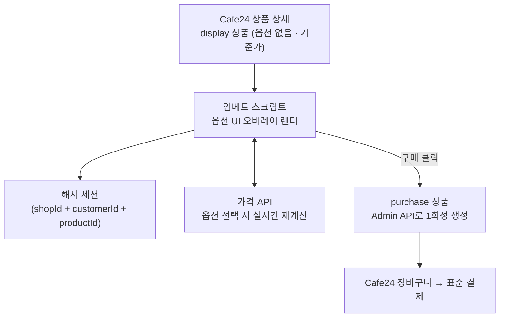

# Estimator (Cafe24 인쇄 견적 앱)

## 개요

책자·봉투·포스터·리플렛 같은 인쇄 상품은 일반 쇼핑몰의 옵션 구조로 표현하기 어렵습니다. 규격·용지·인쇄도수·후가공이 서로 의존하고, 가격은 수량 구간·판형·후가공 조합에 따라 다층으로 계산되며, 내지·표지 원본 파일은 수백 MB를 넘기기 일쑤입니다.

이 앱은 그 영역만 Cafe24 **외부**에서 처리합니다. 결제·회원·주문·배송·세금 같은 표준 흐름은 Cafe24 기본 기능을 그대로 쓰고, 옵션 트리·가격 계산·견적 UI·원본 파일 보관·운영자 도구만 자체 구현한 뒤, 견적 결과를 **1회성 동적 상품**으로 만들어 Cafe24 장바구니에 밀어 넣는 구조입니다.

특정 쇼핑몰 전용이 아니라 앱을 설치한 어떤 쇼핑몰에서도 동작하도록 Shop(업체) 단위 멀티테넌시로 설계했습니다.

## 아키텍처

### Display / Purchase 이중 상품 구조

핵심 아이디어는 "보여주는 상품"과 "사는 상품"을 분리한 것입니다.

- Cafe24에는 **옵션 없는 display 상품**만 등록합니다. 복잡한 옵션 UI와 가격 계산은 상품 상세 페이지에 주입된 스크립트가 오버레이로 렌더합니다.
- 구매 클릭 시점에 서버가 견적 결과·상품 유형·의뢰 여부에 맞춰 Cafe24 options와 입력옵션을 **동적으로 구성한 purchase 상품**을 Admin API로 생성해 장바구니에 담습니다.
- 미결제로 이탈한 purchase 상품은 TTL이 지나면 정리 배치가 Cafe24에서 삭제합니다. 앱 DB에는 옵션·파일 메타가 남아 재주문 시 이전 선택을 복원합니다.

### 해시 세션

견적 도중의 화면 상태(선택 옵션·업로드 파일·편집 번호)는 `(shopId, customerId, productId)` 3축으로 만든 해시 키에 묶여 DB에 저장됩니다. URL은 해시만 들고 다니므로 새로고침·재진입에도 상태가 복원되고, 같은 데이터가 앱 DB에 구조화된 원본으로도 남아 재주문·운영자 조회에 쓰입니다.

### 임베드 스크립트

Cafe24 쇼핑몰 화면에 붙는 6개 슬롯을 esbuild로 각각 번들해 ScriptTag로 주입합니다.

| 슬롯                | 역할                                               |
| ------------------- | -------------------------------------------------- |
| PRODUCT_DETAIL      | 5섹션 견적 렌더러 (옵션·파일·표지·수량·요약)       |
| CART                | 입력옵션 파싱 → 사양·썸네일 렌더, 옵션 변경 재생성 |
| MAIN                | 최근 주문 + 템플릿 탭 위젯                         |
| MYPAGE_MAIN         | 내 디자인 목록, 후불 미수금 섹션                   |
| MYPAGE_ORDER_LIST   | 분할배송·원본 건수·후불 배지 포함 주문 목록        |
| MYPAGE_ORDER_DETAIL | 배송지별 송장, 원본 파일 재서명 다운로드           |

> 초기 설계의 해시 파일명 + SRI integrity 방식은 배포마다 ScriptTag가 끊기는 문제로 폐기하고, 고정 파일명 방식으로 전환했습니다.

### 범용 견적 엔진 분리 (`estimator-engine`)

옵션·가격 계산의 순수 로직만 별도 저장소의 라이브러리로 떼어내고, 이 앱은 그것을 소비하는 쪽에 두었습니다.

| 패키지                         | 역할                                                 |
| ------------------------------ | ---------------------------------------------------- |
| `@tils-ai/estimator-types`     | Money·Quantity·PrintMethod·SizeKey 등 공용 primitive |
| `@tils-ai/estimator-options`   | 옵션 그룹·가시성·검증·파생 사양 계산                 |
| `@tils-ai/estimator-pricing`   | 티어·수량 구간·옵션 가산·할인 상한·등급 할인         |
| `@tils-ai/estimator-packaging` | 박스 분할·스파인 매칭·배송 요금 산정                 |
| `@tils-ai/estimator-engine`    | 위 4종을 조합한 파사드 진입점                        |

분리한 이유는 세 가지입니다.

- **멀티 납품 베이스**: 첫 도입처 이후 다른 고객사에도 같은 엔진을 재사용합니다. 고객 단위 파생 프로젝트에 엔진 소스를 복제하지 않습니다.
- **자산 경계의 물리적 분리**: 범용 엔진 원본과 고객 납품 소스를 다른 저장소에 두어야 "설정 데이터는 고객, 계산 함수는 개발사"라는 경계가 코드 구조에서도 보입니다.
- **Rule-as-Data 계승**: 관리자 UI로 입력한 DB 설정값을 읽어 계산하는 기존 사내 제품(PHP)의 구조를 TypeScript로 재구현하면서, 제품별로 흩어져 있던 계산 규약을 하나로 표준화했습니다.

**순수함수 원칙**을 ESLint로 강제합니다. `@prisma/client`·`next`·`react`·`fs`·`http`·`fetch` 직접 사용을 금지하고, 시간·난수가 필요하면 인자로 주입합니다. pnpm workspace + tsup(ESM + d.ts) + vitest + changesets로 구성해 GitHub Packages로 배포하고, 소비 프로젝트는 플래그십 패키지 하나만 의존하는 것을 기본 경로로 둡니다.

## 주요 기능

### 복합 옵션·가격 엔진

- 후가공 계층 조건, 2축 합성 select, 용지 스펙(PaperSpec), 파생 사양 자동 계산을 포함한 옵션 트리
- 6종 규칙 엔진(가시성·활성화·검증 등)과 18종 단가 테이블, 옵셋 2트랙 가격 체계
- 관리자 화면에서 옵션·단가·규칙을 직접 편집하고, 저장 전 **가격 미리보기**로 검증
- 옵션 메타 조립기를 위젯 API와 관리자 미리보기가 공유해 두 화면의 계산 결과가 어긋나지 않도록 구성
- 규격 직접입력(현수막 등) 치수를 서버에서 재검증해 위젯 우회 입력을 차단

### 상품 타입 확장

책자(booklet) 전제로 출발한 옵션·가격 엔진을 **일반(general) 타입**까지 넓혀, 명함·봉투·포스터·리플렛·달력·스티커·현수막 7종의 견적 골격을 세웠습니다.

- 타입별 고유 축은 대부분 `FinishingOption`에 얹고, 포장 방법만 주문당 1회 정액 축으로 분리
- 리플렛 접힌 면처럼 파생되는 사양은 규칙 엔진의 derive로 계산
- 책자에만 있던 표지·내지 개념을 타입 축으로 분리했습니다. 어휘(내지↔용지, 권↔매), 코팅 단가 위치(`PriceCoverFinishing`↔`PriceFinishing`), 도수 조합 커버리지가 타입마다 달라 이를 전부 갈라내는 작업이 실제 비용의 대부분이었습니다

### 주문 운영 표면

운영자가 Cafe24 어드민을 오가지 않고 이 앱에서 주문 업무를 끝내도록, Cafe24 주문 API를 앱 UI로 감쌌습니다.

- 취소(접수·철회·요청 거부), 환불, 반품, 교환
- 송장 추가·수정·삭제·배치 등록, 묶음배송, 수거
- 주문 메모(중요·상단고정·상담분류), 결품 취소
- 상태별 탭 9종 + 일괄 액션 7종, 주문 상세의 견적·생산 탭(사양 전개·원본 재서명 다운로드·표지 디자인·배송지)
- 스냅샷이 없는 과거 주문은 Cafe24 입력옵션 원문을 역파싱해 동일하게 표시

### 분할 배송·퀵

- 한 주문을 여러 배송지로 나눠 발송, 배송지별 배송수단(택배·퀵·방문수령) 선택
- 상품 크기·무게 기반 박스 분할 계산
- 부릉(dver) API로 퀵 배송 실시간 운임 조회 및 배차 접수·취소·상태 동기화(`DverDispatch` + cron)
- 부릉 권역 밖 배송지는 브이월드 지오코딩 좌표에 하버사인 + 도로 보정 계수(1.3)를 적용해 자체 산정하고, 결과를 30일 캐시(`DistanceCache`)에 보관. 별도 라우팅 provider를 두지 않는 선택

### 월결제 후불(여신)

운영자가 수기로 관리하던 외상·월말 정산을 시스템화했습니다.

- 후불 화이트리스트 회원이 무통장으로 주문하면 앱이 즉시 입금 완료 처리하고 미수금으로 적재
- 결제 예정일에 회원별 미수금을 합산해 **결제용 상품**을 자동 배치 발행하고 해당 회원에게만 결제 URL 제공
- LMS 통지, 연체 자동 마킹, 마이페이지 미수금 섹션, 회계 처리 방식 토글

### 디자인 연동

- 자사 편집기 **Jarvis**를 iframe으로 로드해 표지 디자인 작업, 결과물을 상품 파일 자산으로 연결
- display 상품별로 Jarvis 템플릿 카테고리와 레거시 이미지 샘플 풀을 매핑
- 4티어 디자인 의뢰(커미션) 접수·운영 화면, 전용 디자인의 공용 풀 전환

### 대용량 파일 저장소

- 내지·표지 원본(수백 MB~수 GB)을 S3 서명 URL로 브라우저에서 직접 업로드해 Cafe24 업로드 한계를 우회
- 업체별 프리픽스 격리, 운영자 저장소 화면에서 조회·다운로드·정리
- 수동 삭제는 휴지통 유예(기본 7일) 후 cron이 자동 정리

### MES 게이트웨이

자사 MES가 붙는 경우를 위해 주문 큐·생산지시 상세·생산 상태·송장 등록/수정을 외부 게이트웨이 API로 노출합니다. 전용 토큰 인증과 멱등 처리를 적용했고, MES 없이 앱 단독으로 운영해도 같은 기능을 UI에서 그대로 제공합니다.

### 저장 견적·재주문

견적을 저장·복원할 수 있고, 견적번호(`QT-{MALLID}-00001`) 발급과 견적서 인쇄/PDF 출력을 지원합니다.

재주문은 **견적 스냅샷 복원** 방식으로 구현했습니다. 주문 시점의 견적을 스냅샷으로 남겨 두고, 재주문 버튼이 그 스냅샷을 복원 API로 되살려 견적 화면을 채웁니다. 스냅샷이 없는 과거 주문은 입력옵션 원문 역파싱으로 폴백합니다.

### 주문 금액 변경

주문 확정 후 금액이 바뀌는 경우를 Cafe24 표준 흐름 안에서 처리했습니다.

- **증액**: 차액을 별도의 1회성 결제용 상품으로 발행해 결제 탭의 추가 결제 패널에서 결제
- **감액·취소**: 배송비 취소·현금영수증 취소를 포함한 부분 취소 경로
- 주문 라인 수량 조정과 발송예정일, 주문 상세에서 제작 정보(입력옵션) 직접 수정
- 배송지별 배송 메시지·희망 배송일을 분할 배송지에 적재하고 운영 화면에 노출

### 운영자 권한·가이드

인수인계를 전제로, 운영자가 개발자에게 묻지 않고 화면에서 판단할 수 있도록 정비했습니다.

- **운영자 권한 2등급**: 담당자 권한 카드와 운영자 메뉴 숨김으로 관리자 전용 영역 접근을 차단
- **운영 가이드 페이지**: 관리자 콘솔 안에 상품·옵션·단가·주문·후불 절로 나눈 가이드를 두고, 긴급 출고·담당자 권한·분할 송장·추가 결제·통계 같은 실제 시나리오를 예시 화면으로 제공
- **화면 내 도움말**: 도움말 사전과 `PageHeader` 도움말 슬롯을 두고 상품·옵션·단가 매트릭스·곡선 채우기·전용 단가표·배송 설정·저장소 표 헤더까지 라벨 단위로 연결
- 주문 통계 집계 화면 추가

### 위젯 회원 검증

쇼핑몰 위젯이 브라우저에서 도는 이상 회원 식별을 클라이언트 주장에 맡길 수 없어, Cafe24가 발급하는 **이용자 고유 식별자**를 위젯이 받아 서버로 전달하도록 바꿨습니다. 회원 API에는 남용 차단 가드를 붙이고, 진입 서명 검증을 라이브에서 확인했습니다.

### 디자인 의뢰 결과물 전달

4티어 디자인 의뢰의 결과물이 주문·생산까지 이어지도록 체인을 연결했습니다. 디자이너 결과물 파일 첨부, 주문 생산 뷰모델 노출, MES 접수 시 결과물 전달, 주문 목록의 의뢰 상태 배지, 재편집 시 표지 파일 교체와 교체 이력 기록까지 포함합니다.

## 기술 스택

| 분류        | 기술                                                           |
| ----------- | -------------------------------------------------------------- |
| Framework   | Next.js 16 (App Router)                                        |
| Language    | TypeScript 5 (strict mode)                                     |
| UI          | React 19, Tailwind CSS 4, sonner                               |
| ORM         | Prisma 7 (PostgreSQL 어댑터)                                   |
| 인증        | NextAuth 5 + Jarvis SSO, Cafe24 OAuth (mall_id 단위)           |
| 임베드 번들 | esbuild (슬롯별 IIFE 번들 → ScriptTag 주입)                    |
| 스토리지    | S3 (서명 URL 직접 업로드)                                      |
| 배치        | node-cron, GitHub Actions (purchase TTL 정리)                  |
| 검증        | tsx 테스트 러너 320건 (`typecheck → lint → test → build` 일괄) |
| 배포        | PM2 + 배포 스크립트                                            |

## 규모

개발 종료 시점(2026-08-31) 기준 저장소 실측값입니다.

| 항목                 | 값                                             |
| -------------------- | ---------------------------------------------- |
| 커밋 / 머지된 PR     | 2,007 / 439                                    |
| Prisma 모델          | 100                                            |
| 관리자 화면          | 79종 (상품·옵션·단가·주문·배송·정산·가이드 등) |
| 페이지 / API 라우트  | 79 / 50                                        |
| 자동 테스트          | 320건 (전부 통과)                              |
| 쇼핑몰 임베드 슬롯   | 6종 전부 구현                                  |
| Cafe24 주문 API 래핑 | 94개 엔드포인트 중 38개 (운영자 UI 노출 23개)  |

계약 범위의 기능을 더 쪼갤 수 없는 단위 **86개**로 나눠 완료 여부를 판정한 결과 전부 완료했고, 내부 품질 항목까지 포함하면 89개 중 87개(98%)입니다. 항목마다 작업량이 다르지만 임의 가중치는 수치를 유리하게 왜곡할 수 있어 단순 항목 수로 계산했고, 운영 데이터 입력(단가·상품 연결)은 기능이 아니라 운영 준비이므로 완료율에서 제외했습니다.

## 담당 역할

3인 개발 중 전체 커밋의 약 88%를 담당한 주 개발자로, 제품 설계부터 구현·배포까지 주도했습니다.

- **제품·아키텍처 설계**: Cafe24 앱 방식 확정, display/purchase 이중 상품 구조와 해시 세션 설계, 멀티테넌시 모델링
- **옵션·가격 엔진**: 규칙 엔진, 단가 테이블, 파생 사양 계산, 관리자 편집·미리보기, 책자 전제 코드를 일반 타입 7종까지 확장
- **Cafe24 연동**: OAuth 설치·토큰 자동 갱신, 앱 수명주기 Webhook, 주문 Webhook 멱등 처리, Admin/Front API 래핑
- **임베드 스크립트**: 6개 슬롯 번들 파이프라인과 배포 방식 설계
- **운영 기능**: 주문 운영 표면, 분할배송·퀵, 후불(여신), 저장소 관리, MES 게이트웨이, 재주문 스냅샷 복원, 주문 증액 차액 결제
- **엔진 라이브러리 분리**: 순수 계산 로직을 `estimator-engine` 워크스페이스로 떼어내 저장소·저작권 경계를 정리하고, 순수함수 원칙을 ESLint로 강제해 다음 고객사 납품의 공통 기반으로 정리
- **인수인계 준비**: 운영자 권한 2등급, 운영 가이드 페이지와 화면 내 도움말 체계, 코드 대조 기반 완료 보고서 작성

## 범위 경계

문서보다 코드를 기준으로 현황을 고정해 인수인계 문서를 남겼습니다. 아래는 인수인계 시점에 열려 있는 잔여 범위이며, 개발자가 코드로 닫을 것과 운영 데이터·실환경이 있어야 닫히는 것을 구분해 정리했습니다.

- **주력 3상품(책자·옵셋 책자·모의고사)은 실단가 검증까지 통과**했습니다. 나머지 일반 타입은 렌더러·옵션 축은 구현했으나 단가가 도입처 엑셀과 대조되지 않은 임시값이라 실견적 투입 전 입력이 필요합니다
- **퀵 배차 실호출 검증**: 접수·취소·상태 동기화까지 구현했으나, 테스트 환경에서도 실제 기사 알림이 발송돼 실호출 1건을 아직 돌리지 못함. 배차 멱등·실패 복구 처리도 잔여
- **Prisma 마이그레이션 베이스라인**: 100개 모델을 `db push`로만 반영해 마이그레이션 이력 없음
- **자동 테스트 하네스**: 테스트 320건이 전부 순수 함수·페이크 lookup 기반이며, 라우트 핸들러·Server Action·DB 통합 테스트 없음

## 회고

가장 오래 고민한 부분은 "어디까지 직접 만들고 어디부터 플랫폼에 맡길 것인가"였습니다. 결제·회원·주문처럼 검증된 영역을 다시 만들면 인증·보안·세금 처리까지 전부 떠안게 되므로, Cafe24가 표현하지 못하는 옵션·가격·파일 영역만 외부로 떼어내고 나머지는 표준 흐름에 태우는 선택을 했습니다. display/purchase 이중 상품과 해시 세션은 그 경계를 실제로 성립시키기 위한 장치였습니다.

반대로 운영 도구는 플랫폼에 맡기지 않고 앱 안으로 끌어왔습니다. 운영자가 Cafe24 어드민과 앱을 오가며 일하면 결국 어느 쪽도 정본이 아니게 되기 때문입니다.

개발 막바지에는 문서를 믿지 않고 코드에서 직접 구현 현황을 대조해 스냅샷 문서를 만들고, 낡은 설계 문서를 함께 정정했습니다. "문서가 미구현이라 적었지만 실제로는 되어 있는 것"과 "문서가 침묵했지만 실제로 빠진 것"이 양쪽 다 나왔고, 인수인계에서 가장 값이 나간 산출물이 되었습니다.

완료 보고도 같은 방식으로 만들었습니다. "몇 % 완료"를 감으로 적지 않으려고 기능을 더 쪼갤 수 없는 단위 86개로 나눈 뒤 항목마다 완료 여부를 판정했고, 작업량이 다르다는 이유로 가중치를 두면 수치가 유리하게 왜곡되므로 단순 항목 수로 계산했습니다. 운영 데이터 입력은 기능이 아니라 운영 준비여서 완료율에서 빼고 따로 다뤘습니다. 산정 기준을 먼저 적고 숫자를 그 뒤에 두는 편이, 숫자만 크게 적는 것보다 설득에 유리했습니다.

마지막에 남긴 것은 코드가 아니라 **다음 사람이 이 코드를 굴릴 수 있는 조건**이었습니다. 운영자 권한을 2등급으로 갈라 관리자 전용 영역을 닫고, 관리자 콘솔 안에 운영 가이드를 넣고, 설정 라벨마다 도움말을 붙였습니다. 엔진을 별도 저장소로 떼어낸 것도 같은 맥락입니다. 다음 고객사에 갈 때 소스를 복제하지 않으려면, 재사용할 부분과 고객마다 갈라질 부분이 저장소 경계에서 이미 나뉘어 있어야 했습니다.
